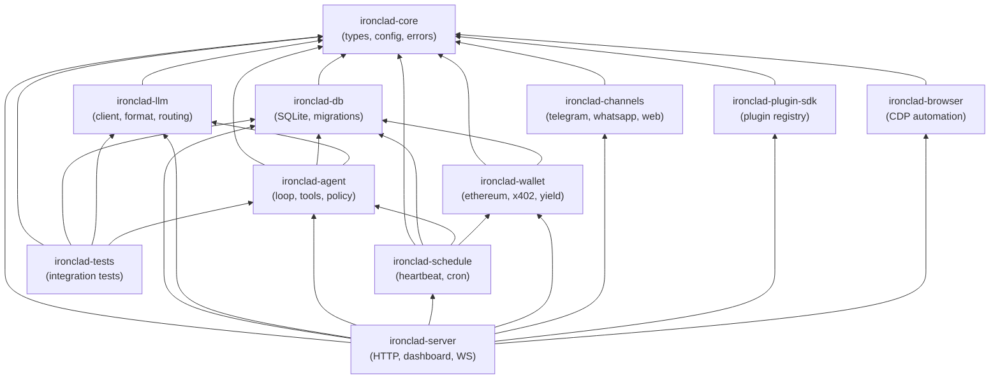

# Ironclad

[](https://www.rust-lang.org)
[](LICENSE)
[](https://github.com/robot-accomplice/ironclad/actions)
[](https://roboticus.ai)
[](#development)
[](#architecture)
[](#architecture)
[](#architecture)

Ironclad is an autonomous agent runtime built in Rust as a single optimized binary. It features ML-based model routing, 3-level semantic caching, zero-trust agent-to-agent communication, 4-layer prompt injection defense, a dual-format skill system, and built-in financial management with DeFi yield optimization. All eleven crates compile into one process with no IPC overhead — inter-component communication is direct async function calls on the tokio runtime, backed by a single SQLite database (28 tables including FTS5).

## Architecture

The workspace is organized as eleven crates with a strict dependency hierarchy:

| Crate | Purpose |
| ------- | --------- |
| `ironclad-core` | Shared types (`SurvivalTier`, `ApiFormat`, `ModelTier`, `RiskLevel`, `SkillKind`), unified config parsing, personality system, error types |
| `ironclad-db` | SQLite persistence via rusqlite — 28 tables (incl. FTS5), WAL mode, migration system, embedding storage |
| `ironclad-llm` | LLM client pipeline — format translation (4 API formats), circuit breaker, in-flight dedup, ML model router (ONNX, ~11μs), 3-level semantic cache, tier-based prompt adaptation |
| `ironclad-agent` | Agent core — ReAct loop state machine, tool system (trait-based), policy engine, 4-layer injection defense, HMAC trust boundaries, 5-tier memory system, dual-format skill loader, sandboxed script runner |
| `ironclad-wallet` | Ethereum wallet (alloy-rs), x402 payment protocol (EIP-3009), treasury policy engine, DeFi yield engine (Aave/Compound on Base) |
| `ironclad-schedule` | Unified cron/heartbeat scheduler — DB-backed with lease-based mutual exclusion, wake signaling via mpsc channels |
| `ironclad-channels` | Chat adapters (Telegram Bot API, WhatsApp Cloud API, Discord, WebSocket) + zero-trust Agent-to-Agent protocol (ECDH session keys, AES-256-GCM) |
| `ironclad-plugin-sdk` | Plugin trait, manifest parser, script runner, plugin registry with auto-discovery and hot-reload |
| `ironclad-browser` | Headless browser automation via Chrome DevTools Protocol (CDP) — navigate, click, type, screenshot, evaluate |
| `ironclad-server` | HTTP API (axum, 41 routes), embedded dashboard SPA, CLI (24 commands), WebSocket push, migration engine, 12-step bootstrap |
| `ironclad-tests` | Integration test suite covering cross-crate workflows |

### Dependency Graph



## Quick Start

```bash
# Build
cargo build --release

# Run with config
./target/release/ironclad-server --config ironclad.toml

# Run tests
cargo test
```

## Configuration

Minimal `ironclad.toml`:

```toml
[agent]
name = "MyAgent"
id = "my-agent"

[server]
port = 18789

[models]
primary = "ollama/qwen3:8b"
```

Full configuration supports 14 sections: `[agent]`, `[server]`, `[database]`, `[models]`, `[providers.*]`, `[circuit_breaker]`, `[memory]`, `[cache]`, `[treasury]`, `[yield]`, `[wallet]`, `[a2a]`, `[skills]`, `[channels.*]`. See `docs/architecture/ironclad-design.md` §5 for all options.

Key configuration areas:

| Section | Controls |
| --------- | ---------- |
| `[models]` | Primary model, fallback chain, routing mode (`ml` or `rule`), local-first preference |
| `[providers.*]` | Per-provider URL, tier classification (T1–T4), API keys via env vars |
| `[memory]` | Token budget allocation across 5 memory tiers (working, episodic, semantic, procedural, relationship) |
| `[cache]` | Exact-match TTL, semantic similarity threshold (default 0.95), max cache entries |
| `[treasury]` | Per-payment cap, hourly/daily transfer limits, minimum reserve, daily inference budget |
| `[skills]` | Skills directory, script timeout, allowed interpreters, sandbox mode, hot-reload |
| `[a2a]` | Max message size, rate limit per peer, session timeout, on-chain identity requirement |

## Skill System

Ironclad supports two skill formats that extend agent capabilities without recompilation:

### Structured Skills (`.toml`)

Programmatic skills with tool chains, policy overrides, and optional external scripts:

```toml
# ~/.ironclad/skills/weather.toml
[skill]
name = "weather-report"
description = "Fetch weather and format a summary"

[triggers]
keywords = ["weather", "forecast", "temperature"]

[[tool_chain]]
tool = "http_get"
args = { url = "https://api.weather.gov/points/{lat},{lon}" }

[[tool_chain]]
tool = "format_response"
args = { template = "weather_summary" }

[policy_overrides]
allow_external_http = true

[script]
path = "scripts/weather-format.py"
interpreter = "python3"
```

### Instruction Skills (`.md`)

Natural-language skills injected into the LLM's system prompt:

```markdown
---
name: code-review
triggers:
  keywords: ["review", "code review", "PR"]
  regex_patterns: ["review (this|my|the) (code|PR|pull request)"]
priority: 10
---

You are performing a code review. Follow these guidelines:

1. Check for correctness, edge cases, and error handling
2. Evaluate naming clarity and code organization
3. Flag security concerns (injection, auth, data exposure)
4. Suggest performance improvements where applicable
5. Be constructive — explain *why*, not just *what*
```

Skills are loaded from `skills.skills_dir` at boot with SHA-256 change detection. Hot-reload watches for file changes when `skills.hot_reload = true`. Script execution is sandboxed with configurable interpreter whitelist, timeout, and output size limits.

## Security

### 4-Layer Prompt Injection Defense

| Layer | Location | Mechanism |
| ------- | ---------- | ----------- |
| L1: Input Gatekeeping | `ironclad-agent/injection.rs` | Regex patterns, encoding evasion detection, financial manipulation checks, multi-language injection scanning → ThreatScore 0.0–1.0 |
| L2: Structured Formatting | `ironclad-agent/prompt.rs` | HMAC-tagged trust boundaries (session secret + content hash) — unforgeable by injected content |
| L3: Output Validation | `ironclad-agent/policy.rs` | Authority-based tool access control (creator > self > peer > external), financial guards, self-modification locks |
| L4: Adaptive Refinement | `ironclad-agent/policy.rs` | Output pattern scanning, behavioral anomaly detection (tool pattern changes, protected file access, repeated financial ops) |

### Zero-Trust Agent-to-Agent

- Mutual authentication via on-chain identity (ERC-8004 registry on Base)
- Challenge-response with signed nonces + timestamps (60s window)
- ECDH ephemeral keypairs → AES-256-GCM session encryption with forward secrecy
- Per-message HMAC authentication, rate limiting, size limits
- Peer messages pass through injection defense with reduced authority
- Opacity principle: agents never expose internal memory, prompts, keys, or session history

### Policy Engine

- Authority levels: `creator`, `self`, `peer`, `external` — each with progressively restricted tool access
- Tool risk classification: `Safe`, `Caution`, `Dangerous`, `Forbidden`
- Treasury policy: per-payment caps, hourly/daily transfer limits, minimum reserve enforcement
- All decisions audit-logged to `policy_decisions` table

### Script Sandbox

- Configurable interpreter whitelist (`bash`, `python3`, `node` by default)
- Environment stripping in sandbox mode (only `PATH`, `HOME`, `IRONCLAD_SESSION_ID`, `IRONCLAD_AGENT_ID`)
- Timeout enforcement and output truncation

## API Reference

41 REST routes + WebSocket upgrade for real-time events:

| Group | Method | Path | Description |
| ------- | -------- | ------ | ------------- |
| **Health** | GET | `/api/health` | Quick health check (status, uptime, version) |
| **Config** | GET | `/api/config` | Current configuration |
| | PUT | `/api/config` | Update configuration |
| **Logs** | GET | `/api/logs` | Structured log output |
| **Sessions** | GET | `/api/sessions` | List sessions |
| | POST | `/api/sessions` | Create new session |
| | GET | `/api/sessions/:id` | Session detail |
| | GET | `/api/sessions/:id/messages` | Session message history |
| | POST | `/api/sessions/:id/messages` | Append message to session |
| **Memory** | GET | `/api/memory/working/:session_id` | Working memory (session-scoped) |
| | GET | `/api/memory/episodic` | Episodic memory (events) |
| | GET | `/api/memory/semantic/:category` | Semantic memory (facts) |
| | GET | `/api/memory/search` | Full-text memory search (FTS5) |
| **Scheduler** | GET | `/api/cron/jobs` | List cron jobs |
| | POST | `/api/cron/jobs` | Create cron job |
| | GET | `/api/cron/jobs/:id` | Cron job detail |
| | DELETE | `/api/cron/jobs/:id` | Delete cron job |
| **Statistics** | GET | `/api/stats/costs` | Inference cost history |
| | GET | `/api/stats/transactions` | Financial transaction history |
| | GET | `/api/stats/cache` | Cache hit/miss statistics |
| **Circuit Breaker** | GET | `/api/breaker/status` | All provider breaker states |
| | POST | `/api/breaker/reset/:provider` | Reset a provider breaker |
| **Agent** | GET | `/api/agent/status` | Agent state, model, cache stats |
| | POST | `/api/agent/message` | Send message through agent pipeline |
| **Wallet** | GET | `/api/wallet/balance` | USDC + credit balance |
| | GET | `/api/wallet/address` | Wallet address |
| **Skills** | GET | `/api/skills` | List all registered skills |
| | GET | `/api/skills/:id` | Skill detail + content |
| | POST | `/api/skills/reload` | Trigger hot-reload from disk |
| | PUT | `/api/skills/:id/toggle` | Enable/disable a skill |
| **Plugins** | GET | `/api/plugins` | List installed plugins |
| | PUT | `/api/plugins/:name/toggle` | Enable/disable plugin |
| | POST | `/api/plugins/:name/execute/:tool` | Execute a plugin tool |
| **Browser** | GET | `/api/browser/status` | Browser session status |
| | POST | `/api/browser/start` | Start headless browser |
| | POST | `/api/browser/stop` | Stop browser session |
| | POST | `/api/browser/action` | Execute browser action |
| **Agents** | GET | `/api/agents` | List agent instances |
| | POST | `/api/agents/:id/start` | Start an agent |
| | POST | `/api/agents/:id/stop` | Stop an agent |
| **Workspace** | GET | `/api/workspace/state` | Workspace file/state overview |
| **A2A** | POST | `/api/a2a/hello` | A2A handshake initiation |
| **Webhooks** | POST | `/api/webhooks/telegram` | Telegram webhook receiver |
| | GET/POST | `/api/webhooks/whatsapp` | WhatsApp verify + webhook |
| **Channels** | GET | `/api/channels/status` | Channel adapter status |
| **WebSocket** | GET | `/ws` | Real-time event push (upgrades to WS) |

## Architecture Docs

Detailed documentation in `docs/architecture/`:

| Document | Contents |
| ---------- | ---------- |
| [ironclad-design.md](docs/architecture/ironclad-design.md) | Full blueprint — workspace layout, trait hierarchy, database schema (28 tables), complete config reference |
| [ironclad-dataflow.md](docs/architecture/ironclad-dataflow.md) | 9 dataflow diagrams — request lifecycle, semantic cache, ML router, memory, A2A, injection defense, financial/yield, scheduling, skill execution |
| [ironclad-sequences.md](docs/architecture/ironclad-sequences.md) | 7 cross-crate sequence diagrams — end-to-end request, cache pipeline, x402 payment, bootstrap, injection attack, skill execution, cron leasing |
| [ironclad-c4-system-context.md](docs/architecture/ironclad-c4-system-context.md) | C4 Level 1: System context |
| [ironclad-c4-container.md](docs/architecture/ironclad-c4-container.md) | C4 Level 2: Container diagram + table ownership |
| [ironclad-c4-core.md](docs/architecture/ironclad-c4-core.md) | C4 Level 3: ironclad-core components |
| [ironclad-c4-db.md](docs/architecture/ironclad-c4-db.md) | C4 Level 3: ironclad-db components |
| [ironclad-c4-llm.md](docs/architecture/ironclad-c4-llm.md) | C4 Level 3: ironclad-llm components |
| [ironclad-c4-agent.md](docs/architecture/ironclad-c4-agent.md) | C4 Level 3: ironclad-agent components |
| [ironclad-c4-wallet.md](docs/architecture/ironclad-c4-wallet.md) | C4 Level 3: ironclad-wallet components |
| [ironclad-c4-channels.md](docs/architecture/ironclad-c4-channels.md) | C4 Level 3: ironclad-channels components |
| [ironclad-c4-schedule.md](docs/architecture/ironclad-c4-schedule.md) | C4 Level 3: ironclad-schedule components |
| [ironclad-c4-server.md](docs/architecture/ironclad-c4-server.md) | C4 Level 3: ironclad-server components + full API route map |
| [ironclad-c4-browser.md](docs/architecture/ironclad-c4-browser.md) | C4 Level 3: ironclad-browser components |
| [ironclad-c4-plugin-sdk.md](docs/architecture/ironclad-c4-plugin-sdk.md) | C4 Level 3: ironclad-plugin-sdk components |
| [ironclad-c4-tests.md](docs/architecture/ironclad-c4-tests.md) | C4 Level 3: ironclad-tests integration test suite |
| [research-alternatives.md](docs/architecture/research-alternatives.md) | Technology alternatives research and decision rationale |

Additional docs in `docs/`:

| Document | Contents |
| ---------- | ---------- |
| [IRONCLAD.md](docs/IRONCLAD.md) | Comprehensive feature summary, OpenClaw comparison, migration guide, cost analysis |
| [SECURITY-AUDIT-REPORT.md](docs/SECURITY-AUDIT-REPORT.md) | Full security audit — 23 findings across injection, auth, crypto, wallet, policy |
| [audit-code-quality-completeness.md](docs/audit-code-quality-completeness.md) | Code quality assessment — panics, coverage, completeness |

## Development

```bash
# Run all tests
cargo test

# Run specific crate tests
cargo test -p ironclad-core
cargo test -p ironclad-db
cargo test -p ironclad-llm
cargo test -p ironclad-agent
cargo test -p ironclad-wallet
cargo test -p ironclad-channels
cargo test -p ironclad-schedule
cargo test -p ironclad-server
cargo test -p ironclad-plugin-sdk
cargo test -p ironclad-browser
cargo test -p ironclad-tests

# Run with logging
RUST_LOG=info cargo run -- --config ironclad.toml

# Check formatting
cargo fmt --check

# Lint
cargo clippy -- -D warnings
```

## Migration from OpenClaw

Ironclad includes full bidirectional migration support for OpenClaw installations, covering 6 data areas: configuration, personality, skills, sessions, cron jobs, and channels.

```bash
# Import from an existing OpenClaw workspace
ironclad migrate import /path/to/openclaw-root --yes

# Export back to OpenClaw format
ironclad migrate export /path/to/output

# Standalone skill import with safety scanning
ironclad skills import /path/to/skill-directory
```

Skills pass through a safety scanner (50+ patterns across 5 categories) before import. Secrets are never stored in config files — API keys and tokens are converted to environment variable references. See [IRONCLAD.md](docs/IRONCLAD.md#migration-openclaw-interoperability) for full details.

## License

Apache License, Version 2.0 -- see [LICENSE](LICENSE) and [NOTICE](NOTICE).
