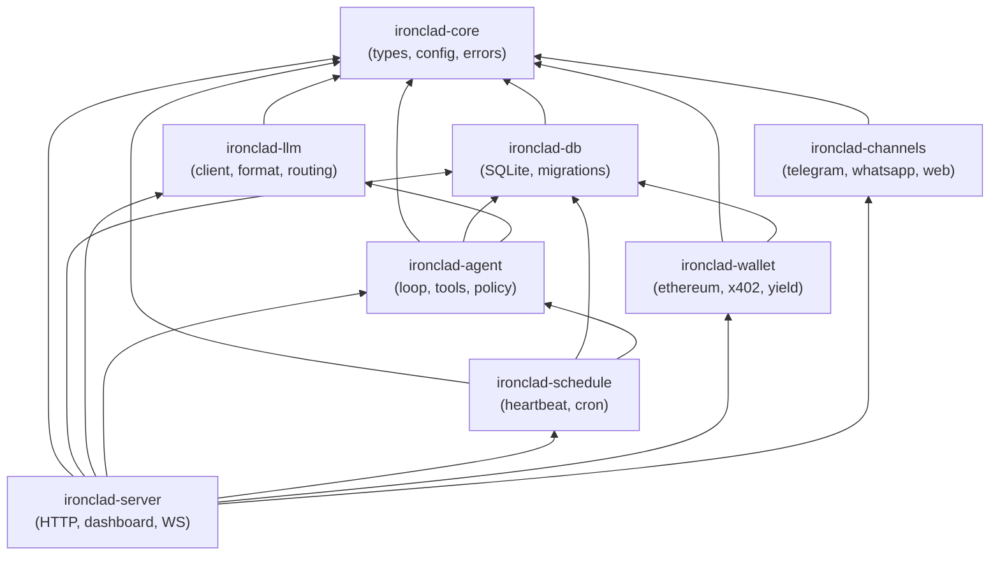

# Ironclad

Ironclad is an autonomous agent runtime built in Rust as a single optimized binary. It features ML-based model routing, 3-level semantic caching, zero-trust agent-to-agent communication, 4-layer prompt injection defense, a dual-format skill system, and built-in financial management with DeFi yield optimization. All eight crates compile into one process with no IPC overhead — inter-component communication is direct async function calls on the tokio runtime, backed by a single SQLite database (24 tables + FTS5).

## Architecture

The workspace is organized as eight crates with a strict dependency hierarchy:

| Crate | Purpose |
|-------|---------|
| `ironclad-core` | Shared types (`SurvivalTier`, `ApiFormat`, `ModelTier`, `RiskLevel`, `SkillKind`), unified config parsing, error types |
| `ironclad-db` | SQLite persistence via rusqlite — 24 tables + FTS5 full-text search, WAL mode, migration system |
| `ironclad-llm` | LLM client pipeline — format translation (4 API formats), circuit breaker, in-flight dedup, ML model router (ONNX, ~11μs), 3-level semantic cache, tier-based prompt adaptation |
| `ironclad-agent` | Agent core — ReAct loop state machine, tool system (trait-based), policy engine, 4-layer injection defense, HMAC trust boundaries, 5-tier memory system, dual-format skill loader, sandboxed script runner |
| `ironclad-wallet` | Ethereum wallet (alloy-rs), x402 payment protocol (EIP-3009), treasury policy engine, DeFi yield engine (Aave/Compound on Base) |
| `ironclad-channels` | Chat adapters (Telegram Bot API, WhatsApp Cloud API, WebSocket) + zero-trust Agent-to-Agent protocol (ECDH session keys, AES-256-GCM) |
| `ironclad-schedule` | Unified cron/heartbeat scheduler — DB-backed with lease-based mutual exclusion, wake signaling via mpsc channels |
| `ironclad-server` | HTTP API (axum, 29 routes), embedded dashboard SPA, WebSocket push, 12-step bootstrap sequence |

### Dependency Graph



## Quick Start

```bash
# Build
cargo build --release

# Run with config
./target/release/ironclad-server --config ironclad.toml

# Run tests
cargo test
```

## Configuration

Minimal `ironclad.toml`:

```toml
[agent]
name = "MyAgent"
id = "my-agent"

[server]
port = 18789

[models]
primary = "ollama/qwen3:8b"
```

Full configuration supports 14 sections: `[agent]`, `[server]`, `[database]`, `[models]`, `[providers.*]`, `[circuit_breaker]`, `[memory]`, `[cache]`, `[treasury]`, `[yield]`, `[wallet]`, `[a2a]`, `[skills]`, `[channels.*]`. See `docs/architecture/ironclad-design.md` §5 for all options.

Key configuration areas:

| Section | Controls |
|---------|----------|
| `[models]` | Primary model, fallback chain, routing mode (`ml` or `rule`), local-first preference |
| `[providers.*]` | Per-provider URL, tier classification (T1–T4), API keys via env vars |
| `[memory]` | Token budget allocation across 5 memory tiers (working, episodic, semantic, procedural, relationship) |
| `[cache]` | Exact-match TTL, semantic similarity threshold (default 0.95), max cache entries |
| `[treasury]` | Per-payment cap, hourly/daily transfer limits, minimum reserve, daily inference budget |
| `[skills]` | Skills directory, script timeout, allowed interpreters, sandbox mode, hot-reload |
| `[a2a]` | Max message size, rate limit per peer, session timeout, on-chain identity requirement |

## Skill System

Ironclad supports two skill formats that extend agent capabilities without recompilation:

### Structured Skills (`.toml`)

Programmatic skills with tool chains, policy overrides, and optional external scripts:

```toml
# ~/.ironclad/skills/weather.toml
[skill]
name = "weather-report"
description = "Fetch weather and format a summary"

[triggers]
keywords = ["weather", "forecast", "temperature"]

[[tool_chain]]
tool = "http_get"
args = { url = "https://api.weather.gov/points/{lat},{lon}" }

[[tool_chain]]
tool = "format_response"
args = { template = "weather_summary" }

[policy_overrides]
allow_external_http = true

[script]
path = "scripts/weather-format.py"
interpreter = "python3"
```

### Instruction Skills (`.md`)

Natural-language skills injected into the LLM's system prompt:

```markdown
---
name: code-review
triggers:
  keywords: ["review", "code review", "PR"]
  regex_patterns: ["review (this|my|the) (code|PR|pull request)"]
priority: 10
---

You are performing a code review. Follow these guidelines:

1. Check for correctness, edge cases, and error handling
2. Evaluate naming clarity and code organization
3. Flag security concerns (injection, auth, data exposure)
4. Suggest performance improvements where applicable
5. Be constructive — explain *why*, not just *what*
```

Skills are loaded from `skills.skills_dir` at boot with SHA-256 change detection. Hot-reload watches for file changes when `skills.hot_reload = true`. Script execution is sandboxed with configurable interpreter whitelist, timeout, and output size limits.

## Security

### 4-Layer Prompt Injection Defense

| Layer | Location | Mechanism |
|-------|----------|-----------|
| L1: Input Gatekeeping | `ironclad-agent/injection.rs` | Regex patterns, encoding evasion detection, financial manipulation checks, multi-language injection scanning → ThreatScore 0.0–1.0 |
| L2: Structured Formatting | `ironclad-agent/prompt.rs` | HMAC-tagged trust boundaries (session secret + content hash) — unforgeable by injected content |
| L3: Output Validation | `ironclad-agent/policy.rs` | Authority-based tool access control (creator > self > peer > external), financial guards, self-modification locks |
| L4: Adaptive Refinement | `ironclad-agent/policy.rs` | Output pattern scanning, behavioral anomaly detection (tool pattern changes, protected file access, repeated financial ops) |

### Zero-Trust Agent-to-Agent

- Mutual authentication via on-chain identity (ERC-8004 registry on Base)
- Challenge-response with signed nonces + timestamps (60s window)
- ECDH ephemeral keypairs → AES-256-GCM session encryption with forward secrecy
- Per-message HMAC authentication, rate limiting, size limits
- Peer messages pass through injection defense with reduced authority
- Opacity principle: agents never expose internal memory, prompts, keys, or session history

### Policy Engine

- Authority levels: `creator`, `self`, `peer`, `external` — each with progressively restricted tool access
- Tool risk classification: `Safe`, `Caution`, `Dangerous`, `Forbidden`
- Treasury policy: per-payment caps, hourly/daily transfer limits, minimum reserve enforcement
- All decisions audit-logged to `policy_decisions` table

### Script Sandbox

- Configurable interpreter whitelist (`bash`, `python3`, `node` by default)
- Environment stripping in sandbox mode (only `PATH`, `HOME`, `IRONCLAD_SESSION_ID`, `IRONCLAD_AGENT_ID`)
- Timeout enforcement and output truncation

## API Reference

29 REST endpoints + 2 A2A protocol endpoints:

### Health

| Method | Path | Description |
|--------|------|-------------|
| GET | `/api/health` | Quick health check |
| GET | `/api/health/deep` | DB + provider connectivity check |

### Sessions

| Method | Path | Description |
|--------|------|-------------|
| GET | `/api/sessions` | List sessions |
| GET | `/api/sessions/:id/messages` | Session message history |
| POST | `/api/sessions/:id/inject` | Inject message into session |

### Memory

| Method | Path | Description |
|--------|------|-------------|
| GET | `/api/memory/:tier` | Browse memory tier |
| GET | `/api/memory/search` | Full-text memory search |

### Scheduler

| Method | Path | Description |
|--------|------|-------------|
| GET | `/api/cron/jobs` | List cron jobs |
| PUT | `/api/cron/jobs/:id` | Update cron job |
| POST | `/api/cron/jobs/:id/trigger` | Manually trigger job |

### Statistics

| Method | Path | Description |
|--------|------|-------------|
| GET | `/api/stats` | Current statistics |
| GET | `/api/stats/costs` | Inference cost history |
| GET | `/api/stats/cache` | Cache hit/miss stats |

### Circuit Breaker

| Method | Path | Description |
|--------|------|-------------|
| GET | `/api/breaker/status` | Circuit breaker states |
| POST | `/api/breaker/reset/:provider` | Reset provider breaker |

### Agent

| Method | Path | Description |
|--------|------|-------------|
| POST | `/api/agent/wake` | Wake agent from sleep |
| POST | `/api/agent/sleep` | Put agent to sleep |
| GET | `/api/agent/state` | Current agent state |

### Wallet

| Method | Path | Description |
|--------|------|-------------|
| GET | `/api/wallet/balance` | USDC + credit balance |
| GET | `/api/wallet/transactions` | Transaction history |
| GET | `/api/wallet/yield` | Yield status + earnings |

### Configuration

| Method | Path | Description |
|--------|------|-------------|
| GET | `/api/config` | Current configuration |
| PUT | `/api/config/models` | Update model config |

### Skills

| Method | Path | Description |
|--------|------|-------------|
| GET | `/api/skills` | List all registered skills |
| GET | `/api/skills/:id` | Skill detail + content |
| POST | `/api/skills/reload` | Trigger hot-reload from disk |
| PUT | `/api/skills/:id/toggle` | Enable/disable a skill |

### A2A Protocol

| Method | Path | Description |
|--------|------|-------------|
| POST | `/a2a/hello` | A2A handshake initiation |
| POST | `/a2a/message` | A2A encrypted message exchange |

WebSocket upgrade is available at the server root for real-time push events (turn completions, tool calls, cron fires, balance changes, A2A messages, alerts).

## Architecture Docs

Detailed documentation in `docs/architecture/`:

| Document | Contents |
|----------|----------|
| [ironclad-design.md](docs/architecture/ironclad-design.md) | Full blueprint — workspace layout, trait hierarchy, database schema (24 tables), complete config reference |
| [ironclad-dataflow.md](docs/architecture/ironclad-dataflow.md) | 9 dataflow diagrams — request lifecycle, semantic cache, ML router, memory, A2A, injection defense, financial/yield, scheduling, skill execution |
| [ironclad-sequences.md](docs/architecture/ironclad-sequences.md) | 7 cross-crate sequence diagrams — end-to-end request, cache pipeline, x402 payment, bootstrap, injection attack, skill execution, cron leasing |
| [ironclad-c4-system-context.md](docs/architecture/ironclad-c4-system-context.md) | C4 Level 1: System context |
| [ironclad-c4-container.md](docs/architecture/ironclad-c4-container.md) | C4 Level 2: Container diagram + table ownership |
| [ironclad-c4-core.md](docs/architecture/ironclad-c4-core.md) | C4 Level 3: ironclad-core components |
| [ironclad-c4-db.md](docs/architecture/ironclad-c4-db.md) | C4 Level 3: ironclad-db components |
| [ironclad-c4-llm.md](docs/architecture/ironclad-c4-llm.md) | C4 Level 3: ironclad-llm components |
| [ironclad-c4-agent.md](docs/architecture/ironclad-c4-agent.md) | C4 Level 3: ironclad-agent components |
| [ironclad-c4-wallet.md](docs/architecture/ironclad-c4-wallet.md) | C4 Level 3: ironclad-wallet components |
| [ironclad-c4-channels.md](docs/architecture/ironclad-c4-channels.md) | C4 Level 3: ironclad-channels components |
| [ironclad-c4-schedule.md](docs/architecture/ironclad-c4-schedule.md) | C4 Level 3: ironclad-schedule components |
| [ironclad-c4-server.md](docs/architecture/ironclad-c4-server.md) | C4 Level 3: ironclad-server components + full API route map |

## Development

```bash
# Run all tests
cargo test

# Run specific crate tests
cargo test -p ironclad-core
cargo test -p ironclad-db
cargo test -p ironclad-llm
cargo test -p ironclad-agent
cargo test -p ironclad-wallet
cargo test -p ironclad-channels
cargo test -p ironclad-schedule
cargo test -p ironclad-server

# Run with logging
RUST_LOG=info cargo run -- --config ironclad.toml

# Check formatting
cargo fmt --check

# Lint
cargo clippy -- -D warnings
```

## License

MIT
