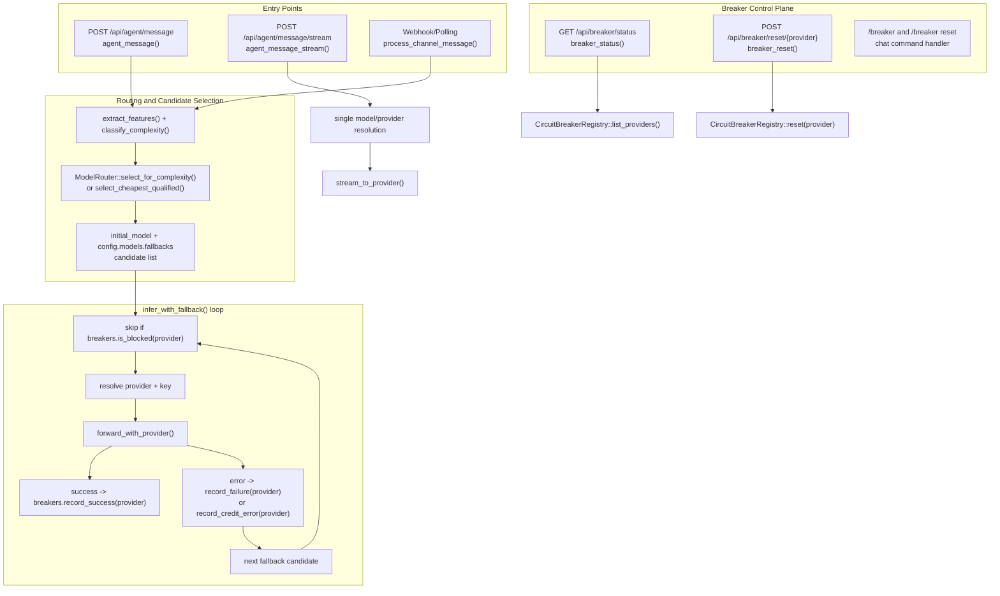
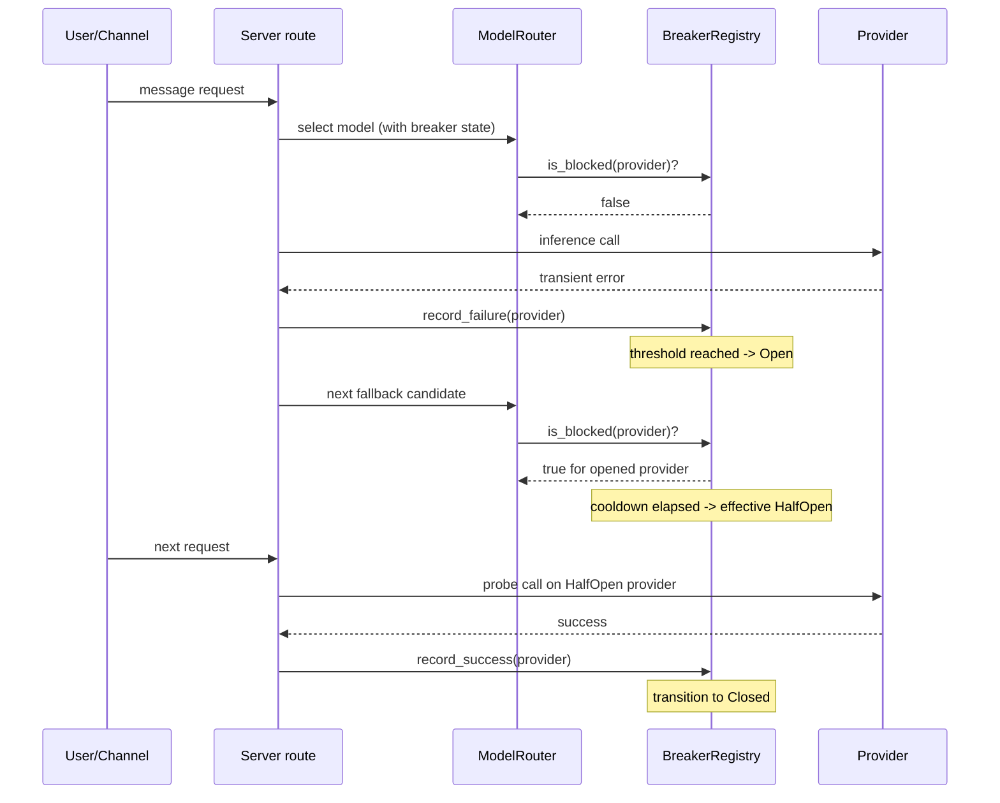
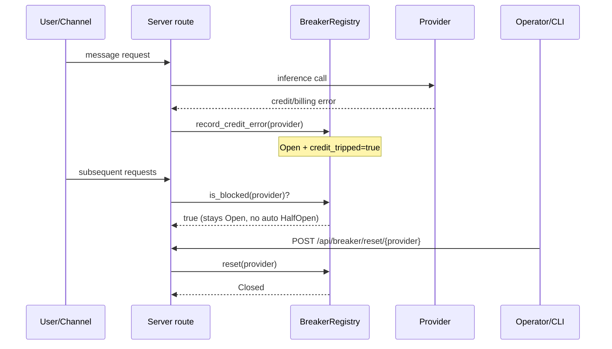
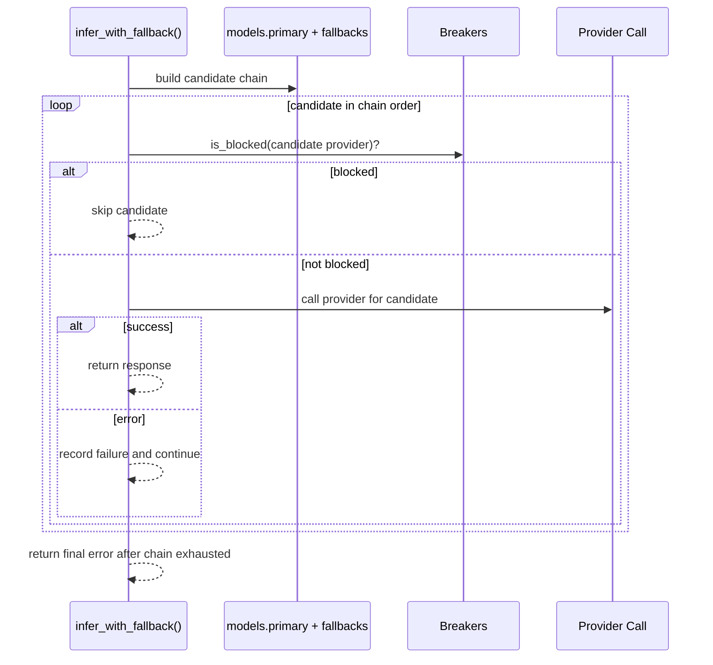

# Circuit Breaker Dataflow and Audit

This document maps the current runtime dataflow for circuit breaker behavior, defines intended sequence behavior, and audits code paths against that intent.

## Current Runtime Dataflow (As Implemented)

## Intended Sequence Diagrams

### 1) Transient Failure Recovery (Normal Open -> HalfOpen -> Closed)

### 2) Credit Error Path (Manual Reset Required)

### 3) Bounded Fallback Policy (Only Configured Candidates)

## Audit: Code vs Intended Behavior

### Pass

- Breaker state machine supports `Closed`, `Open`, `HalfOpen` and cooldown-based effective state transitions.
- Credit-trip behavior is sticky until explicit reset (`credit_tripped` blocks auto recovery).
- Fallback loop in `infer_with_fallback()` checks `is_blocked()` before provider call and updates breaker state after each outcome.
- API endpoints exist for status and provider-scoped reset:
  - `GET /api/breaker/status`
  - `POST /api/breaker/reset/{provider}`

### Fails / Mismatches

1. **CLI reset endpoint mismatch (high impact)**
   - CLI currently posts to `/api/breaker/reset` (no provider path).
   - Server route is `/api/breaker/reset/{provider}`.
   - Result: `ironclad circuit reset` can return non-success and not actually reset breakers.

2. **Streaming path bypasses fallback loop**
   - `agent_message_stream()` performs single-provider stream call and does not run `infer_with_fallback()` chain.
   - Intended behavior is to remain within bounded fallback policy for all chat surfaces.

3. **Interview path bypasses routing/fallback/breaker accounting**
   - `interview_turn` uses direct provider call from `models.primary`.
   - This path does not apply standard breaker/fallback policy.

4. **Runtime control-plane drift risk**
   - Config updates and model mutation endpoints update config structures.
   - Active runtime router behavior can diverge if router internals are not synchronized for every mutation path.

5. **Insufficient integration coverage for breaker lifecycle**
   - Good unit coverage exists in `ironclad-llm` (`circuit.rs`, `router.rs`).
   - Integration tests in `ironclad-tests` do not currently exercise full API-level breaker lifecycle and command/reset surfaces end-to-end.

## Files Audited

- `crates/ironclad-server/src/api/routes/agent.rs`
- `crates/ironclad-server/src/api/routes/admin.rs`
- `crates/ironclad-server/src/api/routes/mod.rs`
- `crates/ironclad-server/src/api/routes/interview.rs`
- `crates/ironclad-server/src/cli/admin/misc.rs`
- `crates/ironclad-llm/src/circuit.rs`
- `crates/ironclad-llm/src/router.rs`

## Next Implementation Plan (Integration Tests)

1. Add API-level integration tests for:
   - threshold trip to Open
   - credit-trip persistence across cooldown
   - provider reset endpoint restoring Closed
2. Add regression test for CLI reset endpoint path contract.
3. Add stream-path test ensuring breaker-aware fallback semantics (or explicitly document stream exception and add health guard).

## Path Coverage Matrix (Integration Test Set)

- `A1 -> B1 -> B2 -> B3 -> C1..C6`  
  - `server_api::fallback_chain_is_bounded_to_configured_candidates`
- `A2 -> E1 -> E2`  
  - `server_api::stream_path_attempts_single_selected_provider`
- `A3 -> process_channel_message (normal payload)`  
  - `server_api::telegram_webhook_public_entrypoint_accepts_and_returns_ok`
- `A3 -> D3 (slash command payload)`  
  - `server_api::telegram_webhook_public_entrypoint_accepts_slash_command_payload`
- `D1 -> F1`  
  - `server_api::breaker_status_reports_open_after_threshold_failures`
  - `server_api::breaker_transient_open_transitions_to_half_open_after_cooldown`
- `D2 -> F2`  
  - `server_api::breaker_credit_trip_stays_open_until_reset_endpoint`

Additional breaker lifecycle integration checks:

- `server_api::breaker_status_reports_open_after_threshold_failures`
- `server_api::breaker_credit_trip_stays_open_until_reset_endpoint`
- `server_api::breaker_transient_open_transitions_to_half_open_after_cooldown`
