# C4 Level 3: Component Diagram -- ironclad-agent

*Agent core implementing the ReAct reasoning loop, tool execution, policy enforcement, prompt injection defense, memory management, and context assembly.*

---

## Component Diagram

```mermaid
flowchart TB
    subgraph IroncladAgent ["ironclad-agent"]
        LOOP["loop.rs<br/>ReAct Loop<br/>(typed state machine)"]
        TOOLS["tools.rs<br/>Tool System<br/>(trait-based)"]
        POLICY["policy.rs<br/>Policy Engine"]
        PROMPT["prompt.rs<br/>System Prompt Builder"]
        CONTEXT["context.rs<br/>Context Assembly +<br/>Compression"]
        INJECTION["injection.rs<br/>Injection Defense<br/>(4 layers)"]
        MEMORY["memory.rs<br/>Memory Retrieval +<br/>Ingestion"]
        SKILLS_MOD["skills.rs<br/>Skill Loader, Registry,<br/>Executor"]
        SCRIPT_RUN["script_runner.rs<br/>Sandboxed Script Execution"]
        APPROVALS["approvals.rs<br/>Approval flows"]
        INTERVIEW["interview.rs<br/>Personality interview"]
        SUBAGENTS["subagents.rs<br/>Subagent registry"]
    end

    subgraph LoopDetail ["loop.rs - ReAct State Machine"]
        THINK["Think: select action<br/>based on current state"]
        ACT["Act: execute tool call<br/>(via policy gate)"]
        OBSERVE["Observe: process<br/>tool result"]
        PERSIST["Persist: write turn,<br/>tool calls, policy decisions<br/>to DB in single transaction"]
        IDLE_DETECT["Idle detection:<br/>3 turns with no tool use"]
        LOOP_DETECT["Loop detection:<br/>3x same tool+params pattern"]
        FIN_GUARD["Financial guard:<br/>check SurvivalTier before<br/>expensive operations"]
    end

    subgraph ToolsDetail ["tools.rs"]
        TRAIT["Tool trait:<br/>name, description, risk_level,<br/>parameters_schema, execute"]
        REGISTRY_T["ToolRegistry:<br/>register, lookup by name,<br/>list by category"]
        CATEGORIES["10 categories:<br/>vm, self_mod, survival,<br/>financial, skills, git,<br/>registry, replication,<br/>memory, general"]
    end

    subgraph PolicyDetail ["policy.rs"]
        RULE_TRAIT["PolicyRule trait:<br/>name, priority, evaluate"]
        RULES["Built-in rules:<br/>- AuthorityRule (creator > self > peer > external)<br/>- CommandSafetyRule (forbidden patterns)<br/>- FinancialRule (treasury limits)<br/>- PathProtectionRule (block sensitive paths)<br/>- RateLimitRule (per-turn/session caps)<br/>- ValidationRule (input format checks)"]
        EVAL["evaluate_all():<br/>sorted by priority,<br/>first Deny wins,<br/>all decisions persisted"]
    end

    subgraph InjectionDetail ["injection.rs - L1 + L4 in this crate"]
        L1["L1: check_injection(input) -> ThreatScore<br/>NFKC normalize, homoglyph_fold(), regex sets<br/>(instruction, encoding, authority, financial)<br/>Block >0.7, sanitize 0.3-0.7, pass <0.3"]
        L4["L4: scan_output(output) -> bool<br/>NFKC, decode_common_encodings (HTML entities,<br/>hex escapes), homoglyph_fold, regex match<br/>Detects injection patterns in model output"]
    end

    subgraph PromptDetail ["prompt.rs"]
        BUILD_SYS["build_system_prompt():<br/>identity + config + soul +<br/>tools + financial status"]
        INJECT_HMAC["inject_hmac_boundaries():<br/>wrap each content section<br/>in HMAC-tagged trust markers"]
        VERIFY_HMAC["verify_hmac_boundary():<br/>validate marker integrity"]
    end

    subgraph ContextDetail ["context.rs"]
        PROGRESSIVE["progressive_load():<br/>Level 0: identity + task only (~2K tokens)<br/>Level 1: + relevant memories (~4K)<br/>Level 2: + full tool descriptions (~8K)<br/>Level 3: + full history window (~16K)"]
        COMPRESS["compress_context():<br/>structural dedup, reference<br/>replacement, truncation"]
        BUDGET_CTX["token_budget_check():<br/>ensure total context fits<br/>model's max_tokens"]
    end

    subgraph MemoryDetail ["memory.rs"]
        RETRIEVE["retrieve_memories():<br/>MemoryBudgetManager allocates<br/>tokens across 5 tiers,<br/>parallel retrieval,<br/>format into memory block"]
        INGEST["ingest_turn():<br/>classify turn type,<br/>extract episodic events,<br/>semantic facts, procedural<br/>outcomes, relationship updates"]
        BUDGET_MEM["MemoryBudgetManager:<br/>working 30%, episodic 25%,<br/>semantic 20%, procedural 15%,<br/>relationship 10%<br/>(unused budget rolls over)"]
    end

    subgraph SkillsModDetail ["skills.rs - Dual-Format Skill System"]
        SK_LOADER["SkillLoader:<br/>scan skills_dir for .toml + .md,<br/>parse manifests, compute hashes,<br/>register in ironclad-db/skills table,<br/>hot-reload on hash change"]
        SK_REGISTRY["SkillRegistry:<br/>in-memory trigger index,<br/>match_skills(context) evaluates<br/>keyword + tool-name + regex triggers"]
        SK_STRUCTURED["StructuredSkillExecutor:<br/>orchestrate tool_chain sequence,<br/>apply policy_overrides,<br/>invoke ScriptRunner if script_path set"]
        SK_INSTRUCTION["InstructionSkillExecutor:<br/>inject .md body into system prompt,<br/>LLM interprets instructions"]
    end

    subgraph ScriptRunDetail ["script_runner.rs - Sandboxed Execution"]
        EXEC["ScriptRunner::execute():<br/>spawn process via tokio::process,<br/>capture stdout/stderr"]
        SANDBOX["Sandbox controls:<br/>- script_timeout_seconds (kill on timeout)<br/>- script_max_output_bytes (truncate)<br/>- allowed_interpreters (whitelist)<br/>- sandbox_env (strip env, pass only<br/>  PATH, HOME, IRONCLAD_SESSION_ID,<br/>  IRONCLAD_AGENT_ID)"]
        SCRIPT_TOOL["ScriptTool:<br/>implements Tool trait,<br/>wraps ScriptRunner,<br/>RiskLevel::Caution default,<br/>policy engine evaluates first"]
        WORKDIR["Working directory:<br/>locked to skill parent dir<br/>or temp dir (never workspace root)"]
    end

    LOOP --> THINK --> ACT --> OBSERVE --> PERSIST
    ACT --> POLICY --> TOOLS
    ACT --> SKILLS_MOD
    SKILLS_MOD --> SCRIPT_RUN
    LOOP --> CONTEXT --> PROMPT
    LOOP --> INJECTION
    LOOP --> MEMORY
```



## Module Interactions

```mermaid
sequenceDiagram
    participant Channel as Channel Adapter
    participant Loop as loop.rs
    participant Injection as injection.rs
    participant Context as context.rs
    participant Memory as memory.rs
    participant Prompt as prompt.rs
    participant LLM as ironclad-llm
    participant Policy as policy.rs
    participant Tools as tools.rs
    participant DB as ironclad-db

    participant Skills as skills.rs

    Channel->>Loop: inbound message
    Loop->>Injection: Layer 1 gatekeeping
    Injection-->>Loop: ThreatScore (pass/sanitize/block)
    Loop->>Skills: match_skills(turn_context)
    Skills-->>Loop: matched skills (structured + instruction)
    Loop->>Memory: retrieve_memories(budget)
    Memory-->>Loop: memory block
    Loop->>Context: progressive_load(complexity)
    Context->>Prompt: build_system_prompt()
    Prompt->>Injection: Layer 2 HMAC boundaries
    Context-->>Loop: assembled context
    Loop->>LLM: inference request
    LLM-->>Loop: response (may contain tool calls)
    Loop->>Injection: Layer 3 output validation
    Loop->>Policy: evaluate tool calls
    Policy-->>Loop: allow/deny decisions
    Loop->>Tools: execute allowed tools
    Tools-->>Loop: tool results
    Loop->>DB: persist turn + tool_calls + policy_decisions
    Loop->>Memory: ingest_turn()
    Loop->>Injection: Layer 4 adaptive refinement
    Loop-->>Channel: response
```

## Dependencies

**External crates**: `async-trait`, `serde_json`, `regex`, `hmac`, `sha2`, `tokio` (process, io)

**Internal crates**: `ironclad-core`, `ironclad-db`, `ironclad-llm`

**Depended on by**: `ironclad-schedule`, `ironclad-server`
