<!-- last_updated: 2026-02-23, version: 0.5.0 -->
# C4 Level 3: Component Diagram -- ironclad-agent

*Agent core implementing the ReAct reasoning loop, tool execution, policy enforcement, prompt injection defense, memory management, and context assembly.*

---

## Component Diagram

```mermaid
flowchart TB
    subgraph IroncladAgent ["ironclad-agent"]
        LOOP["loop.rs<br/>ReAct Loop<br/>(typed state machine)"]
        TOOLS["tools.rs<br/>Tool System<br/>(trait-based)"]
        POLICY["policy.rs<br/>Policy Engine"]
        PROMPT["prompt.rs<br/>System Prompt Builder"]
        CONTEXT["context.rs<br/>Context Assembly +<br/>Compression"]
        INJECTION["injection.rs<br/>Injection Defense<br/>(4 layers)"]
        MEMORY["memory.rs<br/>Memory Budget +<br/>Ingestion"]
        RETRIEVAL["retrieval.rs<br/>MemoryRetriever +<br/>Content Chunker"]
        SKILLS_MOD["skills.rs<br/>Skill Loader, Registry,<br/>Executor"]
        SCRIPT_RUN["script_runner.rs<br/>Sandboxed Script Execution"]
        APPROVALS["approvals.rs<br/>Approval flows"]
        INTERVIEW["interview.rs<br/>Personality interview"]
        SUBAGENTS["subagents.rs<br/>Subagent registry"]
        ANALYZER["analyzer.rs<br/>Conversation Analyzer"]
        RECOMMENDATIONS["recommendations.rs<br/>Proactive Recommendations"]
        WORKSPACE["workspace.rs<br/>Workspace State Manager"]
        KNOWLEDGE["knowledge.rs<br/>Knowledge Source Trait +<br/>Aggregation"]
        DISCOVERY["discovery.rs<br/>Capability Discovery"]
        DIGEST["digest.rs<br/>Turn Digest +<br/>Summarization"]
        DEVICE["device.rs<br/>Device Context +<br/>Hardware Info"]
        GOVERNOR["governor.rs<br/>Rate Governor +<br/>Concurrency Limits"]
        MANIFEST["manifest.rs<br/>Agent Manifest +<br/>Capability Declarations"]
        SERVICES["services.rs<br/>Service Locator +<br/>Dependency Wiring"]
        ORCHESTRATION["orchestration.rs<br/>Multi-Agent<br/>Orchestration"]
        MCP["mcp.rs<br/>Model Context Protocol<br/>Client"]
        SPAWNING["spawning.rs<br/>Subagent Spawning +<br/>Lifecycle"]
        SPECULATIVE["speculative.rs<br/>Speculative Execution +<br/>Branch Evaluation"]
        TYPESTATE["typestate.rs<br/>Typed State Machine<br/>Transitions"]
        WASM["wasm.rs<br/>WASM Plugin Runtime"]
    end

    subgraph LoopDetail ["loop.rs - ReAct State Machine"]
        THINK["Think: select action<br/>based on current state"]
        ACT["Act: execute tool call<br/>(via policy gate)"]
        OBSERVE["Observe: process<br/>tool result"]
        PERSIST["Persist: write turn,<br/>tool calls, policy decisions<br/>to DB in single transaction"]
        IDLE_DETECT["Idle detection:<br/>3 turns with no tool use"]
        LOOP_DETECT["Loop detection:<br/>3x same tool+params pattern"]
        FIN_GUARD["Financial guard:<br/>check SurvivalTier before<br/>expensive operations"]
    end

    subgraph ToolsDetail ["tools.rs"]
        TRAIT["Tool trait:<br/>name, description, risk_level,<br/>parameters_schema, execute"]
        REGISTRY_T["ToolRegistry:<br/>register, lookup by name,<br/>list by category"]
        CATEGORIES["10 categories:<br/>vm, self_mod, survival,<br/>financial, skills, git,<br/>registry, replication,<br/>memory, general"]
    end

    subgraph PolicyDetail ["policy.rs"]
        RULE_TRAIT["PolicyRule trait:<br/>name, priority, evaluate"]
        RULES["Built-in rules:<br/>- AuthorityRule (creator > self > peer > external)<br/>- CommandSafetyRule (forbidden patterns)<br/>- FinancialRule (treasury limits)<br/>- PathProtectionRule (block sensitive paths)<br/>- RateLimitRule (per-turn/session caps)<br/>- ValidationRule (input format checks)"]
        EVAL["evaluate_all():<br/>sorted by priority,<br/>first Deny wins,<br/>all decisions persisted"]
    end

    subgraph InjectionDetail ["injection.rs - L1 + L4 in this crate"]
        L1["L1: check_injection(input) -> ThreatScore<br/>NFKC normalize, homoglyph_fold(), regex sets<br/>(instruction, encoding, authority, financial)<br/>Block >0.7, sanitize 0.3-0.7, pass <0.3"]
        L4["L4: scan_output(output) -> bool<br/>NFKC, decode_common_encodings (HTML entities,<br/>hex escapes), homoglyph_fold, regex match<br/>Detects injection patterns in model output"]
    end

    subgraph PromptDetail ["prompt.rs"]
        BUILD_SYS["build_system_prompt():<br/>identity + config + soul +<br/>tools + financial status"]
        INJECT_HMAC["inject_hmac_boundaries():<br/>wrap each content section<br/>in HMAC-tagged trust markers"]
        VERIFY_HMAC["verify_hmac_boundary():<br/>validate marker integrity"]
    end

    subgraph ContextDetail ["context.rs"]
        PROGRESSIVE["progressive_load():<br/>Level 0: identity + task only (~2K tokens)<br/>Level 1: + relevant memories (~4K)<br/>Level 2: + full tool descriptions (~8K)<br/>Level 3: + full history window (~16K)"]
        COMPRESS["compress_context():<br/>structural dedup, reference<br/>replacement, truncation"]
        BUDGET_CTX["token_budget_check():<br/>ensure total context fits<br/>model's max_tokens"]
    end

    subgraph MemoryDetail ["memory.rs"]
        INGEST["ingest_turn():<br/>classify turn type,<br/>extract episodic events,<br/>semantic facts, procedural<br/>outcomes, relationship updates"]
        BUDGET_MEM["MemoryBudgetManager:<br/>working 30%, episodic 25%,<br/>semantic 20%, procedural 15%,<br/>relationship 10%<br/>(unused budget rolls over)"]
    end

    subgraph RetrievalDetail ["retrieval.rs — RAG Pipeline"]
        MEM_RETRIEVER["MemoryRetriever:<br/>orchestrates 5-tier retrieval<br/>with per-tier token budgets,<br/>hybrid search (FTS5 + vector),<br/>formats into [Active Memory] block"]
        CHUNKER["chunk_text():<br/>split long content into<br/>overlapping chunks (512 tok,<br/>64 overlap) for embedding"]
    end

    subgraph SkillsModDetail ["skills.rs - Dual-Format Skill System"]
        SK_LOADER["SkillLoader:<br/>scan skills_dir for .toml + .md,<br/>parse manifests, compute hashes,<br/>register in ironclad-db/skills table,<br/>hot-reload on hash change"]
        SK_REGISTRY["SkillRegistry:<br/>in-memory trigger index,<br/>match_skills(context) evaluates<br/>keyword + tool-name + regex triggers"]
        SK_STRUCTURED["StructuredSkillExecutor:<br/>orchestrate tool_chain sequence,<br/>apply policy_overrides,<br/>invoke ScriptRunner if script_path set"]
        SK_INSTRUCTION["InstructionSkillExecutor:<br/>inject .md body into system prompt,<br/>LLM interprets instructions"]
    end

    subgraph ObsidianDetail ["obsidian.rs + obsidian_tools.rs - Vault Integration"]
        VAULT["ObsidianVault:<br/>scanner, name_index, backlink_index,<br/>wikilink resolver, template engine"]
        NOTE["ObsidianNote:<br/>path, title, content, frontmatter,<br/>tags, outgoing_links"]
        OBS_SOURCE["ObsidianSource:<br/>impl KnowledgeSource<br/>tag-boosted + backlink-weighted search"]
        OBS_READ["ObsidianReadTool:<br/>RiskLevel::Safe<br/>read by path or title"]
        OBS_WRITE["ObsidianWriteTool:<br/>RiskLevel::Caution<br/>write + frontmatter + URI"]
        OBS_SEARCH["ObsidianSearchTool:<br/>RiskLevel::Safe<br/>query, tag, folder filter"]
    end

    subgraph ScriptRunDetail ["script_runner.rs - Sandboxed Execution"]
        EXEC["ScriptRunner::execute():<br/>spawn process via tokio::process,<br/>capture stdout/stderr"]
        SANDBOX["Sandbox controls:<br/>- script_timeout_seconds (kill on timeout)<br/>- script_max_output_bytes (truncate)<br/>- allowed_interpreters (whitelist)<br/>- sandbox_env (strip env, pass only<br/>  PATH, HOME, IRONCLAD_SESSION_ID,<br/>  IRONCLAD_AGENT_ID)"]
        SCRIPT_TOOL["ScriptTool:<br/>implements Tool trait,<br/>wraps ScriptRunner,<br/>RiskLevel::Caution default,<br/>policy engine evaluates first"]
        WORKDIR["Working directory:<br/>locked to skill parent dir<br/>or temp dir (never workspace root)"]
    end

    LOOP --> THINK --> ACT --> OBSERVE --> PERSIST
    ACT --> POLICY --> TOOLS
    ACT --> SKILLS_MOD
    SKILLS_MOD --> SCRIPT_RUN
    LOOP --> CONTEXT --> PROMPT
    LOOP --> INJECTION
    LOOP --> MEMORY
    LOOP --> RETRIEVAL

    subgraph AnalyzerDetail ["analyzer.rs + recommendations.rs"]
        CONV_ANALYZE["ConversationAnalyzer:<br/>topic extraction, sentiment,<br/>complexity scoring"]
        REC_ENGINE["RecommendationEngine:<br/>proactive suggestions from<br/>conversation + memory patterns"]
    end

    subgraph OrchestrationDetail ["orchestration.rs + spawning.rs"]
        ORCH_PLAN["OrchestrationPlan:<br/>decompose task into<br/>subagent assignments"]
        SPAWN_MGR["SpawnManager:<br/>lifecycle, health checks,<br/>result aggregation"]
    end

    subgraph ExtensionDetail ["wasm.rs + mcp.rs"]
        WASM_RT["WasmRuntime:<br/>wasmtime sandbox,<br/>host function bindings"]
        MCP_CLIENT["McpClient:<br/>tool discovery, invoke,<br/>resource fetch"]
    end

    subgraph InfraDetail ["governor.rs + typestate.rs + services.rs"]
        GOV_RATE["RateGovernor:<br/>per-session + global<br/>concurrency limits"]
        TS_MACHINE["TypestateMachine:<br/>compile-time valid<br/>state transitions"]
        SVC_LOCATOR["ServiceLocator:<br/>dependency wiring,<br/>lazy initialization"]
    end

    subgraph ContextExtDetail ["knowledge.rs + discovery.rs + digest.rs + device.rs + workspace.rs + manifest.rs + speculative.rs"]
        KNOW_SRC["KnowledgeSource trait:<br/>search, rank, format"]
        DISC_CAP["CapabilityDiscovery:<br/>scan tools, skills, plugins"]
        DIGEST_TURN["TurnDigest:<br/>compress history into<br/>salient summaries"]
        DEV_CTX["DeviceContext:<br/>OS, hardware, env info"]
        WS_STATE["WorkspaceState:<br/>file tree, git status,<br/>project metadata"]
        AGENT_MANIFEST["AgentManifest:<br/>capability declarations,<br/>version, endpoints"]
        SPEC_EXEC["SpeculativeExecutor:<br/>parallel branch evaluation,<br/>best-result selection"]
    end

    VAULT --> NOTE
    OBS_SOURCE --> VAULT
    OBS_READ --> VAULT
    OBS_WRITE --> VAULT
    OBS_SEARCH --> VAULT
    RETRIEVAL --> OBS_SOURCE
    TOOLS --> OBS_READ
    TOOLS --> OBS_WRITE
    TOOLS --> OBS_SEARCH

    LOOP --> ANALYZER
    ANALYZER --> RECOMMENDATIONS
    LOOP --> TYPESTATE
    LOOP --> GOVERNOR
    LOOP --> SPECULATIVE
    CONTEXT --> KNOWLEDGE
    CONTEXT --> DISCOVERY
    CONTEXT --> DIGEST
    CONTEXT --> DEVICE
    CONTEXT --> WORKSPACE
    SUBAGENTS --> ORCHESTRATION
    SUBAGENTS --> SPAWNING
    TOOLS --> MCP
    TOOLS --> WASM
    LOOP --> SERVICES
    MANIFEST --> DISCOVERY
```



## Module Interactions

```mermaid
sequenceDiagram
    participant Channel as Channel Adapter
    participant Loop as loop.rs
    participant Injection as injection.rs
    participant Context as context.rs
    participant Memory as memory.rs
    participant Retrieval as retrieval.rs
    participant Embedding as ironclad-llm/embedding.rs
    participant Prompt as prompt.rs
    participant LLM as ironclad-llm
    participant Policy as policy.rs
    participant Tools as tools.rs
    participant DB as ironclad-db

    participant Skills as skills.rs

    Channel->>Loop: inbound message
    Loop->>Injection: Layer 1 gatekeeping
    Injection-->>Loop: ThreatScore (pass/sanitize/block)
    Loop->>Skills: match_skills(turn_context)
    Skills-->>Loop: matched skills (structured + instruction)
    Loop->>Embedding: embed_single(query)
    Embedding-->>Loop: query embedding (provider or n-gram fallback)
    Loop->>Retrieval: retrieve(session, query, embedding, complexity)
    Retrieval->>DB: hybrid_search (FTS5 + vector cosine)
    DB-->>Retrieval: memory entries
    Retrieval-->>Loop: formatted memory block
    Loop->>Context: build_context(system, memories, history)
    Context->>Prompt: build_system_prompt()
    Prompt->>Injection: Layer 2 HMAC boundaries
    Context-->>Loop: assembled context
    Loop->>LLM: inference request
    LLM-->>Loop: response (may contain tool calls)
    Loop->>Injection: Layer 3 output validation
    Loop->>Policy: evaluate tool calls
    Policy-->>Loop: allow/deny decisions
    Loop->>Tools: execute allowed tools
    Tools-->>Loop: tool results
    Loop->>DB: persist turn + tool_calls + policy_decisions
    Loop->>Memory: ingest_turn() (background)
    Loop->>Embedding: embed_single(response)
    Embedding-->>Loop: response embedding
    Loop->>DB: store_embedding(BLOB)
    Loop->>Injection: Layer 4 adaptive refinement
    Loop-->>Channel: response
```

## Dependencies

**External crates**: `async-trait`, `serde_json`, `serde_yaml`, `regex`, `hmac`, `sha2`, `tokio` (process, io), `urlencoding`, `notify` (optional, `vault-watcher` feature)

**Internal crates**: `ironclad-core`, `ironclad-db`, `ironclad-llm`

**Depended on by**: `ironclad-schedule`, `ironclad-server`
