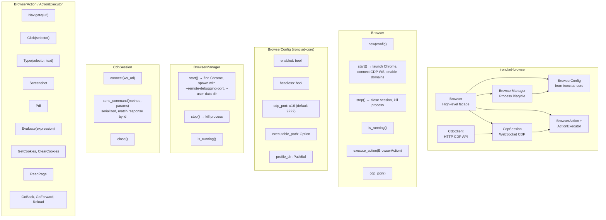

# C4 Level 3: Component Diagram -- ironclad-browser

*Browser automation crate using Chrome/Chromium and the Chrome DevTools Protocol (CDP). Starts and stops the browser process, maintains a WebSocket CDP session to the first page target, and executes high-level actions (navigate, click, type, screenshot, PDF, evaluate JS, cookies, read page, back/forward/reload).*

---

## Component Diagram

## Browser Struct and BrowserConfig

- **Browser**  
  High-level facade that owns a `BrowserManager` (process) and an optional `CdpSession` (WebSocket to the first page target). `start()` launches Chrome via the manager, uses `CdpClient` to list targets and find the page’s `webSocketDebuggerUrl`, then connects a `CdpSession` and enables Page, DOM, Network, Runtime. `execute_action(&BrowserAction)` runs the action against the current session or returns an error if the browser is not started.

- **BrowserConfig**  
  Defined in `ironclad-core` (config): `enabled`, `executable_path`, `headless`, `profile_dir`, `cdp_port`. The browser crate re-exports it and uses it in `Browser::new(config)` and `BrowserManager::new(config)`.

## Browser Automation Capabilities

| Action | CDP / Behavior |
|--------|-----------------|
| **Navigate** | `Page.navigate` to URL |
| **Click** | `Runtime.evaluate` to get element center from selector, then `Input.dispatchMouseEvent` (mousePressed/mouseReleased) |
| **Type** | Focus element via `Runtime.evaluate`, then `Input.insertText` |
| **Screenshot** | `Page.captureScreenshot` (PNG, quality 80) |
| **Pdf** | `Page.printToPDF` (printBackground: true) |
| **Evaluate** | `Runtime.evaluate` with returnByValue |
| **GetCookies** | `Network.getCookies` |
| **ClearCookies** | `Network.clearBrowserCookies` |
| **ReadPage** | `Runtime.evaluate` to return url, title, body innerText (capped), html length |
| **GoBack / GoForward / Reload** | History navigation or `Page.reload` via JS / CDP |

All actions return an `ActionResult` (action name, success, optional data, optional error). The server exposes these via `/api/browser/status`, `/api/browser/start`, `/api/browser/stop`, and `/api/browser/action`.

## Types

| Type | Module | Purpose |
|------|--------|---------|
| `Browser` | `lib.rs` | Facade: config, manager, session; start/stop/execute_action |
| `BrowserConfig` | `ironclad-core` | enabled, executable_path, headless, profile_dir, cdp_port |
| `BrowserManager` | `manager.rs` | Spawn/kill Chrome process; find executable (config or system paths) |
| `CdpClient` | `cdp.rs` | HTTP client to `http://127.0.0.1:{port}/json/*` (list_targets, new_tab, close_tab, version, command builders) |
| `CdpSession` | `session.rs` | WebSocket to one target; send_command(method, params) with response matching |
| `BrowserAction` | `actions.rs` | Enum: Navigate, Click, Type, Screenshot, Pdf, Evaluate, GetCookies, ClearCookies, ReadPage, GoBack, GoForward, Reload |
| `ActionResult` | `actions.rs` | action, success, data, error |
| `ActionExecutor` | `actions.rs` | execute(session, action) → ActionResult |
| `PageInfo`, `ScreenshotResult`, `PageContent` | `lib.rs` | Serialization types for API |

## Dependencies

**External crates**: `serde`, `serde_json`, `tokio`, `tokio-tungstenite`, `futures-util`, `reqwest`

**Internal crates**: `ironclad-core` (Result, IroncladError, BrowserConfig)

**Depended on by**: `ironclad-server` (browser routes and optional tool integration)
