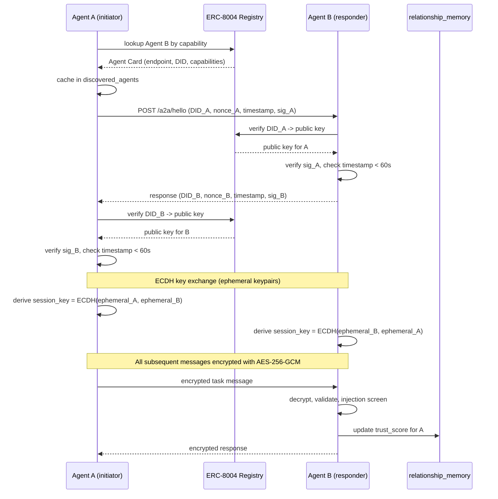

<!-- last_updated: 2026-02-23, version: 0.5.0 -->
# C4 Level 3: Component Diagram -- ironclad-channels

*Channel adapters for user-facing chat platforms and the zero-trust agent-to-agent (A2A) communication protocol.*

---

## Component Diagram

```mermaid
flowchart TB
    subgraph IroncladChannels ["ironclad-channels"]
        ROUTER["router.rs<br/>ChannelRouter"]
        TELEGRAM["telegram.rs<br/>Telegram Bot API"]
        WHATSAPP["whatsapp.rs<br/>WhatsApp Cloud API"]
        WEB["web.rs<br/>WebSocket Interface"]
        A2A["a2a.rs<br/>A2A Protocol (ECDH crypto)"]
        DELIVERY["delivery.rs<br/>Delivery / notification"]
        DISCORD["discord.rs<br/>Discord Gateway +<br/>Slash Commands"]
        SIGNAL["signal.rs<br/>Signal Protocol<br/>(signal-cli daemon)"]
        VOICE["voice.rs<br/>Voice Channel<br/>(WebRTC / STT / TTS)"]
        EMAIL["email.rs<br/>Email Adapter<br/>(IMAP + SMTP)"]
        FILTER["filter.rs<br/>Addressability Filter<br/>(per-channel routing rules)"]
    end

    subgraph TelegramDetail ["telegram.rs"]
        TG_POLL["Long-poll getUpdates<br/>or webhook receiver"]
        TG_PARSE["parse_inbound():<br/>extract text, media refs,<br/>chat_id, user info"]
        TG_FORMAT["format_outbound():<br/>Markdown V2 formatting,<br/>message chunking (4096 char limit),<br/>inline keyboard for actions"]
        TG_SEND["send_message():<br/>POST to Bot API"]
    end

    subgraph WhatsAppDetail ["whatsapp.rs"]
        WA_WEBHOOK["Webhook receiver<br/>(verify token, parse payload)"]
        WA_PARSE["parse_inbound():<br/>extract text, media,<br/>phone number, profile"]
        WA_FORMAT["format_outbound():<br/>WhatsApp message templates,<br/>text formatting"]
        WA_SEND["send_message():<br/>POST to Cloud API"]
    end

    subgraph WebDetail ["web.rs"]
        WS_UPGRADE["WebSocket upgrade handler<br/>(axum ws::WebSocketUpgrade)"]
        WS_RECV["recv_message():<br/>parse JSON frame into<br/>InboundMessage"]
        WS_SEND["send_message():<br/>serialize response<br/>to JSON frame"]
        WS_HEARTBEAT["Ping/pong keepalive"]
    end

    subgraph A2ADetail ["a2a.rs - Zero-Trust Protocol"]
        direction TB
        DISCOVERY["Agent Discovery:<br/>query ERC-8004 registry<br/>on Base, cache agent cards<br/>in discovered_agents table"]
        HELLO["Handshake: POST /a2a/hello<br/>DID + nonce (32 bytes) +<br/>timestamp + signature"]
        VERIFY["Mutual Authentication:<br/>verify signature against<br/>on-chain public key<br/>(ERC-8004 registry lookup)"]
        SESSION_KEY["Session Key Derivation:<br/>x25519-dalek EphemeralSecret/PublicKey,<br/>HKDF -> AES-256-GCM session key"]
        ENCRYPT["Message Encryption:<br/>AES-256-GCM per-message<br/>nonce + HMAC auth tag"]
        VALIDATE["Message Validation:<br/>- timestamp freshness (< 60s)<br/>- size < a2a.max_message_size<br/>- rate limit < a2a.rate_limit_per_peer<br/>- injection defense screening"]
        TRUST_TAG["Trust Tagging:<br/>wrap in peer_agent_input<br/>trust_level=X from<br/>relationship_memory"]
    end

    subgraph SharedTrait ["Shared Channel Trait"]
        CHANNEL_TRAIT["trait ChannelAdapter:<br/>async fn recv() -> InboundMessage<br/>async fn send(OutboundMessage)<br/>fn platform_name() -> &str"]
        INBOUND["InboundMessage:<br/>source, text, media,<br/>platform_metadata"]
        OUTBOUND["OutboundMessage:<br/>text, attachments,<br/>reply_to, format_hints"]
    end

    subgraph DiscordDetail ["discord.rs — Full Gateway Integration"]
        DC_GATEWAY["Discord Gateway:<br/>WebSocket connection,<br/>heartbeat, resume"]
        DC_PARSE["parse_inbound():<br/>extract text, embeds,<br/>guild_id, channel_id"]
        DC_FORMAT["format_outbound():<br/>rich embeds, components,<br/>message chunking (2000 char)"]
        DC_SEND["send_message():<br/>POST to Discord REST API"]
        DC_SLASH["Slash commands:<br/>register, handle interactions"]
    end

    subgraph SignalDetail ["signal.rs"]
        SIG_DAEMON["signal-cli daemon:<br/>JSON-RPC over Unix socket"]
        SIG_PARSE["parse_inbound():<br/>extract text, attachments,<br/>sender phone number"]
        SIG_SEND["send_message():<br/>JSON-RPC send to recipient"]
    end

    subgraph VoiceDetail ["voice.rs"]
        VOICE_RTC["WebRTC session:<br/>audio stream capture"]
        VOICE_STT["STT pipeline:<br/>transcribe audio to text"]
        VOICE_TTS["TTS pipeline:<br/>synthesize response audio"]
    end

    subgraph EmailDetail ["email.rs"]
        EMAIL_IMAP["IMAP listener:<br/>poll inbox for new messages"]
        EMAIL_PARSE["parse_inbound():<br/>extract subject, body,<br/>sender, attachments"]
        EMAIL_SMTP["SMTP sender:<br/>compose and send replies"]
    end

    subgraph FilterDetail ["filter.rs — Addressability Filter"]
        ADDR_RULES["AddressabilityRules:<br/>per-channel include/exclude,<br/>keyword triggers, mention-only"]
        FILTER_APPLY["apply_filter():<br/>evaluate inbound message<br/>against channel rules"]
    end

    TELEGRAM & WHATSAPP & WEB & A2A & DISCORD & SIGNAL & VOICE & EMAIL -.-> CHANNEL_TRAIT
    ROUTER --> FILTER
    FILTER --> DELIVERY
```

## A2A Handshake Sequence

## Dependencies

**External crates**: `reqwest`, WebSocket (platform), `x25519-dalek` (ECDH), `aes-gcm`, `hkdf`, `sha2` (A2A handshake and encryption)

**Internal crates**: `ironclad-core` (types, config)

**Depended on by**: `ironclad-server`
