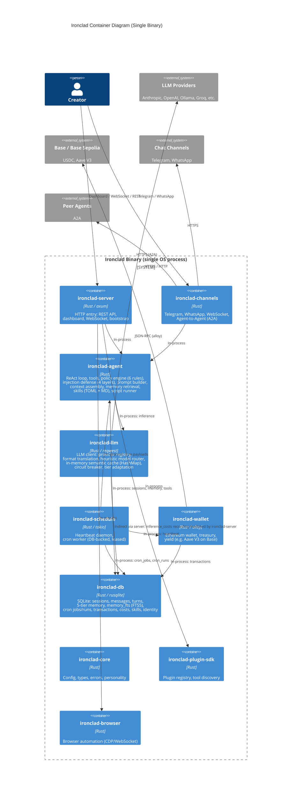

# C4 Level 2: Container Diagram — Ironclad Platform

*All containers run within a single Rust binary (logical separation only). Crate list and dependencies match the workspace.*

---

## Container Diagram

## Crates (Workspace Members)

| Crate | Role | Depends On |
|-------|------|------------|
| `ironclad-core` | Config, types, errors, personality | — |
| `ironclad-db` | SQLite schema, migrations, sessions, memory, FTS, cron, skills, metrics | `ironclad-core` |
| `ironclad-llm` | LLM client, heuristic router, in-memory semantic cache, circuit breaker | `ironclad-core` |
| `ironclad-agent` | Agent loop, tools, policy (6 rules), injection defense, skills | `ironclad-core`, `ironclad-db`, `ironclad-llm` |
| `ironclad-wallet` | Wallet, treasury, yield (Base, Aave V3) | `ironclad-core`, `ironclad-db` |
| `ironclad-schedule` | Heartbeat daemon, cron worker | `ironclad-core`, `ironclad-db`, `ironclad-agent`, `ironclad-wallet` |
| `ironclad-channels` | Telegram, WhatsApp, WebSocket, A2A | `ironclad-core` |
| `ironclad-plugin-sdk` | Plugin registry | `ironclad-core` |
| `ironclad-browser` | Browser automation | `ironclad-core` |
| `ironclad-server` | HTTP server, API, dashboard, CLI, bootstrap | All of the above (except tests) |
| `ironclad-tests` | Integration tests | Multiple crates |

The diagram includes `Rel(schedule, wallet, "In-process: heartbeat")`: ironclad-schedule uses ironclad-wallet for tick context (USDC balance, survival tier).

## Key Corrections (No Drift)

- **Routing**: Heuristic classifier in `ironclad-llm/src/router.rs` (weighted message length, tool calls, depth). No ONNX or ML models. Config `mode` default is `"heuristic"`; `"ml"` is a backward-compat alias for complexity-aware routing.
- **Cache**: In-memory `SemanticCache` in `ironclad-llm/src/cache.rs` (HashMap, L1 exact / L2 semantic n-gram / L3 tool TTL). Not SQLite-backed at runtime.
- **Policy rules**: Six rules in `ironclad-agent/src/policy.rs`: AuthorityRule, CommandSafetyRule, FinancialRule, PathProtectionRule, RateLimitRule, ValidationRule. Server bootstrap wires AuthorityRule and CommandSafetyRule by default.
- **FTS**: `memory_fts` FTS5 virtual table with columns `content`, `category`, `source_table`, `source_id`. Synced via trigger for episodic; working and semantic inserts in `ironclad-db/src/memory.rs`.

## Communication

All inter-container communication is **in-process** on the tokio runtime. No IPC. Single SQLite connection (WAL) shared via `ironclad-db::Database`.
