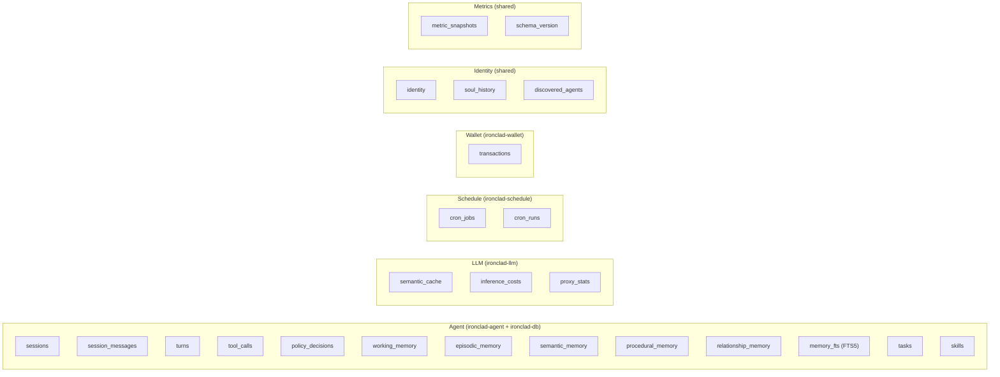

# C4 Level 2: Container Diagram -- Ironclad Platform

*Generated 2026-02-20. All containers run within a single Rust binary -- logical separation only.*

---

## Container Diagram

```mermaid
C4Container
    title Ironclad Container Diagram (Single Binary)

    Person(creator, "Creator")

    System_Boundary(ironclad, "Ironclad Binary (single OS process)") {

        Container(server, "ironclad-server", "Rust / axum", "HTTP entry point: REST API,<br/>static dashboard serving,<br/>WebSocket push for real-time updates")

        Container(channels, "ironclad-channels", "Rust", "Channel adapters: Telegram Bot API,<br/>WhatsApp Cloud API, WebSocket,<br/>Agent-to-Agent (zero-trust A2A)")

        Container(agent, "ironclad-agent", "Rust", "Agent core: ReAct loop state machine,<br/>tool system (trait-based),<br/>policy engine, injection defense (4 layers),<br/>prompt builder (HMAC trust boundaries),<br/>context assembly, memory retrieval/ingestion,<br/>dual-format skill system (TOML + MD),<br/>sandboxed external script execution")

        Container(llm, "ironclad-llm", "Rust / reqwest", "LLM client: persistent connection pool,<br/>format translation (typed enums),<br/>ML model router (ONNX, ~11us),<br/>semantic cache (3-level),<br/>circuit breaker, dedup tracker,<br/>tier-based prompt adaptation")

        Container(schedule, "ironclad-schedule", "Rust / tokio", "Unified scheduler: heartbeat daemon,<br/>cron engine (DB-backed, leased),<br/>built-in heartbeat tasks,<br/>wake signaling (mpsc channel)")

        Container(wallet, "ironclad-wallet", "Rust / alloy-rs", "Financial: Ethereum wallet,<br/>x402 payment protocol,<br/>treasury policy engine,<br/>DeFi yield engine (Aave/Compound)")

        Container(core, "ironclad-core", "Rust", "Shared foundations: types (SurvivalTier,<br/>ApiFormat, ModelTier, RiskLevel,<br/>SkillKind, SkillManifest),<br/>unified config (ironclad.toml parsing),<br/>error types (thiserror)")

        ContainerDb(sqlite, "Unified SQLite", "rusqlite / FTS5", "Single DB: sessions, messages,<br/>turns, tool calls, policy decisions,<br/>5-tier memory + FTS, tasks,<br/>cron jobs/runs, transactions,<br/>inference costs, semantic cache,<br/>identity, soul history, metrics,<br/>discovered agents, skills")
    }

    System_Ext(llmProviders, "LLM Providers", "Anthropic, Google, Moonshot,<br/>OpenAI Codex, Ollama (local)")
    System_Ext(baseChain, "Ethereum Base", "USDC, ERC-8004, DeFi")
    System_Ext(chatChannels, "Chat Channels", "Telegram, WhatsApp")
    System_Ext(peerAgents, "Peer Agents", "A2A-compatible agents")

    Rel(creator, server, "Dashboard / WebSocket / REST API")
    Rel(creator, channels, "Telegram / WhatsApp")
    Rel(server, agent, "In-process function call")
    Rel(channels, agent, "In-process function call")
    Rel(agent, llm, "In-process: inference requests")
    Rel(agent, sqlite, "In-process: sessions, memory, policy, tools")
    Rel(llm, llmProviders, "HTTPS / HTTP (persistent pool)")
    Rel(llm, sqlite, "In-process: semantic cache, inference costs")
    Rel(schedule, agent, "In-process: wake agent loop with payload")
    Rel(schedule, sqlite, "In-process: cron jobs, run history")
    Rel(wallet, baseChain, "JSON-RPC via alloy-rs")
    Rel(wallet, sqlite, "In-process: transactions, identity")
    Rel(channels, peerAgents, "HTTPS (A2A protocol)")
    Rel(channels, chatChannels, "HTTPS (Bot/Cloud API)")
```

## Container Responsibilities

| Container | Crate | Key Modules | Dependencies |
|-----------|-------|-------------|-------------|
| Server | `ironclad-server` | `main.rs`, `api.rs`, `dashboard.rs`, `ws.rs` | All other crates |
| Channels | `ironclad-channels` | `telegram.rs`, `whatsapp.rs`, `web.rs`, `a2a.rs` | `ironclad-core` |
| Agent | `ironclad-agent` | `loop.rs`, `tools.rs`, `policy.rs`, `prompt.rs`, `context.rs`, `injection.rs`, `memory.rs`, `skills.rs`, `script_runner.rs` | `ironclad-core`, `ironclad-db`, `ironclad-llm` |
| LLM | `ironclad-llm` | `client.rs`, `format.rs`, `provider.rs`, `circuit.rs`, `dedup.rs`, `tier.rs`, `router.rs`, `cache.rs` | `ironclad-core` |
| Schedule | `ironclad-schedule` | `heartbeat.rs`, `scheduler.rs`, `tasks.rs` | `ironclad-core`, `ironclad-db`, `ironclad-agent` |
| Wallet | `ironclad-wallet` | `wallet.rs`, `x402.rs`, `treasury.rs`, `yield_engine.rs` | `ironclad-core`, `ironclad-db` |
| Core | `ironclad-core` | `config.rs`, `error.rs`, `types.rs` | None (leaf crate) |
| Database | `ironclad-db` | `schema.rs`, `sessions.rs`, `memory.rs`, `tools.rs`, `policy.rs`, `metrics.rs`, `cron.rs` | `ironclad-core` |

## Communication Model

All inter-container communication is **in-process function calls** on the tokio async runtime. There is:

- **No IPC** between containers (no HTTP, no sockets, no pipes)
- **No serialization boundaries** between containers (shared Rust types)
- **No process coordination** (no PID files, no health checks between components)
- **Single SQLite connection** shared via `Arc<Mutex<Connection>>` with WAL mode for concurrent reads

The only network I/O is to external systems (LLM providers, Ethereum RPC, chat channel APIs, peer agents).

## Database Tables by Container

