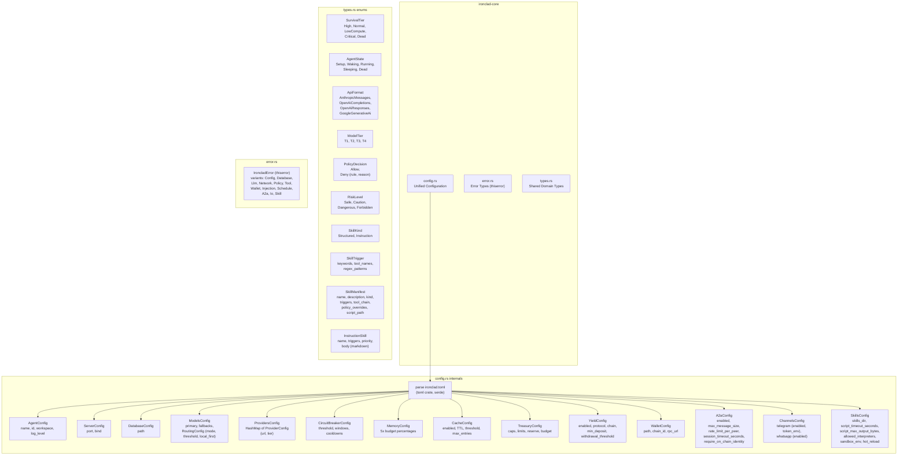

# C4 Level 3: Component Diagram -- ironclad-core

*Leaf crate with zero internal dependencies. Provides shared types, configuration parsing, and error definitions used by every other crate.*

---

## Component Diagram

## Module Responsibilities

| Module | Responsibility | Key Types |
|--------|---------------|-----------|
| `config.rs` | Parse `ironclad.toml` into strongly-typed config structs. Validates at load time (e.g., budget percentages sum to 100, chain_id is valid). | `IroncladConfig`, `AgentConfig`, `ModelsConfig`, `TreasuryConfig`, `A2aConfig`, `SkillsConfig`, etc. |
| `types.rs` | Domain enums and structs shared across crates. All enums are exhaustive -- adding a variant is a compile-time breaking change that forces all consumers to handle it. | `SurvivalTier`, `AgentState`, `ApiFormat`, `ModelTier`, `PolicyDecision`, `RiskLevel`, `SkillKind`, `SkillTrigger`, `SkillManifest`, `InstructionSkill` |
| `error.rs` | Unified error type with `thiserror` derive. Each variant wraps crate-specific errors so the top-level binary can handle them uniformly. | `IroncladError` |

## Dependencies

**External crates**: `serde`, `toml`, `thiserror`

**Internal crates**: None (leaf node in dependency graph)

**Depended on by**: All 7 other crates
