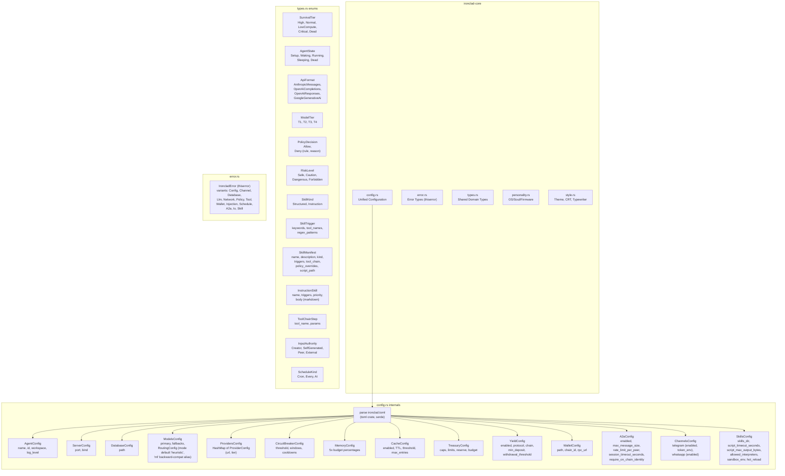

# C4 Level 3: Component Diagram -- ironclad-core

*Leaf crate with zero internal dependencies. Provides shared types, configuration parsing, and error definitions used by every other crate.*

---

## Component Diagram

## Module Responsibilities

| Module | Responsibility | Key Types |
|--------|---------------|-----------|
| `config.rs` | Parse `ironclad.toml` into strongly-typed config structs. **Tilde expansion** applied to `database.path`, `agent.workspace`, `server.log_dir`, `skills.skills_dir`, `wallet.path`, `plugins.dir`, `browser.profile_dir`, `daemon.pid_file`. Validates at load (e.g., memory budget percentages sum to 100, `treasury.per_payment_cap` > 0). | `IroncladConfig`, `AgentConfig`, `ModelsConfig`, `RoutingConfig` (default `mode = "heuristic"`), `TreasuryConfig`, `A2aConfig`, `SkillsConfig`, etc. |
| `types.rs` | Domain enums and structs shared across crates. All enums are exhaustive — adding a variant is a compile-time breaking change. `SurvivalTier::from_balance(usd, hours_below_zero)` derives tier from balance. | `SurvivalTier`, `AgentState`, `ApiFormat`, `ModelTier`, `PolicyDecision`, `RiskLevel`, `SkillKind`, `SkillTrigger`, `SkillManifest`, `ToolChainStep`, `InstructionSkill`, `InputAuthority`, `ScheduleKind` |
| `error.rs` | Unified error type with `thiserror` derive. Each variant wraps crate-specific errors so the top-level binary can handle them uniformly. | `IroncladError` |
| `personality.rs` | Load OS/soul/firmware/operator/directives from workspace; compose identity and firmware text. | `load_os`, `load_firmware`, `compose_identity_text` |
| `style.rs` | Theme (CRT green/orange, terminal), typewriter effect, icons. | `Theme`, `sleep_ms`, `typewrite` |

## Dependencies

**External crates**: `serde`, `toml`, `thiserror`

**Internal crates**: None (leaf node in dependency graph)

**Depended on by**: All 10 other crates
