<!-- last_updated: 2026-02-23, version: 0.5.0 -->
# C4 Level 3: Component Diagram -- ironclad-db

*Database layer providing typed CRUD operations over a single unified SQLite database (rusqlite). All tables, indexes, FTS5 virtual table `memory_fts`, and triggers are defined in `schema.rs`; migrations run from `migrations/` in version order.*

---

## Component Diagram

```mermaid
flowchart TB
    subgraph IroncladDb ["ironclad-db"]
        SCHEMA["schema.rs<br/>Table Definitions +<br/>Migration Runner"]
        SESSIONS["sessions.rs<br/>Session CRUD"]
        MEMORY["memory.rs<br/>5-Tier Memory CRUD"]
        TOOLS["tools.rs<br/>Tool Call Records"]
        POLICY["policy.rs<br/>Policy Decision Records"]
        METRICS["metrics.rs<br/>Metrics + Cost Tracking"]
        CRON["cron.rs<br/>Cron Job State"]
        SKILLS["skills.rs<br/>Skill Definition CRUD"]
        EMBEDDINGS["embeddings.rs<br/>Embedding storage / lookup<br/>(BLOB + JSON fallback)"]
        ANN["ann.rs<br/>HNSW ANN Index<br/>(instant-distance)"]
        CACHE_DB["cache.rs<br/>Semantic Cache Persistence"]
        MIGRATIONS["migrations/<br/>Versioned SQL files"]
        HIPPOCAMPUS["hippocampus.rs<br/>Long-Term Memory<br/>Consolidation"]
        CHECKPOINT["checkpoint.rs<br/>Session Checkpoint +<br/>Restore"]
        BACKEND["backend.rs<br/>Storage Backend<br/>Abstraction"]
        AGENTS["agents.rs<br/>Sub-Agent Registry +<br/>Enabled Agent CRUD"]
    end

    subgraph SchemaDetail ["schema.rs internals"]
        INIT["initialize_db()<br/>Create all tables if not exist"]
        MIGRATE["run_migrations()<br/>Check schema_version table,<br/>apply pending .sql files<br/>in order"]
        CONN_POOL["Connection management<br/>Arc of Mutex of Connection<br/>WAL mode enabled"]
    end

    subgraph SessionsDetail ["sessions.rs"]
        S_FIND["find_or_create(agent_id)"]
        S_GET["get_session(id)"]
        S_APPEND["append_message(session_id, msg)"]
        S_LIST["list_messages(session_id, limit)"]
        S_UPDATE["update_metadata(session_id, json)"]
    end

    subgraph MemoryDetail ["memory.rs"]
        M_WORKING["WorkingMemory CRUD<br/>store, retrieve_by_session,<br/>prune_closed_sessions"]
        M_EPISODIC["EpisodicMemory CRUD<br/>store, retrieve_by_importance,<br/>search_fts, prune_by_threshold"]
        M_SEMANTIC["SemanticMemory CRUD<br/>upsert (category+key unique),<br/>retrieve_by_category,<br/>retrieve_by_confidence"]
        M_PROCEDURAL["ProceduralMemory CRUD<br/>upsert, record_success,<br/>record_failure, retrieve_relevant"]
        M_RELATIONSHIP["RelationshipMemory CRUD<br/>upsert, update_trust_score,<br/>increment_interaction,<br/>retrieve_active_entities"]
        M_FTS["memory_fts (FTS5):<br/>standalone FTS5 table + triggers<br/>syncing episodic/working/semantic inserts"]
    end

    subgraph MetricsDetail ["metrics.rs"]
        INF_COST["record_inference_cost()"]
        INF_QUERY["query_costs(timerange, filters)"]
        CACHE_STATS["record_cache_hit/miss"]
        PROXY_SNAP["store_proxy_snapshot()"]
        METRIC_SNAP["store_metric_snapshot()"]
        TX_RECORD["record_transaction()"]
        TX_QUERY["query_transactions(window)"]
    end

    subgraph CronDetail ["cron.rs"]
        JOB_CRUD["CRUD: create, get, list,<br/>update, delete cron_jobs"]
        LEASE["acquire_lease(job_id, instance_id)<br/>release_lease(job_id)"]
        RUN_LOG["record_run(job_id, status, duration)"]
        NEXT_RUN["calculate_next_run(job)"]
    end

    subgraph SkillsDetail ["skills.rs"]
        SK_REGISTER["register_skill(manifest)"]
        SK_GET["get_skill(id)"]
        SK_LIST["list_skills(filter)"]
        SK_UPDATE["update_skill(id, manifest)"]
        SK_DELETE["delete_skill(id)"]
        SK_TRIGGER["find_by_trigger(context)"]
        SK_HASH["check_content_hash(id, hash)"]
    end

    subgraph IdentityDetail ["identity + discovery"]
        IDENTITY["identity table CRUD<br/>get/set key-value pairs<br/>(ethereum_address, did,<br/>hmac_session_secret, etc.)"]
        DISCOVERED["discovered_agents table CRUD<br/>upsert, lookup_by_did,<br/>search_by_capability,<br/>prune_expired"]
        SOUL["soul_history table CRUD<br/>append, get_current,<br/>get_history"]
    end

    subgraph HippocampusDetail ["hippocampus.rs — Memory Consolidation"]
        HC_CONSOLIDATE["consolidate():<br/>merge short-term episodes<br/>into long-term semantic facts"]
        HC_DECAY["decay_old_memories():<br/>reduce importance scores<br/>over time"]
        HC_PRUNE["prune_below_threshold():<br/>remove low-value memories"]
    end

    subgraph CheckpointDetail ["checkpoint.rs"]
        CP_SAVE["save_checkpoint():<br/>snapshot context, memory<br/>budgets, turn index"]
        CP_RESTORE["restore_checkpoint():<br/>reload session state<br/>from context_snapshots"]
    end

    subgraph BackendDetail ["backend.rs — Storage Abstraction"]
        BACKEND_TRAIT["StorageBackend trait:<br/>open, execute, query"]
        SQLITE_IMPL["SqliteBackend:<br/>rusqlite implementation"]
    end

    subgraph AgentsDetail ["agents.rs"]
        AG_LIST["list_enabled_sub_agents()"]
        AG_REGISTER["register_sub_agent()"]
        AG_TOGGLE["toggle_sub_agent()"]
    end

    SCHEMA --> MIGRATIONS
    SCHEMA --> CONN_POOL
    SCHEMA --> BACKEND
    HIPPOCAMPUS --> MEMORY
    CHECKPOINT --> SESSIONS
```

## Tables Managed

| Table | Module | Row Count Expectation |
|-------|--------|----------------------|
| `schema_version` | `schema.rs` | 1 row per migration |
| `sessions` | `sessions.rs` | Tens |
| `session_messages` | `sessions.rs` | Thousands per session |
| `turns` | `sessions.rs` | Hundreds per session |
| `tool_calls` | `tools.rs` | Thousands |
| `policy_decisions` | `policy.rs` | Thousands |
| `working_memory` | `memory.rs` | Dozens per session |
| `episodic_memory` | `memory.rs` | Thousands (pruned) |
| `semantic_memory` | `memory.rs` | Hundreds |
| `procedural_memory` | `memory.rs` | Dozens |
| `relationship_memory` | `memory.rs` | Dozens |
| `memory_fts` | `memory.rs` | FTS5 virtual table: `content`, `category`, `source_table`, `source_id`. Populated by triggers on `episodic_memory` (episodic_ai, episodic_ad) and explicit INSERT from `store_working`. |
| `tasks` | (schema) | Pending/running/done tasks |
| `cron_jobs` | `cron.rs` | Dozens; lease_holder, lease_expires_at for single-instance execution |
| `cron_runs` | `cron.rs` | History per job |
| `transactions` | (schema) | Financial and yield tx log |
| `inference_costs` | (schema) | Per-request cost tracking |
| `proxy_stats` | (schema) | Snapshot JSON |
| `semantic_cache` | `cache.rs` | Persistent backing store for in-memory cache; loaded on boot, flushed every 5 min |
| `identity` | direct | Key-value (ethereum_address, did, hmac_session_secret, a2a_identity_key, etc.) |
| `soul_history` | direct | Soul content history |
| `metric_snapshots` | (schema) | Alerts and metrics JSON |
| `discovered_agents` | direct | A2A agent card cache (DID, endpoint, trust_score) |
| `delivery_queue` | (schema) | Outbound channel delivery (status, attempts, next_retry_at) |
| `approval_requests` | (schema) | Gated tool approvals (pending/approved/denied, timeout_at) |
| `plugins` | (schema) | Plugin manifests and permissions |
| `embeddings` | `embeddings.rs` | source_table, source_id, embedding_blob (BLOB, ~4x smaller) + embedding_json (legacy fallback); optional HNSW ANN index via `ann.rs` |
| `skills` | `skills.rs` | Dozens |
| `context_snapshots` | `checkpoint.rs` | Snapshots of context state at checkpoint boundaries; used for session restore |
| `turn_feedback` | `metrics.rs` | Per-turn user feedback (thumbs up/down, corrections, rating) |
| `sub_agents` | `agents.rs` | Registered sub-agent configurations and enabled state |

## Dependencies

**External crates**: `rusqlite` (with `bundled` and `fts5` features), `instant-distance` (HNSW ANN index)

**Internal crates**: `ironclad-core` (types, config, errors)

**Depended on by**: `ironclad-agent`, `ironclad-schedule`, `ironclad-wallet`, `ironclad-server`
