# C4 Level 3: Component Diagram -- ironclad-llm

*LLM client layer: HTTP client (reqwest), provider translation (UnifiedRequest/UnifiedResponse), **heuristic** complexity classification and model routing, **in-memory** semantic cache (HashMap), circuit breaker, and deduplication. No ONNX or ML models.*

---

## Component Diagram

```mermaid
flowchart TB
    subgraph IroncladLlm ["ironclad-llm"]
        CACHE["cache.rs<br/>In-Memory SemanticCache<br/>(HashMap)"]
        ROUTER["router.rs<br/>Heuristic Model Router"]
        CIRCUIT["circuit.rs<br/>Circuit Breaker"]
        DEDUP["dedup.rs<br/>In-Flight Dedup"]
        FORMAT["format.rs<br/>API Format Translation"]
        TIER["tier.rs<br/>Tier Adaptation"]
        CLIENT["client.rs<br/>HTTP Client Pool"]
        PROVIDER["provider.rs<br/>Provider Definitions"]
    end

    subgraph CacheDetail ["cache.rs — In-Memory Only (HashMap)"]
        direction LR
        L1["L1: Exact hash<br/>SHA-256(system|msgs|user)"]
        L2["L2: Semantic n-gram<br/>cosine > threshold"]
        L3["L3: Tool TTL<br/>shorter TTL for tools"]
        STORE["store() / store_with_embedding()"]
        EVICT["evict_expired() · evict_lfu()"]
    end

    subgraph RouterDetail ["router.rs"]
        FEATURES["extract_features()<br/>msg len, tool_calls, depth"]
        HEURISTIC["HeuristicBackend<br/>classify_complexity → 0.0–1.0"]
        SELECT["select_for_complexity()<br/>local_first + confidence_threshold"]
        FALLBACK["advance_fallback() / reset()"]
        FEATURES --> HEURISTIC --> SELECT
    end

    subgraph CircuitDetail ["circuit.rs"]
        direction LR
        BREAKER_STATE["Per-provider:<br/>Closed / Open / HalfOpen"]
        RATE_TRIP["Rate trip: threshold in window"]
        CREDIT_TRIP["Credit trip: 401/402/403"]
        BACKOFF["Exponential backoff"]
    end

    subgraph FormatDetail ["format.rs"]
        direction LR
        FMT_ENUM["ApiFormat (4 variants)"]
        XLATE_REQ["translate_request()"]
        XLATE_RESP["translate_response()"]
    end

    subgraph ClientDetail ["client.rs"]
        POOL["Persistent reqwest::Client<br/>HTTP/2, connection reuse"]
        FORWARD["forward_request()"]
        RESP_PROC["process_response()<br/>breaker update + cost tracking"]
        POOL --> FORWARD --> RESP_PROC
    end

    subgraph DedupDetail ["dedup.rs"]
        direction LR
        FINGERPRINT["fingerprint(): SHA-256"]
        TRACK["check_and_track()"]
        RELEASE["release() + TTL eviction"]
    end

    subgraph TierDetail ["tier.rs"]
        direction LR
        ADAPT_T1["T1: condense + strip"]
        ADAPT_T2["T2: preamble + reorder"]
        ADAPT_T3T4["T3/T4: passthrough"]
    end

    CACHE -.->|"hit"| CLIENT
    CACHE -.->|"miss"| ROUTER
    ROUTER --> CIRCUIT
    CIRCUIT --> DEDUP
    DEDUP --> FORMAT
    FORMAT --> TIER
    TIER --> CLIENT
```

## Request Pipeline (in order)

1. **Cache check** (`cache.rs`) — in-memory 3-level lookup (exact hash → tool TTL → semantic n-gram), return on hit
2. **Routing** (`router.rs`) — heuristic `classify_complexity(features)`; `select_for_complexity()` with optional `ProviderRegistry` for `is_local`
3. **Circuit breaker** (`circuit.rs`) — per-provider state (Closed/Open/HalfOpen), configurable threshold/window/cooldown
4. **Dedup** (`dedup.rs`) — in-flight duplicate detection
5. **Format translation** (`format.rs`) — `translate_request(UnifiedRequest, ApiFormat)`, `translate_response(Value, ApiFormat)` → `UnifiedResponse`
6. **Tier adaptation** (`tier.rs`) — tier-based prompt adaptation (T1 strip/condense, T2 preamble, T3/T4 passthrough)
7. **Forward** (`client.rs`) — `forward_request` / `forward_with_provider` (reqwest POST, auth + extra headers)
8. **Response** — back-translate, update breaker, record cost
9. **Cache store** (`cache.rs`) — `store` or `store_with_embedding` in HashMap

## Dependencies

**External crates**: `reqwest` (HTTP client), `sha2` (hashing). **No ONNX or ML runtime.**

**Internal crates**: `ironclad-core` (types, config, errors)

**Depended on by**: `ironclad-agent`, `ironclad-server`
