<!-- last_updated: 2026-02-23, version: 0.5.0 -->
# C4 Level 3: Component Diagram -- ironclad-llm

*LLM client layer: HTTP client (reqwest), provider translation (UnifiedRequest/UnifiedResponse), **heuristic** complexity classification and model routing, semantic cache (in-memory HashMap with SQLite persistence), circuit breaker, deduplication, and multi-provider embedding client. No ONNX or ML models.*

---

## Component Diagram

```mermaid
flowchart TB
    subgraph IroncladLlm ["ironclad-llm"]
        CACHE["cache.rs<br/>SemanticCache<br/>(HashMap + SQLite persist)"]
        ROUTER["router.rs<br/>Heuristic Model Router"]
        CIRCUIT["circuit.rs<br/>Circuit Breaker"]
        DEDUP["dedup.rs<br/>In-Flight Dedup"]
        FORMAT["format.rs<br/>API Format Translation"]
        TIER["tier.rs<br/>Tier Adaptation"]
        CLIENT["client.rs<br/>HTTP Client Pool"]
        PROVIDER["provider.rs<br/>Provider Definitions"]
        EMBEDDING["embedding.rs<br/>Multi-Provider Embedding Client"]
        UNIROUTE["uniroute.rs<br/>Unified Routing<br/>(ModelVector + QueryRequirements)"]
        TIERED["tiered.rs<br/>Tiered Inference<br/>(ConfidenceEvaluator + Escalation)"]
        ML_ROUTER["ml_router.rs<br/>Logistic Backend +<br/>Preference Collector"]
        CASCADE["cascade.rs<br/>Cascade Optimizer<br/>(CascadeStrategy)"]
        CAPACITY["capacity.rs<br/>CapacityTracker<br/>(TPM/RPM limits)"]
        ACCURACY["accuracy.rs<br/>QualityTracker +<br/>Quality-Target Selection"]
        COMPRESSION["compression.rs<br/>PromptCompressor<br/>(token estimation)"]
        OAUTH["oauth.rs<br/>OAuthManager<br/>(token refresh)"]
        TRANSFORM["transform.rs<br/>Request/Response<br/>Transform Pipeline"]
    end

    subgraph CacheDetail ["cache.rs — HashMap + SQLite Persistence"]
        direction LR
        L1["L1: Exact hash<br/>SHA-256(system|msgs|user)"]
        L2["L2: Semantic cosine<br/>(real embeddings or n-gram)"]
        L3["L3: Tool TTL<br/>shorter TTL for tools"]
        STORE["store() / store_with_embedding()"]
        EVICT["evict_expired() · evict_lfu()"]
        PERSIST_C["In-memory: export_entries() / import_entries()<br/>DB layer: save_cache_entry() / load_cache_entries()<br/>(ironclad-db/cache.rs)"]
    end

    subgraph EmbeddingDetail ["embedding.rs — Multi-Provider Embedding"]
        EMBED_CFG["EmbeddingConfig:<br/>base_url, embedding_path, model,<br/>dimensions, format, api_key_env,<br/>auth_header, extra_headers"]
        EMBED_BATCH["embed() / embed_single():<br/>batch to provider endpoint"]
        EMBED_FORMATS["Format translation:<br/>OpenAI, Ollama, Google"]
        EMBED_FALLBACK["fallback_ngram():<br/>char 3-gram hash when<br/>no provider configured"]
    end

    subgraph RouterDetail ["router.rs"]
        FEATURES["extract_features()<br/>msg len, tool_calls, depth"]
        HEURISTIC["HeuristicBackend<br/>classify_complexity → 0.0–1.0"]
        SELECT["select_for_complexity()<br/>local_first + confidence_threshold"]
        FALLBACK["advance_fallback() / reset()"]
        FEATURES --> HEURISTIC --> SELECT
    end

    subgraph CircuitDetail ["circuit.rs"]
        direction LR
        BREAKER_STATE["Per-provider:<br/>Closed / Open / HalfOpen"]
        RATE_TRIP["Rate trip: threshold in window"]
        CREDIT_TRIP["Credit trip: 401/402/403"]
        BACKOFF["Exponential backoff"]
    end

    subgraph FormatDetail ["format.rs"]
        direction LR
        FMT_ENUM["ApiFormat (4 variants)"]
        XLATE_REQ["translate_request()"]
        XLATE_RESP["translate_response()"]
    end

    subgraph ClientDetail ["client.rs"]
        POOL["Persistent reqwest::Client<br/>HTTP/2, connection reuse"]
        FORWARD["forward_request()"]
        RESP_PROC["process_response()<br/>breaker update + cost tracking"]
        POOL --> FORWARD --> RESP_PROC
    end

    subgraph DedupDetail ["dedup.rs"]
        direction LR
        FINGERPRINT["fingerprint(): SHA-256"]
        TRACK["check_and_track()"]
        RELEASE["release() + TTL eviction"]
    end

    subgraph TierDetail ["tier.rs"]
        direction LR
        ADAPT_T1["T1: condense + strip"]
        ADAPT_T2["T2: preamble + reorder"]
        ADAPT_T3T4["T3/T4: passthrough"]
    end

    subgraph UnirouteDetail ["uniroute.rs — Unified Model Selection"]
        MODEL_VEC["ModelVector:<br/>capability dimensions per model"]
        VEC_REG["ModelVectorRegistry:<br/>register, score, rank models"]
        QUERY_REQ["QueryRequirements:<br/>context length, tool support,<br/>quality target"]
    end

    subgraph TieredDetail ["tiered.rs — Tiered Inference"]
        CONF_EVAL["ConfidenceEvaluator:<br/>score response quality"]
        ESCALATION["EscalationTracker:<br/>promote to higher tier<br/>on low confidence"]
        INF_TIER["InferenceTier:<br/>Fast, Standard, Premium"]
    end

    subgraph CascadeDetail ["cascade.rs — Cascade Optimizer"]
        CASC_STRAT["CascadeStrategy:<br/>cheapest-first, fallback chain"]
        CASC_OUTCOME["CascadeOutcome:<br/>accepted tier + cost saved"]
    end

    subgraph CapacityDetail ["capacity.rs"]
        CAP_REG["register(provider, tpm, rpm)"]
        CAP_CHECK["check_capacity() / record_usage()"]
        CAP_WINDOW["Sliding window counters<br/>(60s buckets)"]
    end

    subgraph AccuracyDetail ["accuracy.rs"]
        QUAL_TRACK["QualityTracker:<br/>per-model EMA scoring"]
        QUAL_SELECT["select_for_quality_target():<br/>pick model meeting accuracy floor"]
    end

    subgraph CompressionDetail ["compression.rs"]
        COMPRESS_EST["CompressionEstimate:<br/>original vs compressed tokens"]
        PROMPT_COMP["PromptCompressor:<br/>structural dedup,<br/>reference replacement"]
    end

    CACHE -.->|"hit"| CLIENT
    CACHE -.->|"miss"| ROUTER
    ROUTER --> UNIROUTE
    UNIROUTE --> TIERED
    TIERED --> CASCADE
    CASCADE --> CIRCUIT
    CIRCUIT --> DEDUP
    DEDUP --> FORMAT
    FORMAT --> TRANSFORM
    TRANSFORM --> COMPRESSION
    COMPRESSION --> TIER
    TIER --> CLIENT
    ROUTER --> ML_ROUTER
    CLIENT --> CAPACITY
    CLIENT --> OAUTH
    ACCURACY --> ROUTER
```

## Request Pipeline (in order)

1. **Cache check** (`cache.rs`) — 3-level lookup (exact hash → tool TTL → semantic cosine), return on hit
2. **Routing** (`router.rs`) — heuristic `classify_complexity(features)`; `select_for_complexity()` with optional `ProviderRegistry` for `is_local`
3. **Circuit breaker** (`circuit.rs`) — per-provider state (Closed/Open/HalfOpen), configurable threshold/window/cooldown
4. **Dedup** (`dedup.rs`) — in-flight duplicate detection
5. **Format translation** (`format.rs`) — `translate_request(UnifiedRequest, ApiFormat)`, `translate_response(Value, ApiFormat)` → `UnifiedResponse`
6. **Tier adaptation** (`tier.rs`) — tier-based prompt adaptation (T1 strip/condense, T2 preamble, T3/T4 passthrough)
7. **Forward** (`client.rs`) — `forward_request` / `forward_with_provider` (reqwest POST, auth + extra headers)
8. **Response** — back-translate, update breaker, record cost
9. **Cache store** (`cache.rs`) — `store` or `store_with_embedding` in HashMap; periodically flushed to SQLite

## Embedding Pipeline (used by ironclad-agent for RAG)

1. **Config resolution** (`lib.rs`) — `resolve_embedding_config()` matches `memory.embedding_provider` to a provider with `embedding_path`
2. **Batch embed** (`embedding.rs`) — `embed()` / `embed_single()` send texts to provider (OpenAI/Ollama/Google) or fall back to n-gram
3. **Format translation** (`embedding.rs`) — builds provider-specific request body, parses response (OpenAI `data[].embedding`, Ollama `embeddings[]`, Google `embeddings[].values`)
4. **Graceful fallback** — on network error or missing provider, `fallback_ngram()` produces deterministic char-3-gram hash vectors

## Dependencies

**External crates**: `reqwest` (HTTP client), `sha2` (hashing). **No ONNX or ML runtime.**

**Internal crates**: `ironclad-core` (types, config, errors)

**Depended on by**: `ironclad-agent`, `ironclad-server`
