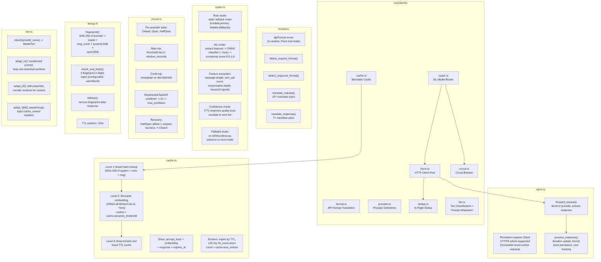

# C4 Level 3: Component Diagram -- ironclad-llm

*LLM client layer handling all inference requests: connection pooling, format translation, ML-based model routing, semantic caching, circuit breaking, deduplication, and tier-based prompt adaptation.*

---

## Component Diagram

## Request Pipeline (in order)

1. **Cache check** (`cache.rs`) -- 3-level lookup, return on hit
2. **ML routing** (`router.rs`) -- classify complexity, select model + provider
3. **Circuit breaker** (`circuit.rs`) -- check provider availability
4. **Dedup** (`dedup.rs`) -- reject duplicate in-flight requests
5. **Format translation** (`format.rs`) -- translate request to provider's API format
6. **Tier adaptation** (`tier.rs`) -- adapt prompt for model tier
7. **Forward** (`client.rs`) -- send via persistent connection pool
8. **Response processing** (`client.rs`) -- back-translate format, update breaker, record cost
9. **Cache store** (`cache.rs`) -- store response for future hits

## Dependencies

**External crates**: `reqwest` (HTTP client), `ort` (ONNX runtime for ML router + embeddings), `sha2` (hashing)

**Internal crates**: `ironclad-core` (types, config, errors)

**Depended on by**: `ironclad-agent`, `ironclad-server`
