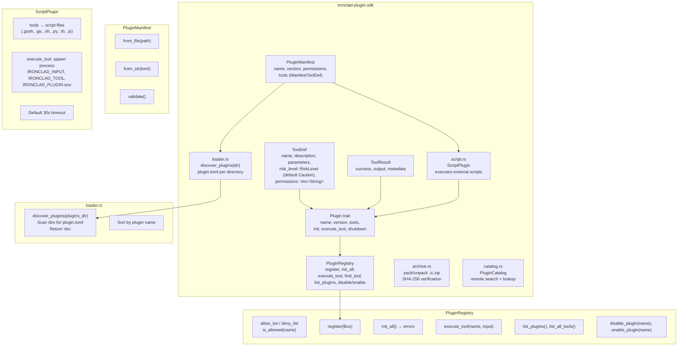
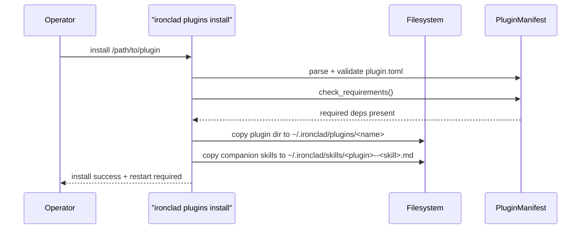
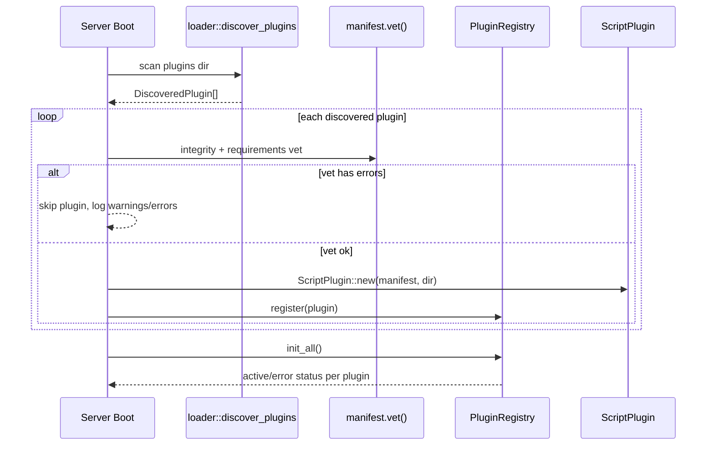
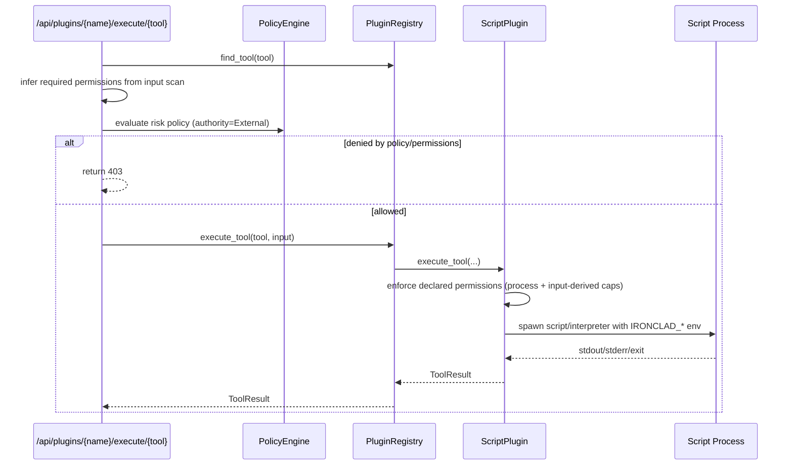

# C4 Level 3: Component Diagram -- ironclad-plugin-sdk

*SDK for defining and running plugins that expose tools to the agent. Plugins are loaded from a directory (one `plugin.toml` per plugin), registered in a central registry, and executed on demand. The built-in `ScriptPlugin` runs external scripts (e.g. `.gosh`, `.py`, `.sh`) per tool. The SDK also provides packaging (`.ic.zip` archives), checksum verification, and remote catalog discovery for plugin distribution.*

---

## Component Diagram

## How Plugins Are Loaded, Registered, and Executed

1. **Discovery**  
   The server (or bootstrap code) calls `discover_plugins(plugins_dir)`. Each subdirectory that contains a `plugin.toml` is parsed into a `PluginManifest`; invalid manifests are skipped with a warning. Results are sorted by plugin name.

2. **Registration**  
   For each `DiscoveredPlugin`, the loader typically builds a `ScriptPlugin::new(manifest, dir)` and passes it to `PluginRegistry::register(Box::new(plugin))`. The registry checks `is_allowed(name)` (allow_list/deny_list); if denied, registration fails. Otherwise the plugin is stored with status `Loaded`.

3. **Initialization**  
   `PluginRegistry::init_all()` is called once after all plugins are registered. Each plugin’s `init()` is run; on success the status becomes `Active`, on failure `Error`. Init errors are collected and returned; the registry does not remove failed plugins.

4. **Execution**  
   When the agent (or API) invokes a tool by name, the server calls `PluginRegistry::execute_tool(tool_name, input)`. The registry finds the first *Active* plugin that declares that tool and calls `plugin.execute_tool(tool_name, input)`. For `ScriptPlugin`, this runs the corresponding script with `IRONCLAD_INPUT` (JSON), `IRONCLAD_TOOL`, and `IRONCLAD_PLUGIN` set; stdout is captured as the result output.

5. **Toggle**  
   `disable_plugin(name)` / `enable_plugin(name)` set status to `Disabled` or `Active`. Disabled plugins are skipped for `execute_tool` and `list_all_tools`.

## Plugin Development Sequences

### 1) Install + Companion Skill Deployment

### 2) Server Startup Registration Path

### 3) Tool Execution + Permission Gates

## Types

| Type | Location | Purpose |
|------|----------|---------|
| `Plugin` | `lib.rs` | Async trait: name, version, tools(), init(), execute_tool(), shutdown() |
| `ToolDef` | `lib.rs` | name, description, parameters (JSON schema), risk_level (RiskLevel, default Caution), permissions (Vec\<String\>) |
| `ToolResult` | `lib.rs` | success, output, optional metadata |
| `PluginStatus` | `lib.rs` | Loaded, Active, Disabled, Error |
| `PluginManifest` | `manifest.rs` | TOML: name, version, description, author, permissions, requirements, companion_skills, tools |
| `ManifestToolDef` | `manifest.rs` | name, description, dangerous |
| `Requirement` | `manifest.rs` | External dependency: name, command, install_hint, optional |
| `PackResult` | `archive.rs` | Result of packing: archive_path, sha256, name, version, file_count |
| `UnpackResult` | `archive.rs` | Result of unpacking: dest_dir, manifest, sha256, file_count |
| `ArchiveError` | `archive.rs` | IO, ZIP, manifest, checksum, path traversal errors |
| `PluginCatalog` | `catalog.rs` | Remote catalog: search(query), find(name) |
| `PluginCatalogEntry` | `catalog.rs` | Catalog entry: name, version, sha256, path, tier |
| `PluginRegistry` | `registry.rs` | In-memory map of plugins, allow/deny lists, init/execute/list/disable/enable |
| `PluginInfo` | `registry.rs` | name, version, status, tools (for API listing) |
| `DiscoveredPlugin` | `loader.rs` | manifest + directory path |
| `ScriptPlugin` | `script.rs` | Plugin impl that runs scripts per tool; interpreters: gosh, go run, python3, ruby, node, sh |

## Dependencies

**External crates**: `async-trait`, `serde`, `serde_json`, `tokio`, `tracing`, `toml`, `zip`, `sha2`, `hex`, `thiserror`

**Internal crates**: `ironclad-core` (Result, IroncladError, config)

**Depended on by**: `ironclad-server` (wires discovery, registry, and `/api/plugins/*`). Note: `ironclad-agent` does NOT directly depend on `ironclad-plugin-sdk`; plugin-to-agent integration is server-mediated.
