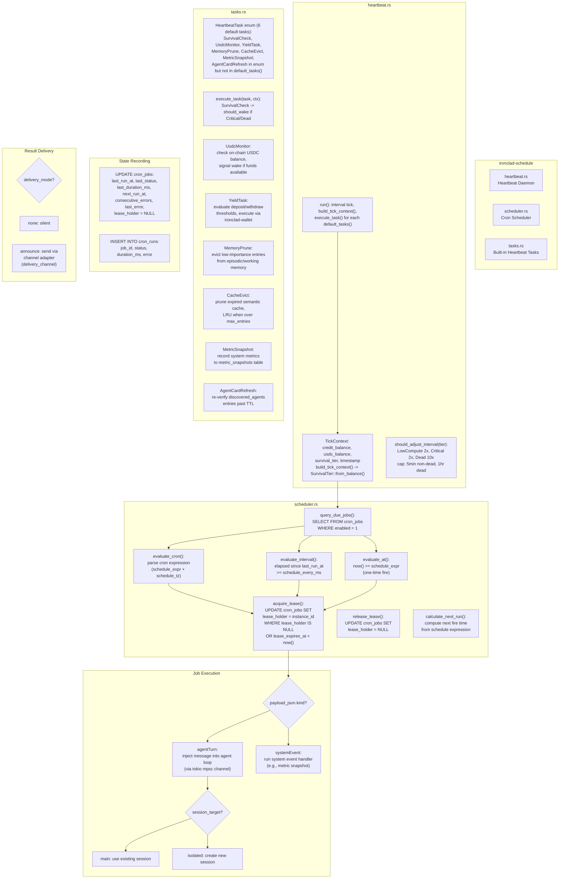
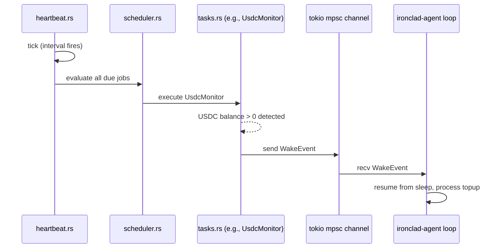

# C4 Level 3: Component Diagram -- ironclad-schedule

*Heartbeat daemon (SurvivalTier-based interval adjustment) and durable cron worker. **run_heartbeat** and **run_cron_worker** in lib.rs; HeartbeatDaemon + TickContext in heartbeat.rs; DurableScheduler (cron/interval/at evaluation) in scheduler.rs; default_tasks() and HeartbeatTask enum in tasks.rs.*

---

## Component Diagram

## Wake Signal Flow

## Dependencies

**External crates**: `tokio`, `chrono` (cron/interval/at time parsing). No separate cron crate — DurableScheduler uses chrono for expression evaluation.

**Internal crates**: `ironclad-core`, `ironclad-db`, `ironclad-agent`, `ironclad-wallet`

**Depended on by**: `ironclad-server`
