<!-- last_updated: 2026-02-23, version: 0.5.0 -->
# C4 Level 3: Component Diagram -- ironclad-server

*Top-level binary crate that wires all other crates together: HTTP server (axum), REST API, embedded dashboard, WebSocket push, and application bootstrap.*

---

## Component Diagram

```mermaid
flowchart TB
    subgraph IroncladServer ["ironclad-server"]
        MAIN["main.rs<br/>Entry Point + Bootstrap"]
        API["api/routes/<br/>REST API (build_router)"]
        DASHBOARD["dashboard.rs<br/>Dashboard Serving"]
        WS["ws.rs<br/>WebSocket Push"]
        CLI["cli/<br/>CLI Commands"]
    end

    subgraph MainDetail ["main.rs - Bootstrap Sequence"]
        BOOT_1["1. Parse CLI args"]
        BOOT_2["2. Load ironclad.toml (ironclad-core)"]
        BOOT_3["3. Initialize SQLite DB +<br/>run migrations (ironclad-db)"]
        BOOT_4["4. Load/generate wallet (ironclad-wallet)"]
        BOOT_5["5. Generate cryptographic HMAC secret<br/>(OsRng, 32 bytes)"]
        BOOT_6["6. Initialize LLM client pool +<br/>heuristic router + embedding client<br/>(ironclad-llm)"]
        BOOT_6B["6b. Load persisted semantic cache<br/>from SQLite (ironclad-db/cache.rs)"]
        BOOT_7["7. Initialize agent loop +<br/>tool registry + MemoryRetriever<br/>(ironclad-agent)"]
        BOOT_8["8. Skills loaded on demand<br/>via POST /api/skills/reload"]
        BOOT_9["9. Start heartbeat daemon +<br/>cron scheduler (ironclad-schedule)"]
        BOOT_10["10. Start channel adapters<br/>(ironclad-channels)"]
        BOOT_11["11. Start axum HTTP server"]
        BOOT_12["12. Await shutdown signal<br/>(SIGTERM / SIGINT)"]

        BOOT_1 --> BOOT_2 --> BOOT_3 --> BOOT_4 --> BOOT_5 --> BOOT_6 --> BOOT_6B --> BOOT_7 --> BOOT_8 --> BOOT_9 --> BOOT_10 --> BOOT_11 --> BOOT_12
    end

    subgraph ApiDetail ["api/routes/ - REST API (build_router)"]
        direction TB
        SESSIONS_API["GET /api/sessions<br/>POST /api/sessions<br/>GET /api/sessions/{id}<br/>GET /api/sessions/{id}/messages<br/>POST /api/sessions/{id}/messages"]
        MEMORY_API["GET /api/memory/working/{session_id}<br/>GET /api/memory/episodic<br/>GET /api/memory/semantic/{category}<br/>GET /api/memory/search?q="]
        CRON_API["GET /api/cron/jobs<br/>POST /api/cron/jobs<br/>GET /api/cron/jobs/{id}<br/>DELETE /api/cron/jobs/{id}"]
        STATS_API["GET /api/stats/costs<br/>GET /api/stats/transactions<br/>GET /api/stats/cache"]
        BREAKER_API["GET /api/breaker/status<br/>POST /api/breaker/reset/{provider}"]
        HEALTH_API["GET /api/health"]
        AGENT_API["GET /api/agent/status<br/>POST /api/agent/message"]
        LOGS_API["GET /api/logs"]
        PLUGINS_API["GET /api/plugins<br/>PUT /api/plugins/{name}/toggle<br/>POST /api/plugins/{name}/execute/{tool}"]
        BROWSER_API["GET /api/browser/status<br/>POST /api/browser/start<br/>POST /api/browser/stop<br/>POST /api/browser/action"]
        AGENTS_API["GET /api/agents<br/>POST /api/agents/{id}/start<br/>POST /api/agents/{id}/stop"]
        WALLET_API["GET /api/wallet/balance<br/>GET /api/wallet/address"]
        CONFIG_API["GET /api/config<br/>PUT /api/config"]
        A2A_API["POST /api/a2a/hello"]
        SKILLS_API["GET /api/skills<br/>GET /api/skills/{id}<br/>POST /api/skills/reload<br/>PUT /api/skills/{id}/toggle"]
        WEBHOOKS_API["POST /api/webhooks/telegram<br/>GET /api/webhooks/whatsapp (verify)<br/>POST /api/webhooks/whatsapp"]
        CHANNELS_API["GET /api/channels/status"]
        WORKSPACE_API["GET /api/workspace/state"]
        TURNS_API["GET /api/sessions/{id}/turns<br/>GET /api/turns/{turn_id}<br/>(v0.5.0)"]
        FEEDBACK_API["POST /api/turns/{turn_id}/feedback<br/>GET /api/feedback/summary<br/>(v0.5.0)"]
        EFFICIENCY_API["GET /api/stats/efficiency<br/>GET /api/stats/efficiency/trends<br/>(v0.5.0)"]
        RECOMMENDATIONS_API["GET /api/agent/recommendations<br/>POST /api/agent/recommendations/{id}/apply<br/>(v0.5.0)"]
        STREAMING_API["GET /api/agent/stream<br/>POST /api/agent/message/stream<br/>(v0.5.0 — SSE streaming)"]
    end

    subgraph DashboardDetail ["dashboard.rs"]
        STATIC_SERVE["Serve static assets from<br/>embedded static/ directory<br/>(include_dir! at compile time<br/>or filesystem fallback)"]
        SPA_FALLBACK["SPA fallback: all non-API<br/>routes serve index.html"]
        PAGES["Dashboard pages:<br/>- Overview (stats, health)<br/>- Sessions (browse, messages)<br/>- Memory (5-tier browser)<br/>- Scheduler (cron jobs, runs)<br/>- Financial (balance, transactions)<br/>- Agents (A2A peers, trust scores)<br/>- Settings (config, breaker)"]
    end

    subgraph WsDetail ["ws.rs - WebSocket Push"]
        WS_UPGRADE_S["WebSocket upgrade<br/>(axum::extract::ws)"]
        BROADCAST["broadcast_to_subscribers():<br/>push events on:<br/>- new turn completed<br/>- tool call executed<br/>- cron job fired<br/>- balance change<br/>- A2A message received<br/>- alert triggered"]
        EVENT_BUS["Event bus:<br/>tokio::broadcast channel<br/>All components publish events<br/>ws.rs subscribes and pushes"]
    end

    MAIN --> API & DASHBOARD & WS & CLI
```

## API Route Map

*Derived from `crates/ironclad-server/src/api/routes/mod.rs` `build_router()`.*

| Method | Path | Handler | Crate |
|--------|------|---------|-------|
| GET | `/` | Dashboard | `ironclad-server` |
| GET | `/.well-known/agent.json` | A2A agent card (discovery) | `ironclad-channels` |
| GET | `/api/health` | Quick health check | `ironclad-server` |
| GET | `/api/config` | Current configuration | `ironclad-core` |
| PUT | `/api/config` | Update config | `ironclad-core` |
| GET | `/api/logs` | Recent log entries (lines, level filter) | `ironclad-server` |
| GET | `/api/sessions` | List sessions | `ironclad-db` |
| POST | `/api/sessions` | Create session | `ironclad-db` |
| GET | `/api/sessions/{id}` | Get session | `ironclad-db` |
| GET | `/api/sessions/{id}/messages` | Session message history | `ironclad-db` |
| POST | `/api/sessions/{id}/messages` | Post message to session | `ironclad-agent` |
| GET | `/api/memory/working/{session_id}` | Working memory | `ironclad-db` |
| GET | `/api/memory/episodic` | Episodic memory | `ironclad-db` |
| GET | `/api/memory/semantic/{category}` | Semantic memory by category | `ironclad-db` |
| GET | `/api/memory/search` | Full-text memory search | `ironclad-db` |
| GET | `/api/cron/jobs` | List cron jobs | `ironclad-db` |
| POST | `/api/cron/jobs` | Create cron job | `ironclad-db` |
| GET | `/api/cron/jobs/{id}` | Get cron job | `ironclad-db` |
| DELETE | `/api/cron/jobs/{id}` | Delete cron job | `ironclad-db` |
| GET | `/api/stats/costs` | Inference cost history | `ironclad-db` |
| GET | `/api/stats/transactions` | Transaction history | `ironclad-db` |
| GET | `/api/stats/cache` | Cache hit/miss stats | `ironclad-llm` |
| GET | `/api/breaker/status` | Circuit breaker states | `ironclad-llm` |
| POST | `/api/breaker/reset/{provider}` | Reset provider breaker | `ironclad-llm` |
| GET | `/api/agent/status` | Agent status | `ironclad-agent` |
| POST | `/api/agent/message` | Send message through RAG pipeline (embed → retrieve → context → LLM → ingest) | `ironclad-agent`, `ironclad-llm`, `ironclad-db` |
| GET | `/api/wallet/balance` | USDC + credit balance | `ironclad-wallet` |
| GET | `/api/wallet/address` | Wallet address | `ironclad-wallet` |
| GET | `/api/skills` | List all registered skills | `ironclad-db` |
| GET | `/api/skills/{id}` | Skill detail + content | `ironclad-db` |
| POST | `/api/skills/reload` | Reload skills from disk | `ironclad-agent` |
| PUT | `/api/skills/{id}/toggle` | Enable/disable a skill | `ironclad-db` |
| GET | `/api/plugins` | List registered plugins and tools | `ironclad-plugin-sdk` |
| PUT | `/api/plugins/{name}/toggle` | Enable/disable a plugin | `ironclad-plugin-sdk` |
| POST | `/api/plugins/{name}/execute/{tool}` | Execute a plugin tool | `ironclad-plugin-sdk` |
| GET | `/api/browser/status` | Browser running state | `ironclad-browser` |
| POST | `/api/browser/start` | Start Chrome/Chromium with CDP | `ironclad-browser` |
| POST | `/api/browser/stop` | Stop browser process | `ironclad-browser` |
| POST | `/api/browser/action` | Run browser action | `ironclad-browser` |
| GET | `/api/agents` | List configured/known agents | `ironclad-server` |
| POST | `/api/agents/{id}/start` | Start agent by id | `ironclad-server` |
| POST | `/api/agents/{id}/stop` | Stop agent by id | `ironclad-server` |
| GET | `/api/workspace/state` | Workspace state | `ironclad-server` |
| POST | `/api/a2a/hello` | A2A handshake initiation | `ironclad-channels` |
| POST | `/api/webhooks/telegram` | Telegram webhook | `ironclad-channels` |
| GET | `/api/webhooks/whatsapp` | WhatsApp webhook verify | `ironclad-channels` |
| POST | `/api/webhooks/whatsapp` | WhatsApp webhook | `ironclad-channels` |
| GET | `/api/channels/status` | Channel adapters status | `ironclad-channels` |
| GET | `/api/sessions/{id}/turns` | List turns for a session | `ironclad-db` |
| GET | `/api/turns/{turn_id}` | Get turn detail with tool calls | `ironclad-db` |
| POST | `/api/turns/{turn_id}/feedback` | Submit feedback on a turn | `ironclad-db` |
| GET | `/api/feedback/summary` | Aggregated feedback metrics | `ironclad-db` |
| GET | `/api/stats/efficiency` | Current efficiency metrics | `ironclad-db` |
| GET | `/api/stats/efficiency/trends` | Efficiency trends over time | `ironclad-db` |
| GET | `/api/agent/recommendations` | Proactive recommendations | `ironclad-agent` |
| POST | `/api/agent/recommendations/{id}/apply` | Apply a recommendation | `ironclad-agent` |
| GET | `/api/agent/stream` | SSE event stream (live) | `ironclad-server` |
| POST | `/api/agent/message/stream` | Send message with SSE streaming response | `ironclad-agent`, `ironclad-llm` |

## Server Module Layout

| Path | Responsibility |
|------|----------------|
| `main.rs` | CLI (clap), bootstrap, serve loop |
| `lib.rs` | Bootstrap app (config, db, wallet, llm, embedding, cache load, agent, retriever, router, dashboard, ws, cache flush daemon) |
| `api/mod.rs` | API mount, shared state |
| `api/routes/mod.rs` | `build_router()`, AppState, route table |
| `api/routes/admin.rs` | Config, wallet, browser, agents, workspace, a2a, plugins |
| `api/routes/agent.rs` | Agent status, message |
| `api/routes/channels.rs` | Channels status, webhooks (telegram, whatsapp) |
| `api/routes/cron.rs` | Cron jobs CRUD |
| `api/routes/health.rs` | Health, logs |
| `api/routes/memory.rs` | Memory endpoints |
| `api/routes/sessions.rs` | Sessions CRUD, messages |
| `api/routes/skills.rs` | Skills list, get, reload, toggle |
| `cli/mod.rs` | Theme, CLI helpers |
| `cli/*.rs` | admin, wallet, schedule, memory, sessions, status, etc. |
| `dashboard.rs` | Dashboard handler, static/SPA |
| `ws.rs` | WebSocket, event bus |
| `auth.rs` | API key layer |
| `rate_limit.rs` | Global + per-IP rate limiting middleware |
| `daemon.rs` | Daemon install/status/uninstall |
| `migrate/*.rs` | Migration, skill import/export |
| `plugins.rs` | Plugin loading |

## CLI Commands (main.rs)

*Lifecycle*: `serve` (start), `init`, `setup`, `check`, `version`, `update`  
*Operations*: `status`, `mechanic`, `logs`, `circuit` (status/reset)  
*Data*: `sessions` (list/show/create/export), `memory` (list/search), `skills` (list/show/reload/import/export), `schedule` (list), `metrics` (costs/transactions/cache), `wallet` (show/address/balance)  
*Configuration*: `config` (show/get/set/unset), `models` (list/scan), `plugins` (list/info/install/uninstall/enable/disable), `agents` (list/start/stop), `channels` (list), `security` (audit)  
*Migration*: `migrate` (import/export)  
*System*: `daemon` (install/status/uninstall), `web`, `reset`, `uninstall`, `completion`

## Dependencies

**External crates**: `axum` (HTTP framework), `tower` (middleware), `tokio` (async runtime), `clap` (CLI)

**Internal crates**: All workspace crates (core, db, llm, agent, wallet, schedule, channels, plugin-sdk, browser); this is the top-level assembly point.

**Depended on by**: None (binary crate, top of dependency graph)
