# C4 Level 3: Component Diagram -- ironclad-server

*Top-level binary crate that wires all other crates together: HTTP server (axum), REST API, embedded dashboard, WebSocket push, and application bootstrap.*

---

## Component Diagram

```mermaid
flowchart TB
    subgraph IroncladServer ["ironclad-server"]
        MAIN["main.rs<br/>Entry Point + Bootstrap"]
        API["api.rs<br/>REST API Routes"]
        DASHBOARD["dashboard.rs<br/>Dashboard Serving"]
        WS["ws.rs<br/>WebSocket Push"]
    end

    subgraph MainDetail ["main.rs - Bootstrap Sequence"]
        BOOT_1["1. Parse CLI args"]
        BOOT_2["2. Load ironclad.toml (ironclad-core)"]
        BOOT_3["3. Initialize SQLite DB +<br/>run migrations (ironclad-db)"]
        BOOT_4["4. Load/generate wallet (ironclad-wallet)"]
        BOOT_5["5. Bootstrap identity table<br/>(ethereum_address, did,<br/>hmac_session_secret)"]
        BOOT_6["6. Initialize LLM client pool +<br/>ML router (ironclad-llm)"]
        BOOT_7["7. Initialize agent loop +<br/>tool registry (ironclad-agent)"]
        BOOT_8["8. Load skills from disk +<br/>register script tools<br/>(ironclad-agent/skills.rs)"]
        BOOT_9["9. Start heartbeat daemon +<br/>cron scheduler (ironclad-schedule)"]
        BOOT_10["10. Start channel adapters<br/>(ironclad-channels)"]
        BOOT_11["11. Start axum HTTP server"]
        BOOT_12["12. Await shutdown signal<br/>(SIGTERM / SIGINT)"]

        BOOT_1 --> BOOT_2 --> BOOT_3 --> BOOT_4 --> BOOT_5 --> BOOT_6 --> BOOT_7 --> BOOT_8 --> BOOT_9 --> BOOT_10 --> BOOT_11 --> BOOT_12
    end

    subgraph ApiDetail ["api.rs - REST API"]
        direction TB
        SESSIONS_API["GET /api/sessions<br/>GET /api/sessions/:id/messages<br/>POST /api/sessions/:id/inject"]
        MEMORY_API["GET /api/memory/:tier<br/>GET /api/memory/search?q="]
        CRON_API["GET /api/cron/jobs<br/>PUT /api/cron/jobs/:id<br/>POST /api/cron/jobs/:id/trigger"]
        STATS_API["GET /api/stats<br/>GET /api/stats/costs<br/>GET /api/stats/cache"]
        BREAKER_API["GET /api/breaker/status<br/>POST /api/breaker/reset/:provider"]
        HEALTH_API["GET /api/health<br/>GET /api/health/deep"]
        AGENT_API["POST /api/agent/wake<br/>POST /api/agent/sleep<br/>GET /api/agent/state"]
        WALLET_API["GET /api/wallet/balance<br/>GET /api/wallet/transactions<br/>GET /api/wallet/yield"]
        CONFIG_API["GET /api/config<br/>PUT /api/config/models"]
        A2A_API["POST /a2a/hello<br/>POST /a2a/message"]
        SKILLS_API["GET /api/skills<br/>GET /api/skills/:id<br/>POST /api/skills/reload<br/>PUT /api/skills/:id/toggle"]
    end

    subgraph DashboardDetail ["dashboard.rs"]
        STATIC_SERVE["Serve static assets from<br/>embedded static/ directory<br/>(include_dir! at compile time<br/>or filesystem fallback)"]
        SPA_FALLBACK["SPA fallback: all non-API<br/>routes serve index.html"]
        PAGES["Dashboard pages:<br/>- Overview (stats, health)<br/>- Sessions (browse, inject)<br/>- Memory (5-tier browser)<br/>- Scheduler (cron jobs, runs)<br/>- Financial (balance, transactions, yield)<br/>- Agents (A2A peers, trust scores)<br/>- Settings (config, breaker)"]
    end

    subgraph WsDetail ["ws.rs - WebSocket Push"]
        WS_UPGRADE_S["WebSocket upgrade<br/>(axum::extract::ws)"]
        BROADCAST["broadcast_to_subscribers():<br/>push events on:<br/>- new turn completed<br/>- tool call executed<br/>- cron job fired<br/>- balance change<br/>- A2A message received<br/>- alert triggered"]
        EVENT_BUS["Event bus:<br/>tokio::broadcast channel<br/>All components publish events<br/>ws.rs subscribes and pushes"]
    end

    MAIN --> API & DASHBOARD & WS
```

## API Route Map

| Method | Path | Handler | Crate |
|--------|------|---------|-------|
| GET | `/api/health` | Quick health check | `ironclad-server` |
| GET | `/api/health/deep` | DB + provider connectivity | `ironclad-server`, `ironclad-db`, `ironclad-llm` |
| GET | `/api/sessions` | List sessions | `ironclad-db` |
| GET | `/api/sessions/:id/messages` | Session message history | `ironclad-db` |
| POST | `/api/sessions/:id/inject` | Inject message into session | `ironclad-agent` |
| GET | `/api/memory/:tier` | Browse memory tier | `ironclad-db` |
| GET | `/api/memory/search` | Full-text memory search | `ironclad-db` |
| GET | `/api/cron/jobs` | List cron jobs | `ironclad-db` |
| PUT | `/api/cron/jobs/:id` | Update cron job | `ironclad-db` |
| POST | `/api/cron/jobs/:id/trigger` | Manually trigger job | `ironclad-schedule` |
| GET | `/api/stats` | Current statistics | `ironclad-db` |
| GET | `/api/stats/costs` | Inference cost history | `ironclad-db` |
| GET | `/api/stats/cache` | Cache hit/miss stats | `ironclad-llm` |
| GET | `/api/breaker/status` | Circuit breaker states | `ironclad-llm` |
| POST | `/api/breaker/reset/:provider` | Reset provider breaker | `ironclad-llm` |
| POST | `/api/agent/wake` | Wake agent from sleep | `ironclad-agent` |
| POST | `/api/agent/sleep` | Put agent to sleep | `ironclad-agent` |
| GET | `/api/agent/state` | Current agent state | `ironclad-agent` |
| GET | `/api/wallet/balance` | USDC + credit balance | `ironclad-wallet` |
| GET | `/api/wallet/transactions` | Transaction history | `ironclad-db` |
| GET | `/api/wallet/yield` | Yield status + earnings | `ironclad-wallet` |
| GET | `/api/config` | Current configuration | `ironclad-core` |
| PUT | `/api/config/models` | Update model config | `ironclad-core`, `ironclad-llm` |
| POST | `/a2a/hello` | A2A handshake initiation | `ironclad-channels` |
| POST | `/a2a/message` | A2A encrypted message | `ironclad-channels` |
| GET | `/api/skills` | List all registered skills | `ironclad-db` |
| GET | `/api/skills/:id` | Skill detail + content | `ironclad-db` |
| POST | `/api/skills/reload` | Trigger hot-reload from disk | `ironclad-agent` |
| PUT | `/api/skills/:id/toggle` | Enable/disable a skill | `ironclad-db` |

## Dependencies

**External crates**: `axum` (HTTP framework), `tower` (middleware), `tokio` (async runtime)

**Internal crates**: All 7 other crates (this is the top-level assembly point)

**Depended on by**: None (binary crate, top of dependency graph)
