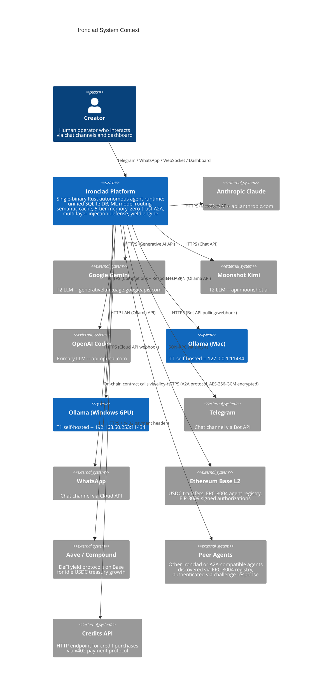

# C4 Level 1: System Context -- Ironclad Platform

*Generated 2026-02-20. Describes the Ironclad autonomous agent runtime and its external dependencies.*

---

## System Context Diagram

## External Systems Summary

| System | Protocol | Purpose | Auth |
|--------|----------|---------|------|
| Anthropic Claude | HTTPS | T3 LLM inference | API key (env var) |
| Google Gemini | HTTPS | T2 LLM inference | API key (env var) |
| Moonshot Kimi | HTTPS | T2 LLM inference | API key (env var) |
| OpenAI Codex | HTTPS | Primary LLM inference | API key (env var) |
| Ollama (Mac) | HTTP | T1 local inference | None (localhost) |
| Ollama (GPU) | HTTP | T1 local inference | None (LAN) |
| Telegram | HTTPS | User chat channel | Bot token (env var) |
| WhatsApp | HTTPS | User chat channel | Cloud API token (env var) |
| Ethereum Base | JSON-RPC | USDC, ERC-8004, yield | Wallet private key (file) |
| Aave / Compound | On-chain | Yield on idle USDC | Wallet private key (file) |
| Peer Agents | HTTPS | A2A task delegation | ECDH session keys + ERC-8004 identity |
| Credits API | HTTPS | x402 credit purchases | EIP-3009 signed authorization |

## Key Boundaries

- **Single process boundary**: Ironclad is one OS process. All internal communication is in-process function calls -- no IPC, no serialization boundaries.
- **Network boundary**: All external systems are accessed over HTTP/HTTPS or JSON-RPC. The only local-network connections are to Ollama instances.
- **Trust boundary**: Creator messages have full authority. Peer agent messages are wrapped in trust-tagged boundaries and processed with reduced authority. All external input passes through the 4-layer injection defense pipeline.
- **Financial boundary**: On-chain operations (USDC transfers, yield deposits/withdrawals) are guarded by the treasury policy engine with per-payment, hourly, and daily limits.
