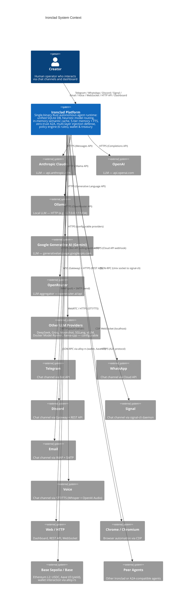

# C4 Level 1: System Context — Ironclad Platform

*Describes the Ironclad autonomous agent runtime and its external boundaries. Aligned with actual codebase (lib.rs, main.rs).*

---

## System Context Diagram

## External Systems Summary

| System | Protocol | Purpose | Auth |
|--------|----------|---------|------|
| Anthropic Claude | HTTPS | LLM inference | API key (env) |
| OpenAI | HTTPS | LLM inference | API key (env) |
| Ollama | HTTP | Local LLM inference | None (localhost/LAN) |
| Google Gemini | HTTPS | LLM inference | API key (env) |
| OpenRouter | HTTPS | LLM aggregator | API key (env) |
| Other LLM Providers | HTTPS | LLM inference (DeepSeek, Groq, Moonshot, SGLang, vLLM, Docker Model Runner, llama-cpp) | API key (env) or none (local) |
| Telegram | HTTPS | User chat channel | Bot token (env) |
| WhatsApp | HTTPS | User chat channel | Cloud API token (env) |
| Discord | WSS + HTTPS | User chat channel | Bot token (env) |
| Signal | JSON-RPC | User chat channel | signal-cli daemon |
| Email | IMAP + SMTP | User chat channel | IMAP/SMTP credentials (env) |
| Voice | WebRTC / HTTPS | User chat channel (STT/TTS) | API key (env) |
| Web / Dashboard | HTTP | REST API, WebSocket, UI | Optional API key |
| Chrome / Chromium | CDP WebSocket | Browser automation | None (localhost) |
| Base (Sepolia/Mainnet) | JSON-RPC | Wallet, USDC, Aave V3 yield | Wallet key (file) |
| Peer Agents | HTTPS | A2A task delegation | A2A identity / challenge-response |

## Key Boundaries

- **Single process**: Ironclad is one OS process. All internal communication is in-process (no IPC).
- **Network boundary**: External systems are reached over HTTP/HTTPS or JSON-RPC.
- **Trust boundary**: Creator input has full authority; peer/external input is constrained by the policy engine (AuthorityRule, CommandSafetyRule, etc.) and 4-layer injection defense.
- **Financial boundary**: On-chain operations (USDC, yield) are guarded by treasury policy and wallet service (ironclad-wallet).

## References

- Entry and bootstrap: `crates/ironclad-server/src/main.rs`, `crates/ironclad-server/src/lib.rs`
- Channels: `ironclad-channels` (Telegram, WhatsApp, Discord, Signal, Email, Voice, WebSocket, A2A)
- Browser: `ironclad-browser` (Chrome/Chromium via CDP)
- Wallet / Base: `ironclad-wallet` (alloy-rs, Aave V3 on Base Sepolia)
