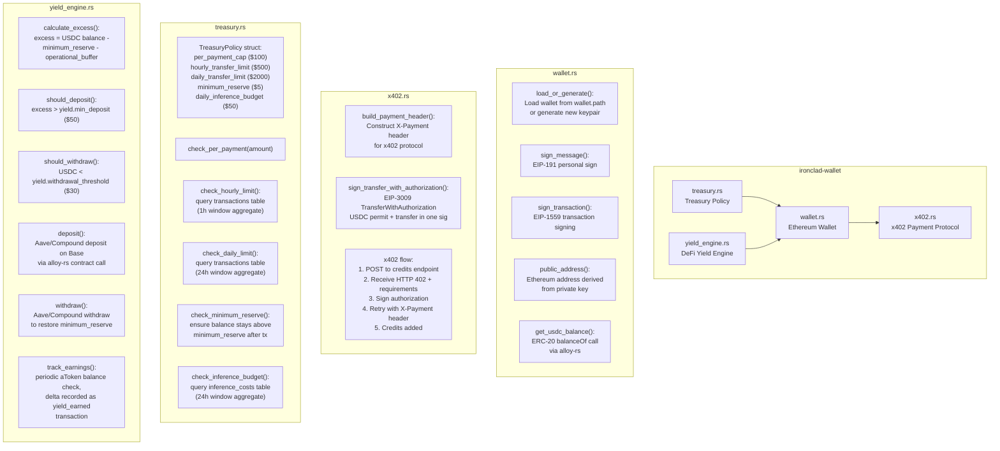
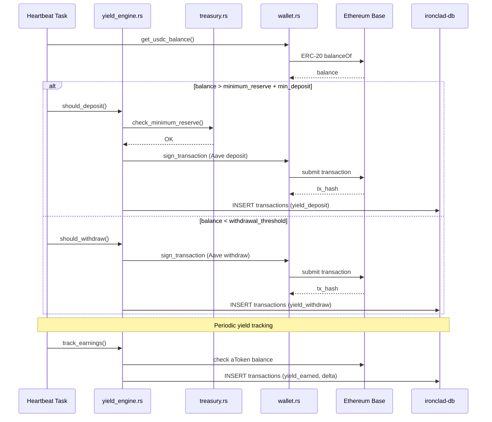

# C4 Level 3: Component Diagram -- ironclad-wallet

*Financial subsystem handling Ethereum wallet operations, x402 credit purchases, treasury policy enforcement, and DeFi yield generation on idle USDC.*

---

## Component Diagram

## Financial Flow

## Dependencies

**External crates**: `alloy-rs` (Ethereum client, signers, contracts), `alloy-sol-types` (Solidity ABI encoding)

**Internal crates**: `ironclad-core`, `ironclad-db`

**Depended on by**: `ironclad-server`
