# Ironclad Dataflow Diagrams

*Data flows for the Ironclad architecture -- a single Rust binary autonomous agent runtime.*

**Convention**: every SQLite table name, config key, crate name, and Rust type referenced in these diagrams is cross-referenced against `ironclad-design.md` in the cross-reference section at the end.

---

## 0. Runtime Config Reload Dataflow

`ironclad.toml` is now a runtime-reloadable source of truth. Update flows persist to disk first (with backup) and then apply to in-memory runtime state.

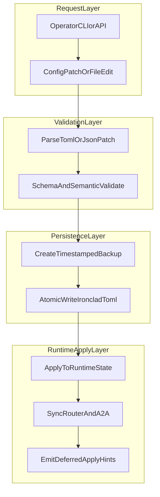

## 1. Primary Request Dataflow
<!-- last_updated: 2026-02-26, version: 0.8.0 -->

End-to-end path from inbound user message to delivered response, entirely within one OS process.

0.6.0 targeted additions reflected in the runtime:

- Capacity-aware model selection now records per-provider throughput and feeds headroom + preemptive breaker pressure.
- Session lookup/create is scope-aware (`agent`, `peer`, `group`) in web and channel paths.
- Session and context UI rendering supports sanitized markdown in dashboard views.
- Local model onboarding now supports Apertus with SGLang-first host recommendation and resource-aware model filtering.
- Outbound channel retries are persisted in `delivery_queue` and recovered on restart before retry drain loops resume.
- Session rotation now evaluates `session.reset_schedule` cron expressions directly (including timezone-prefixed schedules) instead of top-of-hour polling.

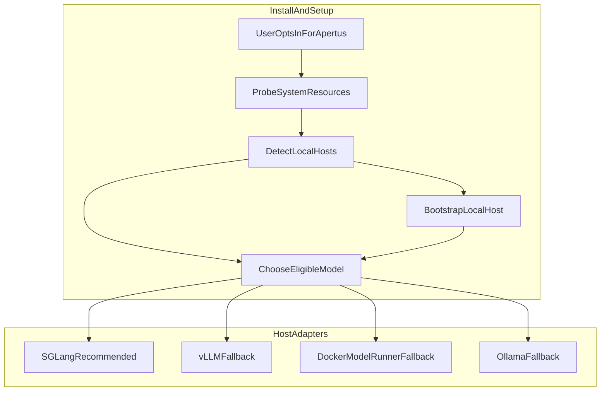

```mermaid
flowchart TD
    subgraph Intake["① Intake & Screening"]
        USER["User Message<br/>(Telegram / WhatsApp / WebSocket)"]
        USER --> ADAPTER["ironclad-channels · Channel Adapter"]
        ADAPTER --> SESSION_LOOKUP["ironclad-db/sessions.rs<br/>Lookup or create session"]
        SESSION_LOOKUP --> INJECTION_L1["ironclad-agent/injection.rs<br/>L1: Input Gatekeeping<br/>(regex, encoding, authority,<br/>financial, multi-lang)<br/>→ ThreatScore 0.0–1.0"]
        INJECTION_L1 --> THREAT_CHECK{"ThreatScore?"}
        THREAT_CHECK -->|"> 0.7"| BLOCK["Block + audit log<br/>(policy_decisions table)"]
        THREAT_CHECK -->|"0.3–0.7"| SANITIZE["Sanitize + flag reduced authority"]
        THREAT_CHECK -->|"< 0.3"| PASS["Pass clean"]
    end

    SANITIZE & PASS --> CACHE_CHECK

    subgraph CachePhase["② Cache Lookup (in-memory HashMap)"]
        CACHE_CHECK["ironclad-llm/cache.rs · 3-Level"]
        CACHE_CHECK --> CACHE_L1{"L1: Exact hash?"}
        CACHE_L1 -->|hit| CACHE_HIT["Cache hit"]
        CACHE_L1 -->|miss| CACHE_L3{"L3: Tool TTL?"}
        CACHE_L3 -->|hit| CACHE_HIT
        CACHE_L3 -->|miss| CACHE_L2{"L2: Semantic n-gram cosine?"}
        CACHE_L2 -->|hit| CACHE_HIT
        CACHE_L2 -->|miss| CACHE_MISS["Cache miss"]
    end

    CACHE_HIT --> DELIVER_CACHED["ironclad-channels · Deliver cached response to User"]
    CACHE_MISS --> CONTEXT_BUILD

    subgraph ContextPhase["③ Context & Prompt Assembly"]
        CONTEXT_BUILD["ironclad-agent/context.rs"]
        CONTEXT_BUILD --> HEURISTIC["ironclad-llm/router.rs<br/>Heuristic classify_complexity"]
        HEURISTIC --> EMBED_QUERY["ironclad-llm/embedding.rs<br/>EmbeddingClient · embed_single(query)<br/>(external provider or n-gram fallback)"]
        EMBED_QUERY --> MEMORY_RETRIEVE["ironclad-agent/retrieval.rs<br/>MemoryRetriever · 5-tier retrieval<br/>(hybrid_search: FTS5 + vector cosine)"]
        MEMORY_RETRIEVE --> LOAD_HISTORY["ironclad-db/sessions.rs<br/>list_messages(session_id, 50)"]
        LOAD_HISTORY --> BUILD_CTX["ironclad-agent/context.rs<br/>build_context(system + memories + history)"]
        BUILD_CTX --> PROMPT_BUILD["ironclad-agent/prompt.rs<br/>Build system prompt + HMAC L2 boundaries"]
    end

    PROMPT_BUILD --> MODEL_SELECT

    subgraph LlmPipeline["④ LLM Inference Pipeline"]
        MODEL_SELECT["ironclad-llm/router.rs<br/>select_for_complexity"]
        MODEL_SELECT --> CIRCUIT{"Circuit Breaker<br/>blocked?"}
        CIRCUIT -->|"blocked → advance fallback"| MODEL_SELECT
        CIRCUIT -->|open| DEDUP{"In-flight<br/>duplicate?"}
        DEDUP -->|duplicate| DEDUP_REJECT["429 reject"]
        DEDUP -->|unique| FORMAT_XLATE["ironclad-llm/format.rs<br/>ApiFormat translation"]
        FORMAT_XLATE --> TIER_ADAPT["ironclad-llm/tier.rs<br/>T1: condense · T2: reorder<br/>T3/T4: passthrough + cache_control"]
        TIER_ADAPT --> FORWARD["ironclad-llm/client.rs<br/>HTTP/2 forward (reqwest pool)"]
        FORWARD --> UPSTREAM["LLM Provider<br/>(Anthropic / OpenAI / Ollama / Google Gemini /<br/>OpenRouter / DeepSeek / Groq / Moonshot /<br/>SGLang / vLLM / Docker Model Runner / llama-cpp)"]
    end

    UPSTREAM --> RESP

    subgraph ResponsePhase["⑤ Response Processing"]
        RESP["Response received"]
        RESP --> BREAKER_UPDATE["Update circuit breaker"]
        RESP --> COST_TRACK["Record inference_costs<br/>(model, provider, tokens, cost, tier)"]
        RESP --> RESP_XLATE["Format back-translation"]
        RESP_XLATE --> TOOL_EXEC{"Tool calls<br/>requested?"}
        TOOL_EXEC -->|yes| POLICY_EVAL["Policy engine (6 rules)"]
        POLICY_EVAL --> EXEC_TOOLS["Execute allowed tools"]
        TOOL_EXEC -->|no| PERSIST
        EXEC_TOOLS --> PERSIST
    end

    subgraph DeliverPhase["⑥ Persist & Deliver"]
        PERSIST["ironclad-db · Atomic SQLite transaction:<br/>session_messages, turn, tool_calls,<br/>policy_decisions"]
        PERSIST --> INJECTION_L4["L4 scan_output:<br/>NFKC, decode, homoglyph, regex"]
        INJECTION_L4 --> MEMORY_INGEST["ingest_turn → classify → store<br/>(background tokio::spawn)"]
        MEMORY_INGEST --> EMBED_RESP["ironclad-llm/embedding.rs<br/>Generate embedding for response<br/>→ store_embedding(BLOB)"]
        EMBED_RESP --> CACHE_STORE["Cache store (HashMap)<br/>+ periodic SQLite flush"]
        CACHE_STORE --> DELIVER["ironclad-channels · Deliver"]
        DELIVER --> USER_RESP["Response to User"]
    end
```

---

## 2. Semantic Cache Dataflow
<!-- last_updated: 2026-02-26, version: 0.8.0 -->

Runtime cache in `ironclad-llm/cache.rs` (in-memory HashMap) with **SQLite persistence** via `ironclad-db/cache.rs`. On startup the server loads persisted entries from the `semantic_cache` table; a background task flushes in-memory entries to SQLite every 5 minutes and evicts expired rows.

```mermaid
flowchart TD
    subgraph Lookup["Cache Lookup (per-request)"]
        PROMPT_IN["Incoming prompt"]
        PROMPT_IN --> HASH["SemanticCache::compute_hash<br/>(system | messages | user_msg)"]
        HASH --> EXACT{"lookup_exact(prompt_hash)<br/>HashMap get, check expires_at"}
        EXACT -->|hit| HIT_EXACT["Return CachedResponse<br/>hits++"]
        EXACT -->|miss| L3{"lookup_tool_ttl(prompt_hash)"}
        L3 -->|hit| HIT_TOOL["Return cached (shorter TTL if tools)"]
        L3 -->|miss| EMBED["lookup_semantic(prompt)<br/>real embedding (if provider configured)<br/>or char n-gram fallback, cosine"]
        EMBED --> ANN{"cosine >= similarity_threshold (0.85)"}
        ANN -->|hit| HIT_SEMANTIC["Return best match"]
        ANN -->|miss| MISS["Cache miss -> LLM pipeline"]
    end

    subgraph Store["Cache Store (post-response)"]
        RESP_OK["Successful LLM response"]
        RESP_OK --> STORE_ENTRY["store() or store_with_embedding()<br/>entries.insert(prompt_hash, entry)<br/>evict_lfu() if len >= max_entries"]
    end

    subgraph Persistence["SQLite Persistence (ironclad-db/cache.rs)"]
        BOOT_LOAD["Server startup:<br/>load_cache_entries() → import_entries()"]
        FLUSH["Background task (5 min interval):<br/>export_entries() → save_cache_entry()<br/>evict_expired_cache()"]
    end

    subgraph Eviction["Eviction"]
        EVICT_EXPIRE["evict_expired(): retain where expires_at > now()"]
        EVICT_LFU["evict_lfu(): remove min hits when at capacity"]
        DB_EVICT["evict_expired_cache():<br/>DELETE FROM semantic_cache<br/>WHERE expires_at < now()"]
    end
```

---

## 3. Metascore Model Router Dataflow
<!-- last_updated: 2026-03-01, version: 0.9.1 -->

Routing hot path in `ironclad-server/api/routes/agent/routing.rs::select_routed_model_with_audit()`. Feature extraction and complexity classification in `ironclad-llm/router.rs`. Model profiles and metascore in `ironclad-llm/profile.rs`. Tiered inference (confidence evaluation + cloud escalation) in `ironclad-llm/tiered.rs`.

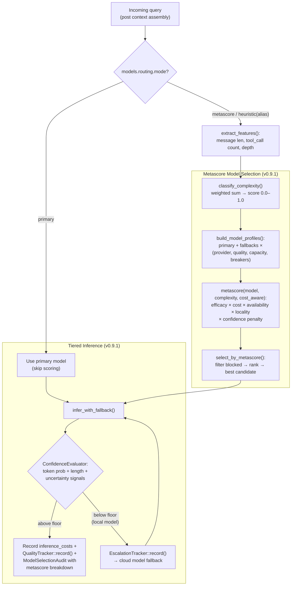

**Metascore dimensions** (weights: normal / cost-aware):

| Dimension | Normal | Cost-Aware | Source |
|-----------|--------|------------|--------|
| Efficacy | 0.45 | 0.35 | `QualityTracker` estimated quality (EMA) |
| Cost | 0.15 | 0.30 | Sigmoid-normalized inverse of per-token cost |
| Availability | 0.30 | 0.25 | Circuit breaker health × capacity headroom |
| Locality | 0.10 | 0.10 | Local bonus for simple tasks, cloud for complex |

Cold-start confidence penalty: linear ramp 0.6→1.0 over first 10 observations.

---

## 4. Memory Lifecycle Dataflow
<!-- last_updated: 2026-02-26, version: 0.8.0 -->

5-tier memory system unified in a single SQLite DB. Ingestion in `ironclad-agent/memory.rs`, storage in `ironclad-db/memory.rs`. The hippocampus schema map (`ironclad-db/schema_map.rs`) provides runtime introspection of memory table structures for dynamic query construction and context-aware retrieval.

```mermaid
flowchart TD
    subgraph Ingestion["Post-Turn Ingestion (ironclad-agent/memory.rs)"]
        TURN_DONE["Turn completed<br/>(thinking + tool results available)"]
        TURN_DONE --> CLASSIFY["Classify turn type<br/>(reasoning, tool_use, creative,<br/>financial, social, maintenance)"]

        CLASSIFY --> EX_WORKING["Update working_memory<br/>- Current goals<br/>- Active observations<br/>- In-progress plans<br/>- Reflections"]
        CLASSIFY --> EX_EPISODIC["Extract episodic events<br/>- Significant tool calls<br/>- Decision points<br/>- Outcomes and results"]
        CLASSIFY --> EX_SEMANTIC["Extract semantic facts<br/>- Learned information<br/>- Environmental changes<br/>- Financial state updates"]
        CLASSIFY --> EX_PROCEDURAL["Track procedural outcomes<br/>- Procedure name<br/>- success_count++ or failure_count++<br/>- Step adjustments"]
        CLASSIFY --> EX_RELATIONSHIP["Update relationships<br/>- trust_score adjustments<br/>- interaction_count++<br/>- last_interaction timestamp"]
    end

    subgraph Store["Atomic SQLite Transaction (ironclad-db/memory.rs)"]
        EX_WORKING --> T_WORKING["INSERT/UPDATE working_memory<br/>(session_id, entry_type,<br/>content, importance)"]
        EX_EPISODIC --> T_EPISODIC["INSERT episodic_memory<br/>(classification, content,<br/>importance)"]
        EX_SEMANTIC --> T_SEMANTIC["INSERT OR REPLACE semantic_memory<br/>(category, key, value,<br/>confidence)"]
        EX_PROCEDURAL --> T_PROCEDURAL["INSERT OR REPLACE procedural_memory<br/>(name, steps, success_count,<br/>failure_count)"]
        EX_RELATIONSHIP --> T_RELATIONSHIP["INSERT OR REPLACE relationship_memory<br/>(entity_id, entity_name,<br/>trust_score, interaction_summary,<br/>interaction_count, last_interaction)"]

        T_EPISODIC --> FTS_SYNC["Sync memory_fts<br/>(FTS5 virtual table)"]
    end

    subgraph EmbeddingGen["Embedding Generation (post-ingestion)"]
        EX_EPISODIC --> GEN_EMBED["ironclad-llm/embedding.rs<br/>EmbeddingClient · embed_single(content)<br/>(external provider or n-gram fallback)"]
        GEN_EMBED --> CHUNK_CHECK{"Content > 512 tokens?"}
        CHUNK_CHECK -->|yes| CHUNK["ironclad-agent/retrieval.rs<br/>chunk_text() with overlap<br/>(default 512 tok, 64 overlap)"]
        CHUNK -->|each chunk| STORE_EMBED["ironclad-db/embeddings.rs<br/>store_embedding()<br/>(BLOB format, ~4x smaller than JSON)"]
        CHUNK_CHECK -->|no| STORE_EMBED
    end

    subgraph Retrieval["Pre-Inference Retrieval (ironclad-agent/retrieval.rs)"]
        INFER_START["Inference call starting"]
        INFER_START --> SCHEMA_MAP["ironclad-db/schema_map.rs<br/>Hippocampus schema introspection<br/>(table structure, column types,<br/>index availability)"]
        SCHEMA_MAP --> EMBED_QUERY_R["ironclad-llm/embedding.rs<br/>Generate query embedding"]
        EMBED_QUERY_R --> BUDGET["MemoryRetriever<br/>MemoryBudgetManager allocates<br/>token budget per tier:<br/>working: 30% · episodic: 25%<br/>semantic: 20% · procedural: 15%<br/>relationship: 10%<br/>(unused budget rolls over)"]

        BUDGET --> R_WORK["Retrieve working_memory<br/>(all entries for current session_id)"]
        BUDGET --> R_HYBRID["hybrid_search(query, embedding)<br/>FTS5 keyword + vector cosine<br/>(configurable hybrid_weight)"]
        BUDGET --> R_PROC["Retrieve procedural_memory<br/>(tool success/failure rates)"]
        BUDGET --> R_REL["Retrieve relationship_memory<br/>(active entities from conversation)"]

        R_HYBRID --> ANN_CHECK{"ANN index built?<br/>(memory.ann_index = true<br/>& entries > threshold)"}
        ANN_CHECK -->|yes| ANN_SEARCH["ironclad-db/ann.rs<br/>HNSW O(log n) search<br/>(instant-distance crate)"]
        ANN_CHECK -->|no| BRUTE["Brute-force cosine scan<br/>(O(n) over embeddings table)"]

        R_WORK & ANN_SEARCH & BRUTE & R_PROC & R_REL --> FORMAT_BLOCK["Format memory block<br/>(structured text within<br/>total token budget)"]
        FORMAT_BLOCK --> INJECT["Inject into context<br/>(after system prompt,<br/>before conversation history)"]
    end

    subgraph Pruning["Background Pruning (heartbeat task)"]
        PRUNE_TICK["Heartbeat tick"]
        PRUNE_TICK --> PRUNE_WORKING["DELETE expired working_memory<br/>(sessions that are closed)"]
        PRUNE_TICK --> PRUNE_EPISODIC["DELETE lowest importance<br/>episodic_memory when count<br/>exceeds threshold"]
        PRUNE_TICK --> PRUNE_FTS["Rebuild memory_fts<br/>after bulk deletes"]
    end
```

---

## 4.1 Behavior Guard + Deterministic Shortcut Dataflow
<!-- last_updated: 2026-03-06, version: 0.9.5-prep -->

High-frequency operator prompts with deterministic intent (for example, filesystem counts and direct capability checks) now prefer the execution-shortcut path. Guardrails sanitize internal protocol metadata and force user-facing fallbacks when model output degrades.

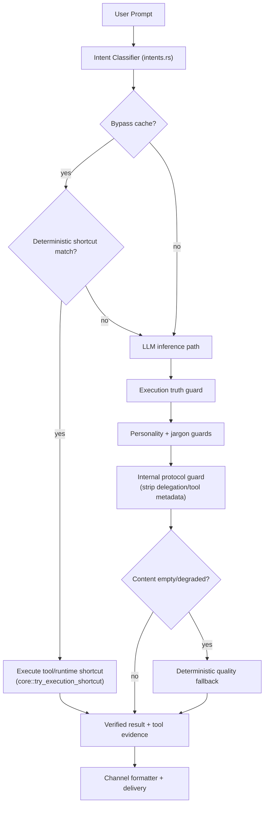

---

## 5. Zero-Trust Agent-to-Agent Communication Dataflow
<!-- last_updated: 2026-02-26, version: 0.8.0 -->

New subsystem. Identity via `ironclad-wallet/wallet.rs`, protocol in `ironclad-channels/a2a.rs`, trust data in `relationship_memory` table.

```mermaid
flowchart TD
    subgraph Discovery["Agent Discovery"]
        NEED_PEER["Need to contact peer agent"]
        NEED_PEER --> CACHE_CARD{"Agent card in<br/>discovered_agents table?<br/>(TTL-based cache)"}
        CACHE_CARD -->|hit| USE_CARD["Use cached agent card"]
        CACHE_CARD -->|miss| ERC8004["Query ERC-8004 registry<br/>on Base (via alloy-rs)<br/>wallet.chain_id = 8453<br/>wallet.rpc_url"]
        ERC8004 --> PARSE_CARD["Parse JSON-LD Agent Card<br/>(capabilities, endpoints, services)"]
        PARSE_CARD --> STORE_CARD["Cache in discovered_agents table"]
        STORE_CARD --> USE_CARD
    end

    subgraph MutualAuth["Mutual Authentication (challenge-response)"]
        USE_CARD --> HELLO["Agent A: POST /a2a/hello<br/>body: DID_A + nonce_A (32 bytes)<br/>+ timestamp_A<br/>+ signature_A(nonce_A || timestamp_A)"]

        HELLO --> B_VERIFY["Agent B: Verify signature_A<br/>against A's on-chain public key<br/>(ERC-8004 registry lookup)"]
        B_VERIFY --> B_FRESH{"timestamp_A<br/>within 60s?"}
        B_FRESH -->|no| B_REJECT["Reject: stale timestamp"]
        B_FRESH -->|yes| B_RESPOND["Agent B responds:<br/>DID_B + nonce_B<br/>+ signature_B(nonce_A || nonce_B || timestamp_B)"]

        B_RESPOND --> A_VERIFY["Agent A: Verify signature_B<br/>against B's on-chain public key"]
        A_VERIFY --> A_FRESH{"timestamp_B<br/>within 60s?"}
        A_FRESH -->|no| A_REJECT["Reject: stale timestamp"]
        A_FRESH -->|yes| DERIVE_KEY["Both sides: derive session key<br/>via ECDH (ephemeral keypairs)<br/>-> AES-256-GCM for forward secrecy"]
    end

    subgraph Messaging["Encrypted Message Exchange"]
        DERIVE_KEY --> SESSION_READY["Authenticated session established"]
        SESSION_READY --> SEND_MSG["Send message:<br/>AES-256-GCM encrypted payload<br/>+ per-message nonce<br/>+ HMAC authentication tag"]
        SEND_MSG --> RECV_VALIDATE["Receiver validates:<br/>1. Decrypt with session key<br/>2. Verify HMAC tag<br/>3. Check message size < a2a.max_message_size (64KB)<br/>4. Rate limit check < a2a.rate_limit_per_peer (10/min)"]
        RECV_VALIDATE --> INJECTION_SCREEN["Pass content through<br/>injection defense pipeline<br/>(Layer 1 gatekeeping)<br/>with source = peer_agent"]
        INJECTION_SCREEN --> TRUST_WRAP["Wrap in trust boundary:<br/>peer_agent_input trust_level=X<br/>(from relationship_memory.trust_score)"]
    end

    subgraph TrustUpdate["Trust Score Management"]
        TRUST_WRAP --> PROCESS["Process peer message<br/>(with reduced authority)"]
        PROCESS --> OUTCOME{"Interaction<br/>outcome?"}
        OUTCOME -->|positive| TRUST_UP["UPDATE relationship_memory<br/>SET trust_score = min(1.0, trust_score + 0.05),<br/>interaction_count = interaction_count + 1,<br/>last_interaction = now()"]
        OUTCOME -->|negative| TRUST_DOWN["UPDATE relationship_memory<br/>SET trust_score = max(0.0, trust_score - 0.1),<br/>interaction_count = interaction_count + 1,<br/>last_interaction = now()"]
        OUTCOME -->|neutral| TRUST_SAME["UPDATE relationship_memory<br/>SET interaction_count = interaction_count + 1,<br/>last_interaction = now()"]
    end

    subgraph Opacity["Opacity Principle"]
        OPACITY_NOTE["Agents NEVER expose to peers:<br/>- Internal memory contents<br/>- Tool state or outputs<br/>- Prompt content or system prompt<br/>- Wallet private key<br/>- Session history<br/>Only structured A2A task messages"]
    end
```

---

## 6. Multi-Layer Prompt Injection Defense Dataflow
<!-- last_updated: 2026-02-26, version: 0.8.0 -->

4-layer defense system spanning `ironclad-agent/injection.rs`, `ironclad-agent/prompt.rs`, and `ironclad-agent/policy.rs`.

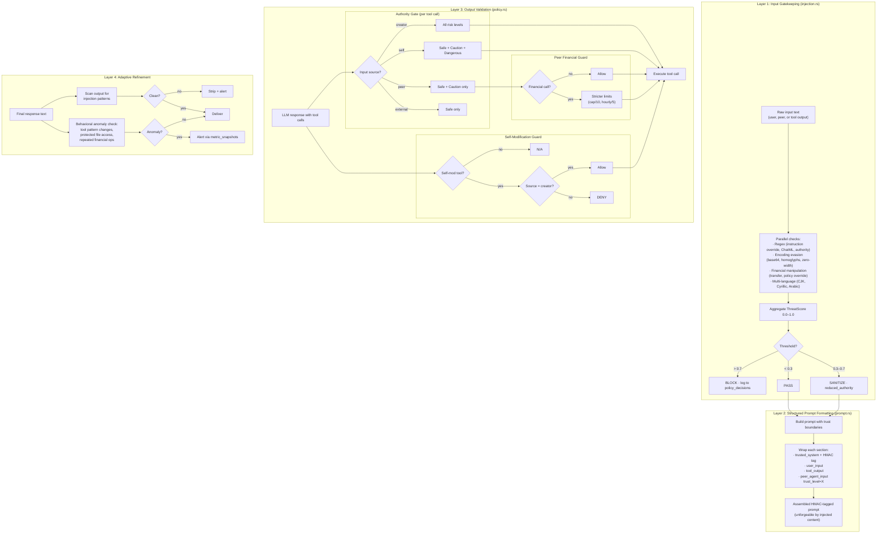

---

## 7. Financial + Yield Engine Dataflow
<!-- last_updated: 2026-02-26, version: 0.8.0 -->

x402 credit purchases and Aave/Compound yield generation. Core logic in `ironclad-wallet/`.

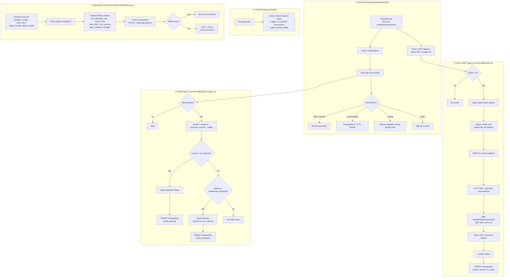

---

## 8. Cron + Heartbeat Unified Scheduling Dataflow
<!-- last_updated: 2026-02-26, version: 0.8.0 -->

Unified scheduling system in `ironclad-schedule/`.

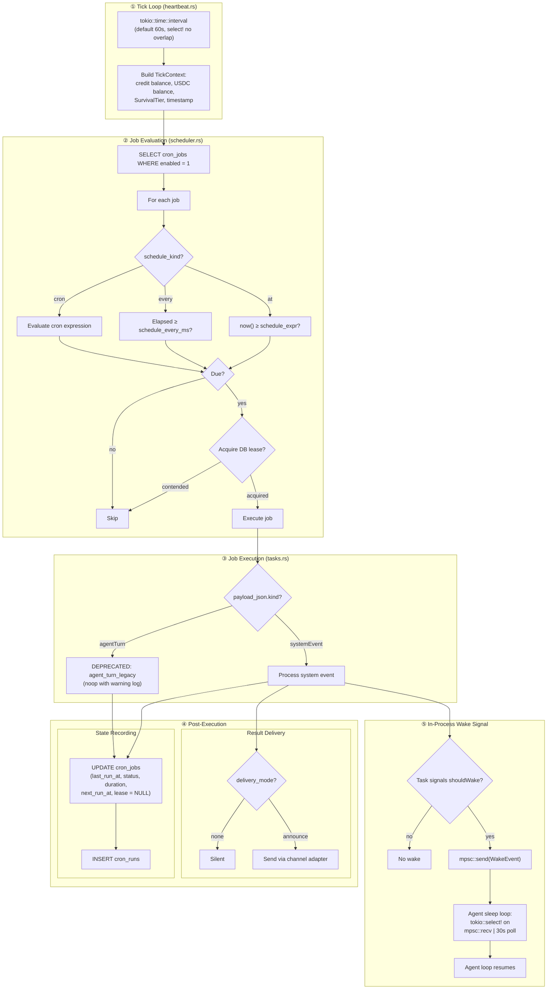

---

## 9. Skill Execution Dataflow
<!-- last_updated: 2026-02-26, version: 0.8.0 -->

Dual-format extensibility system in `ironclad-agent/skills.rs` and `ironclad-agent/script_runner.rs`, with persistence in `ironclad-db/skills.rs`.

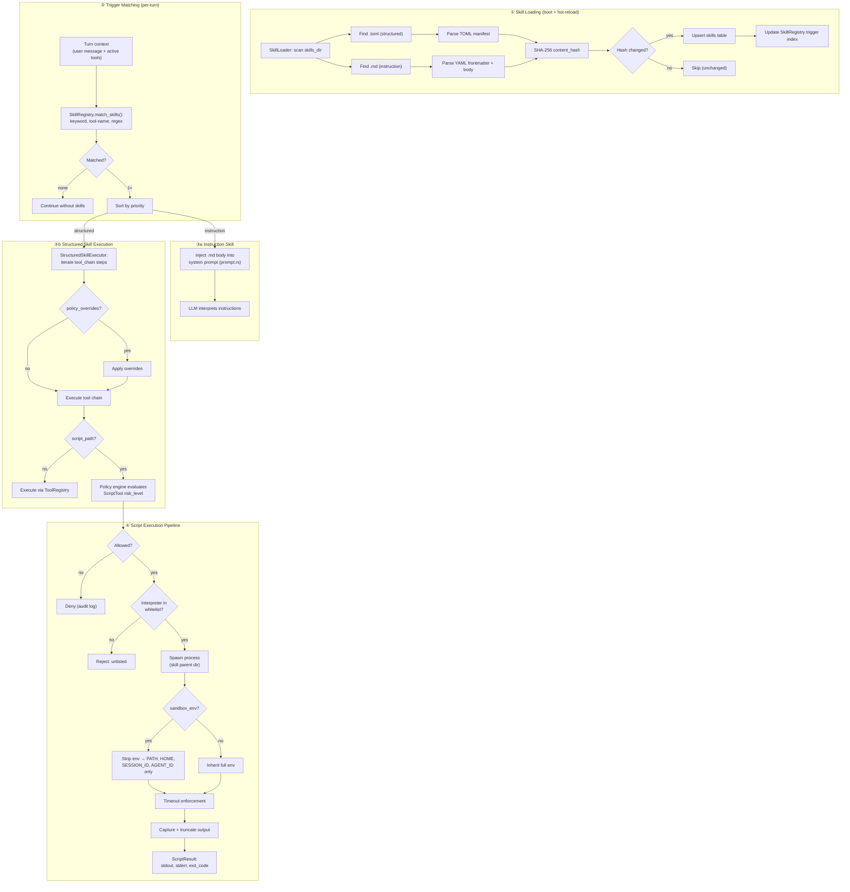

---

## 10. Approval Workflow Dataflow
<!-- last_updated: 2026-02-26, version: 0.8.0 -->

Tool gating with human-in-the-loop approval for dangerous operations. `ApprovalManager` pauses the agent loop until an admin resolves the request via the dashboard WebSocket or REST API.

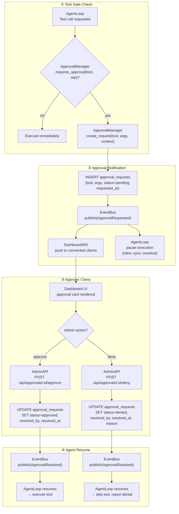

---

## 11. Browser Tool Execution Dataflow
<!-- last_updated: 2026-02-26, version: 0.8.0 -->

CDP-based browser automation via `BrowserTool`. The `BrowserManager` maintains a pool of Chrome sessions with idle eviction.

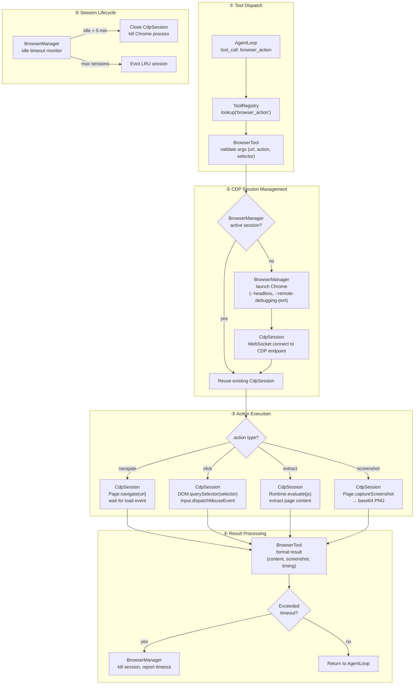

---

## 12. Context Assembly & Snapshot Dataflow
<!-- last_updated: 2026-02-26, version: 0.8.0 -->

Complexity-driven context assembly with progressive trimming. `build_context()` allocates token budgets per tier using `MemoryBudgetManager` and persists snapshots via direct `context_snapshots` table inserts.

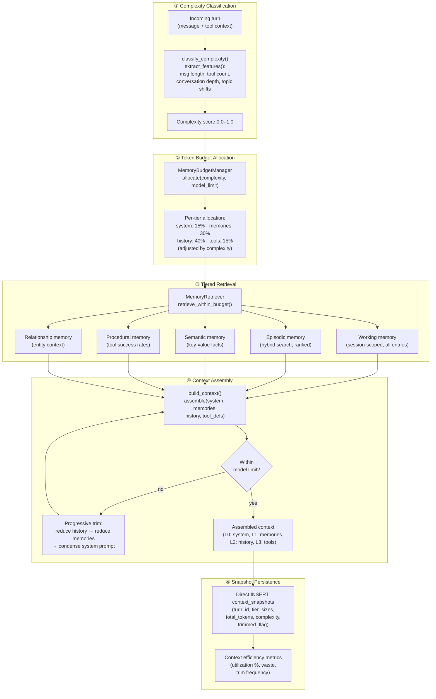

---

## 13. Response Transform Pipeline Dataflow
<!-- last_updated: 2026-02-26, version: 0.8.0 -->

> **Note (v0.8.0)**: The 4-stage pipeline described below (`ReasoningExtractor`, `FormatNormalizer`, `ContentGuard`, PII scan) exists only in the dead-code file `ironclad-llm/src/transform.rs`, which is NOT declared as `pub mod` in `lib.rs` and is unreachable from other crates. Actual response processing in v0.8.0 is performed inline in `agent.rs`. This diagram is retained for reference but does **not** describe current runtime behavior.

Post-LLM response processing chain (unimplemented -- see note above): reasoning extraction, format normalization, and content guarding before the response reaches the agent loop.

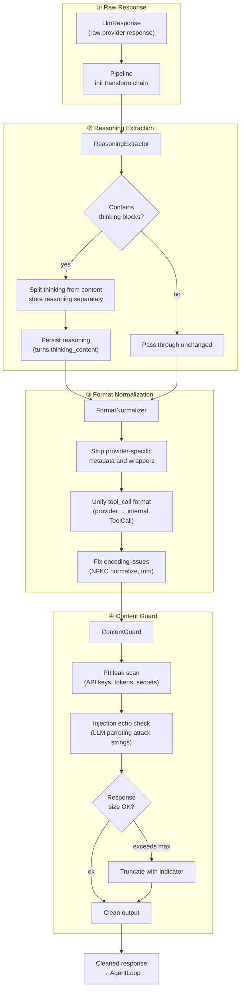

---

## 14. Streaming LLM Dataflow
<!-- last_updated: 2026-02-26, version: 0.8.0 -->

Token-by-token streaming from LLM provider through SSE to the dashboard. The `StreamAccumulator` buffers deltas while the `EventBus` publishes chunks to WebSocket subscribers in real time. Note: v0.8.0 streaming performs in-flight deduplication (`dedup.rs`) before provider dispatch (same as non-stream inference).

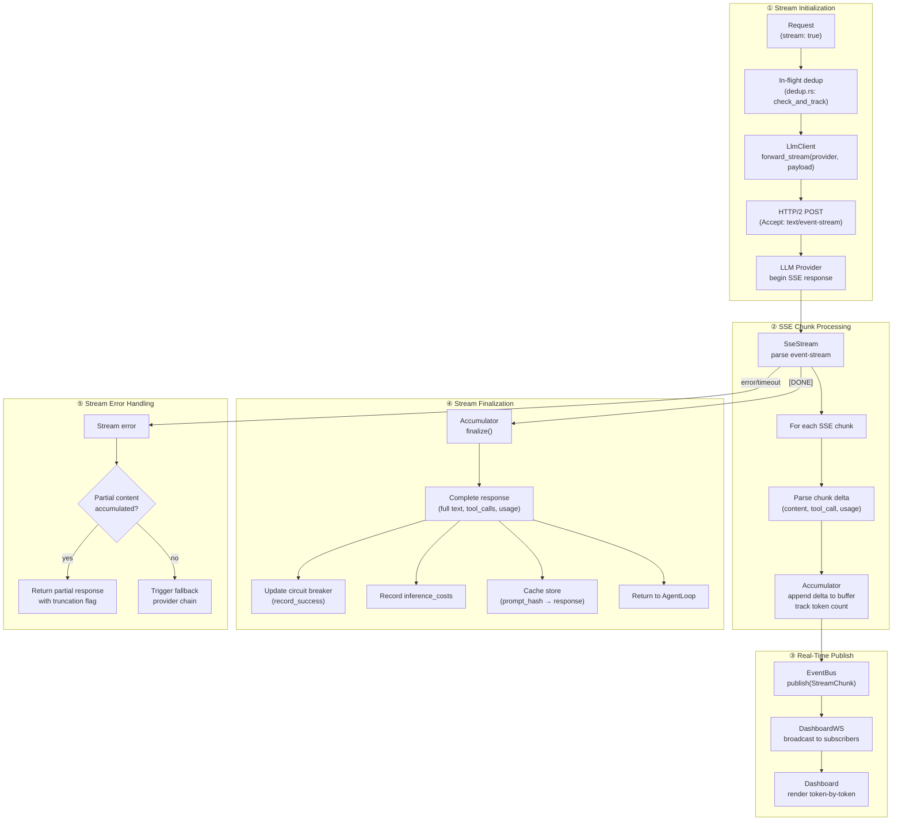

---

## 15. Addressability Filter Dataflow
<!-- last_updated: 2026-02-26, version: 0.8.0 -->

Determines whether an inbound message is addressed to the agent. The `FilterChain` applies OR logic across mention, reply, and conversation filters — if any filter matches, the message is dispatched.

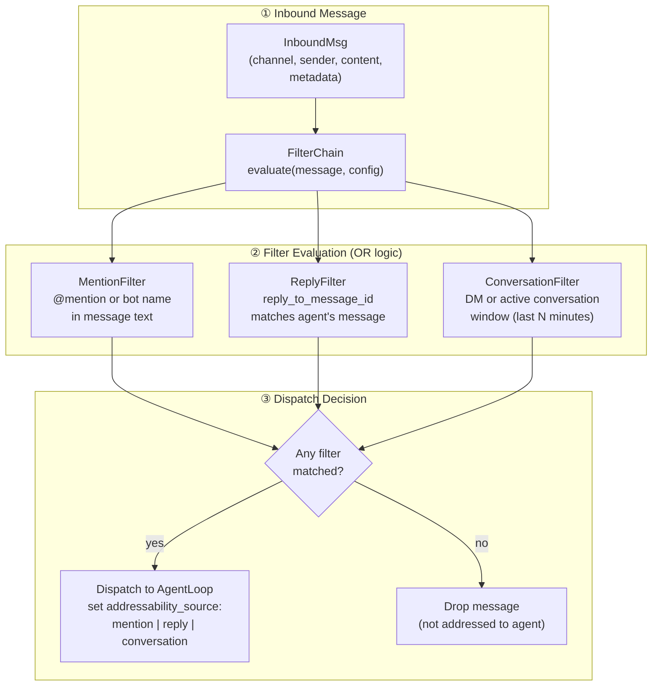

---

## 16. Context Observatory Dataflow
<!-- last_updated: 2026-02-26, version: 0.8.0 -->

Background observability pipeline that records turn-level metrics, analyzes context efficiency, assigns grades, and emits tuning recommendations.

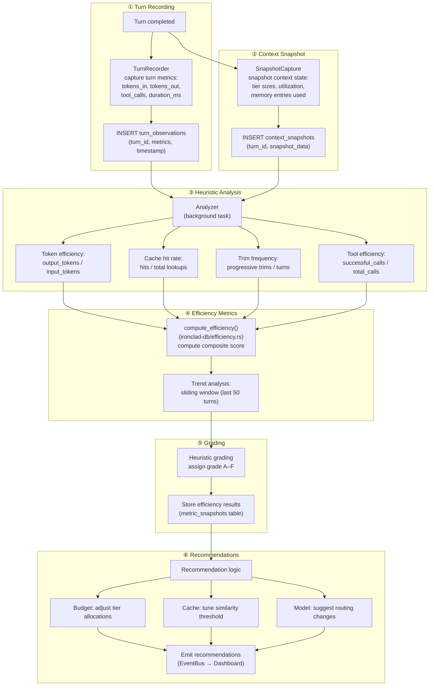

---

## 17. Plugin SDK Execution Dataflow
<!-- last_updated: 2026-02-26, version: 0.8.0 -->

Plugin discovery, manifest parsing, tool registration, and sandboxed execution. Plugins extend the agent's tool surface at runtime.

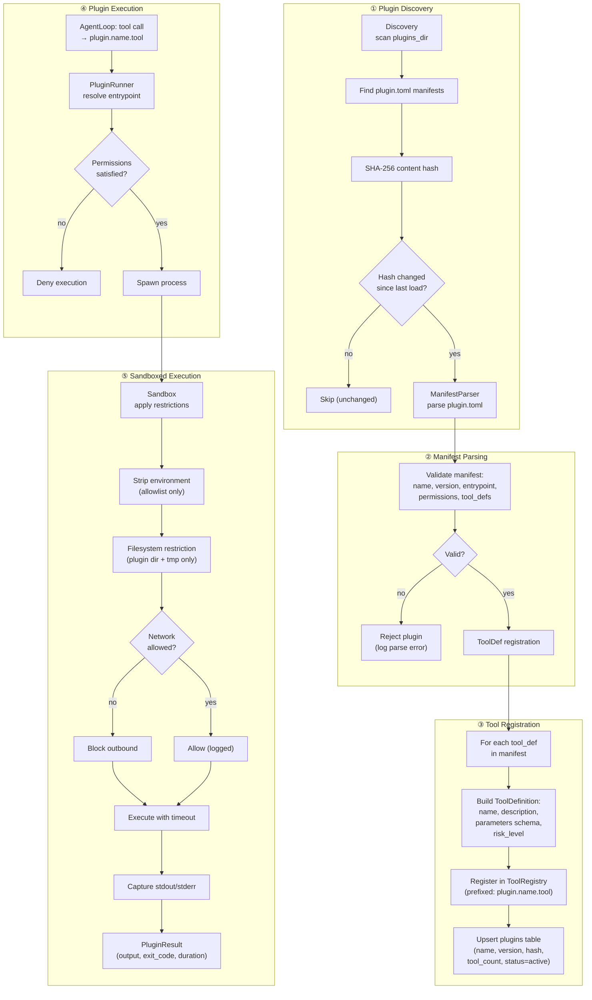

---

## 18. OAuth & Credential Resolution Dataflow
<!-- last_updated: 2026-02-26, version: 0.8.0 -->

Multi-strategy credential resolution: environment variables, encrypted keystore, and OAuth token refresh with automatic rotation.

```mermaid
flowchart TD
    subgraph Resolve["① Credential Resolution"]
        NEED["API call requires credential<br/>(provider, service)"]
        NEED --> STRATEGY{"Resolution<br/>strategy?"}
    end

    subgraph EnvPath["② Environment Variable"]
        STRATEGY -->|env| ENV["EnvVar<br/>std::env::var(key)"]
        ENV --> ENV_FOUND{"Found?"}
        ENV_FOUND -->|yes| ENV_VAL["Use env value"]
        ENV_FOUND -->|no| FALLBACK_KS["Fall back to Keystore"]
    end

    subgraph KeystorePath["③ Keystore Lookup"]
        STRATEGY -->|keystore| KS_DIRECT["Keystore<br/>lookup(service, key_name)"]
        FALLBACK_KS --> KS_DIRECT
        KS_DIRECT --> KS_DECRYPT["Decrypt value<br/>(AES-256-GCM, master key<br/>derived from wallet)"]
        KS_DECRYPT --> KS_FOUND{"Found &<br/>not expired?"}
        KS_FOUND -->|yes| KS_VAL["Use keystore value"]
        KS_FOUND -->|no| OAUTH_NEEDED["Needs OAuth refresh"]
    end

    subgraph OAuthPath["④ OAuth Token Refresh"]
        STRATEGY -->|oauth| OAUTH_DIRECT["OAuthManager<br/>get_token(service)"]
        OAUTH_NEEDED --> OAUTH_DIRECT
        OAUTH_DIRECT --> TOKEN_CHECK{"Cached token<br/>still valid?"}
        TOKEN_CHECK -->|yes| USE_CACHED["Use cached token"]
        TOKEN_CHECK -->|no| REFRESH["OAuthManager<br/>POST /oauth/token<br/>(refresh_token grant)"]
        REFRESH --> REFRESH_OK{"Refresh<br/>succeeded?"}
        REFRESH_OK -->|yes| STORE_TOKEN["Store new token<br/>in Keystore<br/>(encrypted, with TTL)"]
        STORE_TOKEN --> USE_NEW["Use new token"]
        REFRESH_OK -->|no| AUTH_FAIL["Credential error<br/>→ surface to agent"]
    end

    subgraph Inject["⑤ Credential Injection"]
        ENV_VAL & KS_VAL & USE_CACHED & USE_NEW --> INJECT_CRED["CredentialInjection<br/>inject into request"]
        INJECT_CRED --> HEADER["Set Authorization header<br/>or provider-specific header"]
        HEADER --> REDACT["Redact credential from<br/>logs and tool output"]
    end
```

---

## 19. Channel Adapter Lifecycle Dataflow
<!-- last_updated: 2026-02-26, version: 0.8.0 -->

Full lifecycle of a channel adapter: initialization, message reception (webhook or polling), addressability filtering, agent dispatch, response formatting, and health monitoring with auto-reconnect.

```mermaid
flowchart TD
    subgraph Init["① Adapter Initialization"]
        CONFIG["Config<br/>channels.adapter.enabled"]
        CONFIG --> ADAPTER_INIT["AdapterInit<br/>validate credentials,<br/>configure webhook/polling"]
        ADAPTER_INIT --> MODE{"Receive mode?"}
        MODE -->|webhook| WEBHOOK["Register webhook URL<br/>with platform API"]
        MODE -->|polling| POLL_START["Start long-poll loop<br/>(tokio::time::interval)"]
    end

    subgraph Receive["② Message Reception"]
        WEBHOOK --> INBOUND["Receive inbound message"]
        POLL_START --> POLL["Poll<br/>fetch new messages<br/>since last_update_id"]
        POLL --> INBOUND
        INBOUND --> PARSE["Parse platform payload<br/>→ InboundMessage"]
    end

    subgraph Filter["③ Addressability Check"]
        PARSE --> FILTER["FilterChain<br/>evaluate addressability"]
        FILTER --> ADDRESSED{"Addressed<br/>to agent?"}
        ADDRESSED -->|no| DROP["Drop (not for agent)"]
        ADDRESSED -->|yes| SESSION["Lookup/create session<br/>(ironclad-db)"]
    end

    subgraph Dispatch["④ Agent Dispatch"]
        SESSION --> AGENT_DISPATCH["AgentDispatch<br/>send to AgentLoop<br/>(mpsc channel)"]
        AGENT_DISPATCH --> PROCESS["AgentLoop processes<br/>(ReAct cycle)"]
        PROCESS --> AGENT_RESULT["Agent response"]
    end

    subgraph Respond["⑤ Response Delivery"]
        AGENT_RESULT --> FORMAT["Format for platform<br/>(markdown → platform markup,<br/>split long messages)"]
        FORMAT --> SEND["Response<br/>POST to platform API"]
        SEND --> RATE_LIMIT{"Rate limited?"}
        RATE_LIMIT -->|yes| BACKOFF["Exponential backoff<br/>+ retry"]
        BACKOFF --> SEND
        RATE_LIMIT -->|no| DELIVERED["Message delivered"]
    end

    subgraph Lifecycle["⑥ Health & Reconnect"]
        HEALTH["Periodic health check"]
        HEALTH --> CONNECTED{"Connection<br/>healthy?"}
        CONNECTED -->|yes| CONTINUE["Continue"]
        CONNECTED -->|no| RECONNECT["Reconnect<br/>(exponential backoff)"]
        RECONNECT --> ADAPTER_INIT
    end
```

---

## 20. Context Checkpoint Dataflow
<!-- last_updated: 2026-03-01, version: 0.9.0 -->

Checkpoints capture compiled context state every N turns, enabling instant agent readiness on boot and crash recovery with bounded data loss.

```mermaid
flowchart TD
    subgraph turnLoop [Turn Loop]
        turn[InferenceTurn]
        counter[TurnCounter mod N]
    end

    subgraph saveFlow [Checkpoint Save]
        snapshot[CompileContextSnapshot]
        hash[HashSystemPrompt]
        summarize[SummarizeTopKMemory]
        persist[WriteToContextCheckpoints]
    end

    subgraph loadFlow [Checkpoint Load on Boot]
        boot[SessionStart]
        query[QueryLatestCheckpoint]
        validate[ValidateFormatVersion]
        warm[WarmContextFromCheckpoint]
        background[BackgroundFullRetrieval]
    end

    subgraph clearFlow [Checkpoint Cleanup]
        governor[SessionGovernor]
        expire[SessionExpiry]
        clear[ClearCheckpointsForSession]
    end

    turn --> counter
    counter -->|every N turns| snapshot
    snapshot --> hash
    snapshot --> summarize
    hash --> persist
    summarize --> persist
    persist -->|INSERT context_checkpoints| DB[(SQLite)]

    boot --> query
    query -->|SELECT latest by session| DB
    DB --> validate
    validate -->|version match| warm
    validate -->|stale version| background
    warm --> background

    governor --> expire
    expire --> clear
    clear -->|DELETE by session_id| DB
```

Config: `[context.checkpoint]` — `enabled` (bool), `every_n_turns` (u32, default 10).

---

## 21. Durable Delivery Queue Dataflow
<!-- last_updated: 2026-03-01, version: 0.9.0 -->

Outbound channel messages are persisted before send attempts. On crash recovery, pending deliveries are replayed from the store, preventing message loss.

```mermaid
flowchart TD
    subgraph sendPath [Send Path]
        reply[ChannelReply]
        enqueue[PersistToDeliveryQueue]
        attempt[SendViaAdapter]
        success[MarkDelivered]
        fail[IncrementAttempts]
        retry[ScheduleNextRetry]
        deadletter[MoveToDeadLetter]
    end

    subgraph recoveryPath [Recovery on Boot]
        startup[ServerStartup]
        recover[RecoverFromStore]
        replay[ReplayPendingDeliveries]
    end

    reply --> enqueue
    enqueue -->|INSERT delivery_queue| DB[(SQLite)]
    enqueue --> attempt
    attempt -->|success| success
    attempt -->|failure| fail
    success -->|UPDATE status=delivered| DB
    fail --> retry
    retry -->|UPDATE next_retry_at| DB
    fail -->|max attempts exceeded| deadletter
    deadletter -->|UPDATE status=dead_letter| DB

    startup --> recover
    recover -->|SELECT status=pending| DB
    recover --> replay
    replay --> attempt
```

Schema: `delivery_queue` table with idempotency_key, attempt count, next_retry_at, and terminal failure reason.

---

## 22. Episodic Digest Dataflow
<!-- last_updated: 2026-03-01, version: 0.9.0 -->

When sessions close (TTL expiry, rotation, archive), an LLM-generated digest captures key decisions, unresolved tasks, and learned facts. These digests feed future context assembly with decay-weighted relevance.

```mermaid
flowchart TD
    subgraph triggerLayer [Digest Triggers]
        ttl[SessionTTLExpiry]
        rotate[SessionRotation]
        archive[CompactBeforeArchive]
    end

    subgraph digestLayer [Digest Generation]
        governor[SessionGovernor]
        fetch[FetchRecentMessages]
        generate[DigestOnClose]
        llm[LLMSummarize]
        store[StoreAsEpisodicMemory]
    end

    subgraph retrievalLayer [Digest Retrieval]
        newSession[NewSessionStart]
        retrieve[MemoryRetriever]
        decay[DecayWeightedRelevance]
        inject[InjectIntoContext]
    end

    ttl --> governor
    rotate --> governor
    archive --> governor
    governor --> fetch
    fetch -->|list_messages| DB[(SQLite)]
    fetch --> generate
    generate --> llm
    llm --> store
    store -->|INSERT episodic_memory with digest flag| DB

    newSession --> retrieve
    retrieve -->|hybrid FTS5 + vector search| DB
    retrieve --> decay
    decay --> inject
```

Config: `[digest]` — `enabled` (bool), `max_tokens` (usize, default 512).

---

## 23. Prompt Compression Dataflow
<!-- last_updated: 2026-03-01, version: 0.9.0 -->

When enabled, the prompt compression gate reduces token count in assembled prompts before inference. Targets long conversation histories and verbose tool descriptions.

```mermaid
flowchart TD
    subgraph assembly [Context Assembly]
        system[SystemPrompt]
        memory[MemoryRetrieval]
        history[ConversationHistory]
        tools[ToolDescriptions]
        assemble[AssembleFullPrompt]
    end

    subgraph compression [Compression Gate]
        gate{prompt_compression enabled?}
        measure[MeasureTokenCount]
        compress[PromptCompressor]
        ratio[TargetCompressionRatio]
        pruned[PrunedPrompt]
    end

    subgraph inference [Inference]
        send[SendToLLM]
    end

    system --> assemble
    memory --> assemble
    history --> assemble
    tools --> assemble
    assemble --> gate
    gate -->|disabled| send
    gate -->|enabled| measure
    measure --> compress
    ratio --> compress
    compress --> pruned
    pruned --> send
```

Config: `[cache]` — `prompt_compression` (bool, default false), `compression_target_ratio` (f64, default 0.5).

---

## 24. Introspection Tool Architecture
<!-- last_updated: 2026-03-01, version: 0.9.0 -->

Four read-only introspection tools give the agent self-awareness of its runtime state, memory tiers, channel health, and subagent/task status. Tools access runtime state through `ToolContext` which now carries optional database and channel references.

```mermaid
flowchart TD
    subgraph entryPoints [Entry Points]
        api[REST API]
        channel[Channel Message]
        ws[WebSocket]
    end

    subgraph threading [Context Threading]
        input[InferenceInput.channel_label]
        react[RunInferenceAndReact]
        exec[ExecuteToolCall]
        ctx[ToolContext]
    end

    subgraph tools [Introspection Tools]
        runtime[GetRuntimeContextTool]
        memory[GetMemoryStatsTool]
        health[GetChannelHealthTool]
        subagent[GetSubagentStatusTool]
    end

    subgraph data [Data Sources]
        ctxFields[session_id, agent_id, authority, workspace_root, channel]
        budgets[Memory Tier Budgets: working 30%, episodic 25%, semantic 20%, procedural 15%, relationship 10%]
        dbAgents[sub_agents table]
        dbTasks[tasks table]
    end

    api -->|channel_label: api| input
    channel -->|channel_label: platform| input
    ws -->|channel_label: ws| input
    input --> react
    react --> exec
    exec --> ctx

    ctx --> runtime
    ctx --> memory
    ctx --> health
    ctx --> subagent

    runtime --> ctxFields
    memory --> budgets
    health --> ctxFields
    subagent -->|db.conn()| dbAgents
    subagent -->|db.conn()| dbTasks
```

`ToolContext` fields: `session_id`, `agent_id`, `authority`, `workspace_root`, `channel: Option<String>`, `db: Option<Database>`.

---

## Cross-Reference Tables

### Table References

| Diagram | Tables Referenced |
| --------- | ------------------- |
| 1. Request | sessions, policy_decisions, semantic_cache, inference_costs, session_messages, turns, tool_calls, embeddings |
| 2. Cache | semantic_cache, inference_costs |
| 3. Router | inference_costs |
| 4. Memory | working_memory, episodic_memory, semantic_memory, procedural_memory, relationship_memory, memory_fts, embeddings |
| 5. A2A | relationship_memory, discovered_agents |
| 6. Injection | policy_decisions, relationship_memory, metric_snapshots |
| 7. Financial | transactions, inference_costs |
| 8. Scheduling | cron_jobs, cron_runs, sessions |
| 9. Skills | skills, policy_decisions |
| 10. Approval Workflow | approval_requests, policy_decisions |
| 11. Browser Tool | (no direct DB tables; session state in-memory) |
| 12. Context Assembly | context_snapshots, working_memory, episodic_memory, semantic_memory, procedural_memory, relationship_memory |
| 13. Response Transform | turns (thinking_content column) |
| 14. Streaming LLM | inference_costs, semantic_cache |
| 15. Addressability Filter | (no direct DB tables; filter logic in-memory) |
| 16. Context Observatory | turn_observations, context_snapshots, observatory_grades, metric_snapshots |
| 17. Plugin SDK | plugins, policy_decisions |
| 18. OAuth & Credentials | (keystore encrypted on-disk, tokens in-memory) |
| 19. Channel Adapter | sessions |
| 20. Context Checkpoint | context_checkpoints, sessions |
| 21. Durable Delivery Queue | delivery_queue |
| 22. Episodic Digest | sessions, session_messages, episodic_memory |
| 23. Prompt Compression | (no direct DB tables; compression is in-memory before inference) |
| 24. Introspection Tools | sub_agents, tasks, working_memory, episodic_memory, semantic_memory, procedural_memory, relationship_memory, delivery_queue |

Tables not referenced by any diagram: `schema_version` (infrastructure-only), `proxy_stats`, `identity`, `soul_history` -- these are straightforward CRUD subsystems not requiring dataflow diagrams.

### Crate References

| Diagram | Crates Referenced |
| --------- | ------------------- |
| 1. Request | ironclad-channels, ironclad-db, ironclad-agent, ironclad-llm |
| 2. Cache | ironclad-llm, ironclad-db |
| 3. Router | ironclad-llm |
| 4. Memory | ironclad-agent, ironclad-db, ironclad-llm |
| 5. A2A | ironclad-channels, ironclad-wallet |
| 6. Injection | ironclad-agent |
| 7. Financial | ironclad-wallet, ironclad-schedule, ironclad-agent, ironclad-core |
| 8. Scheduling | ironclad-schedule, ironclad-agent, ironclad-db |
| 9. Skills | ironclad-agent, ironclad-db |
| 10. Approval Workflow | ironclad-agent, ironclad-server, ironclad-db |
| 11. Browser Tool | ironclad-agent |
| 12. Context Assembly | ironclad-agent, ironclad-llm, ironclad-db |
| 13. Response Transform | ironclad-llm, ironclad-agent |
| 14. Streaming LLM | ironclad-llm, ironclad-server |
| 15. Addressability Filter | ironclad-channels |
| 16. Context Observatory | ironclad-agent, ironclad-db |
| 17. Plugin SDK | ironclad-agent, ironclad-db |
| 18. OAuth & Credentials | ironclad-wallet, ironclad-llm |
| 19. Channel Adapter | ironclad-channels, ironclad-agent, ironclad-db |
| 20. Context Checkpoint | ironclad-db, ironclad-agent, ironclad-core |
| 21. Durable Delivery Queue | ironclad-channels, ironclad-db |
| 22. Episodic Digest | ironclad-agent, ironclad-db, ironclad-llm, ironclad-schedule |
| 23. Prompt Compression | ironclad-llm, ironclad-agent |
| 24. Introspection Tools | ironclad-agent, ironclad-db |

`ironclad-server` is not dataflow-diagrammed because it is the outer shell that dispatches to channel adapters and serves the dashboard.

### Config Key References

| Diagram | Config Keys Referenced |
| --------- | ---------------------- |
| 1. Request | (crate-level config, not direct keys) |
| 2. Cache | cache.semantic_threshold, cache.exact_match_ttl_seconds, cache.max_entries |
| 3. Router | models.routing.mode, models.routing.confidence_threshold, models.routing.local_first, models.primary, models.fallbacks |
| 4. Memory | memory.working_budget_pct, memory.episodic_budget_pct, memory.semantic_budget_pct, memory.procedural_budget_pct, memory.relationship_budget_pct, memory.embedding_provider, memory.embedding_model, memory.hybrid_weight, memory.ann_index |
| 5. A2A | wallet.chain_id, wallet.rpc_url, a2a.max_message_size, a2a.rate_limit_per_peer |
| 6. Injection | (hardcoded thresholds; `hmac_session_secret` stored in `identity` table) |
| 7. Financial | yield.enabled, yield.min_deposit, yield.withdrawal_threshold, yield.protocol, treasury.minimum_reserve, treasury.per_payment_cap, treasury.hourly_transfer_limit, treasury.daily_transfer_limit, treasury.daily_inference_budget, wallet.rpc_url, wallet.path |
| 8. Scheduling | (cron_jobs in DB, not config) |
| 9. Skills | skills.skills_dir, skills.script_timeout_seconds, skills.script_max_output_bytes, skills.allowed_interpreters, skills.sandbox_env |
| 10. Approval Workflow | approval.enabled, approval.timeout_seconds, approval.gated_risk_levels |
| 11. Browser Tool | browser.enabled, browser.chrome_path, browser.max_sessions, browser.idle_timeout_seconds |
| 12. Context Assembly | context.system_budget_pct, context.memory_budget_pct, context.history_budget_pct, context.tool_budget_pct |
| 13. Response Transform | (pipeline stages hardcoded; no user-facing config) |
| 14. Streaming LLM | models.stream_by_default |
| 15. Addressability Filter | channels.addressability.mention_names, channels.addressability.conversation_window_minutes |
| 16. Context Observatory | observatory.enabled, observatory.analysis_interval_turns, observatory.window_size |
| 17. Plugin SDK | plugins.plugins_dir, plugins.sandbox_env, plugins.allowed_network |
| 18. OAuth & Credentials | credentials.keystore_path, credentials.oauth_providers |
| 19. Channel Adapter | channels.telegram.enabled, channels.whatsapp.enabled, channels.telegram.polling_interval_ms |

### Differentiator Coverage

| Differentiator | Diagram |
| --------------- | --------- |
| Semantic cache | 2 |
| Persistent semantic cache (SQLite-backed) | 2 |
| Heuristic model routing | 3 |
| Yield engine | 7 |
| Zero-trust A2A | 5 |
| Multi-layer injection defense | 6 |
| Unified SQLite DB | All |
| In-process routing (no IPC) | 1 |
| Progressive context loading | 1 |
| HMAC trust boundaries | 6 (Layer 2) |
| Connection pooling | 1 |
| Dual-format skill system | 9 |
| Sandboxed script execution | 9 |
| Hybrid RAG (FTS5 + vector cosine) | 1, 4 |
| Multi-provider embedding (OpenAI/Ollama/Google + n-gram fallback) | 1, 4 |
| Binary BLOB embedding storage | 4 |
| HNSW ANN index (instant-distance) | 4 |
| Content chunking with overlap | 4 |
| Human-in-the-loop approval gating | 10 |
| CDP browser automation | 11 |
| Complexity-driven context assembly | 12 |
| Response transform pipeline | 13 |
| Token-by-token SSE streaming | 14 |
| Multi-filter addressability (OR logic) | 15 |
| Context observatory (grading + recommendations) | 16 |
| Plugin SDK (sandboxed execution) | 17 |
| Multi-strategy credential resolution | 18 |
| Channel adapter lifecycle (health + reconnect) | 19 |
| Hippocampus schema introspection | 4 |
| ML model routing (ONNX alternative) | 3 |

### Error/Failure Paths

| Diagram | Error Paths Shown |
| --------- | ------------------- |
| 1. Request | Injection block, cache miss, circuit breaker block, dedup reject, fallback exhaustion, policy deny |
| 2. Cache | All 3 miss paths, eviction |
| 3. Router | Provider unavailable, T1 quality failure, escalation, all providers exhausted |
| 4. Memory | No error paths (CRUD against SQLite) |
| 5. A2A | Stale timestamp reject (both sides), signature verification failure |
| 6. Injection | Block, sanitize, deny paths for all 4 layers |
| 7. Financial | Policy deny, insufficient balance |
| 8. Scheduling | Lease contention (skip), error status recording |
| 9. Skills | Unlisted interpreter reject, policy deny, script timeout, no matching skills |
| 10. Approval Workflow | Approval timeout, admin deny |
| 11. Browser Tool | Session timeout, CDP connect failure, max sessions exceeded |
| 12. Context Assembly | Progressive trim (over budget), model limit exceeded |
| 13. Response Transform | PII leak detected, injection echo detected, response truncation |
| 14. Streaming LLM | Stream error/timeout, partial response, fallback chain |
| 15. Addressability Filter | All filters fail (message dropped) |
| 16. Context Observatory | (no error paths; observatory is advisory-only) |
| 17. Plugin SDK | Invalid manifest, permission denied, sandbox timeout |
| 18. OAuth & Credentials | Env var missing, token expired, OAuth refresh failure |
| 19. Channel Adapter | Rate limited (backoff), connection unhealthy (reconnect) |

---

## Test Surface Map (90% Unit Test Coverage Target)

### Diagram 1 -- Primary Request

| Crate | Module | Functions to Test | Mock Strategy |
| ------- | -------- | ------------------- | --------------- |
| ironclad-channels | telegram.rs, whatsapp.rs, web.rs | `parse_inbound()`, `format_outbound()` | Mock HTTP payloads |
| ironclad-db | sessions.rs | `find_or_create()`, `append_message()` | In-memory SQLite |
| ironclad-agent | context.rs | `build_context()`, `progressive_load()` | Fixture sessions |
| ironclad-agent | prompt.rs | `build_system_prompt()`, `inject_hmac_boundaries()` | Known inputs/outputs |
| ironclad-llm | format.rs | All `From<ApiFormat>` impls (12+ pairs) | Pure function tests |
| ironclad-llm | circuit.rs | `is_blocked()`, `record_429()`, `record_success()`, `record_credit_error()`, exponential backoff | Time-based tests with `tokio::time::pause()` |
| ironclad-llm | dedup.rs | `fingerprint()`, `check_and_track()`, `release()`, TTL expiry | Time-based tests |
| ironclad-llm | tier.rs | `classify()`, `adapt_t1()`, `adapt_t2()`, `adapt_t3t4()` | Known model -> tier mappings |
| ironclad-llm | client.rs | `forward_request()`, `process_response()` | `mockall` mock of `reqwest::Client` |
| ironclad-db | metrics.rs | `record_inference_cost()`, `query_hourly()`, `query_daily()` | In-memory SQLite |

### Diagram 2 -- Semantic Cache

| Module | Functions to Test | Mock Strategy |
|--------|-------------------|---------------|
| ironclad-llm/cache.rs | `lookup_exact()`, `lookup_semantic()`, `lookup_tool_ttl()`, `lookup()`, `store()`, `store_with_embedding()`, `evict_expired()`, `evict_lfu()`, `compute_hash()` | In-memory HashMap, fixed n-gram vectors for tests |

### Diagram 3 -- Heuristic Router

| Module | Functions to Test | Mock Strategy |
| -------- | ------------------- | --------------- |
| ironclad-llm/router.rs | `extract_features()`, `classify_complexity()`, `select_model()`, `select_for_complexity()`, `advance_fallback()`, `reset()` | HeuristicBackend (no mock; pure functions), mock ProviderRegistry |

### Diagram 4 -- Memory

| Module | Functions to Test | Mock Strategy |
| -------- | ------------------- | --------------- |
| ironclad-db/memory.rs | `store_working()`, `store_episodic()`, `store_semantic()`, `store_procedural()`, `store_relationship()`, `retrieve_*()` for all 5 tiers, `prune_*()`, `fts_search()` | In-memory SQLite |
| ironclad-agent/memory.rs | `classify_turn()`, `extract_episodic()`, `extract_semantic()`, `extract_procedural()`, `allocate_budget()`, `format_memory_block()` | Fixture turns, mock DB |

### Diagram 5 -- A2A

| Module | Functions to Test | Mock Strategy |
|--------|-------------------|---------------|
| ironclad-channels/a2a.rs | `generate_hello()`, `verify_hello()`, `generate_response()`, `verify_response()`, `derive_session_key()`, `encrypt_message()`, `decrypt_message()`, `validate_timestamp()`, `check_rate_limit()`, `check_message_size()` | Mock alloy-rs signer (deterministic keypairs), mock ERC-8004 registry (return known agent cards) |

### Diagram 6 -- Injection Defense

| Module | Functions to Test | Mock Strategy |
|--------|-------------------|---------------|
| ironclad-agent/injection.rs | `check_regex_patterns()`, `check_encoding_evasion()`, `check_financial_manipulation()`, `check_multilang()`, `compute_threat_score()`, `sanitize()` | Corpus of known injection strings (from academic papers + established injection test suites) |
| ironclad-agent/prompt.rs | `inject_hmac_boundary()`, `verify_hmac_boundary()` | Known session secrets + content hashes |
| ironclad-agent/policy.rs | `evaluate_authority()`, `check_financial_peer()`, `check_self_mod_authority()` | Fixture tool calls with various sources |

### Diagram 7 -- Financial

| Module | Functions to Test | Mock Strategy |
|--------|-------------------|---------------|
| ironclad-wallet/treasury.rs | `check_per_payment()`, `check_hourly_limit()`, `check_daily_limit()`, `check_minimum_reserve()`, `check_inference_budget()` | In-memory SQLite with fixture transactions |
| ironclad-wallet/yield_engine.rs | `calculate_excess()`, `should_deposit()`, `should_withdraw()`, `record_yield_earned()` | Mock alloy-rs contract calls (return balances), in-memory SQLite |
| ironclad-wallet/x402.rs | `build_payment_header()`, `sign_transfer_with_authorization()` | Mock signer (deterministic) |
| ironclad-wallet/wallet.rs | `load_or_generate()`, `sign_message()`, `public_address()` | Temp directory for wallet files |

### Diagram 8 -- Scheduling

| Module | Functions to Test | Mock Strategy |
|--------|-------------------|---------------|
| ironclad-schedule/scheduler.rs | `evaluate_cron()`, `evaluate_interval()`, `evaluate_at()`, `acquire_lease()`, `release_lease()`, `calculate_next_run()` | In-memory SQLite, fixed timestamps |
| ironclad-schedule/heartbeat.rs | `build_tick_context()`, `run_tick()` | Mock credit/USDC fetchers, mock agent loop |
| ironclad-schedule/tasks.rs | Each built-in task function | Mock dependencies per task |

### Diagram 9 -- Skills

| Module | Functions to Test | Mock Strategy |
|--------|-------------------|---------------|
| ironclad-agent/skills.rs | `SkillLoader::scan_dir()`, `SkillLoader::parse_toml()`, `SkillLoader::parse_md()`, `SkillLoader::compute_hash()`, `SkillLoader::hot_reload()`, `SkillRegistry::match_skills()`, `SkillRegistry::index_triggers()`, `StructuredSkillExecutor::execute_chain()`, `InstructionSkillExecutor::inject_body()` | Fixture .toml/.md skill files in temp dir, in-memory SQLite, mock ToolRegistry |
| ironclad-agent/script_runner.rs | `ScriptRunner::execute()`, `check_interpreter_whitelist()`, `build_sandbox_env()`, timeout enforcement, output truncation | Fixture scripts (bash echo, python print, slow script for timeout), temp working dirs |
| ironclad-db/skills.rs | `register_skill()`, `get_skill()`, `list_skills()`, `update_skill()`, `delete_skill()`, `find_by_trigger()`, `check_content_hash()` | In-memory SQLite |

### Integration Tests (not counted toward unit 90%)

| Test | Scope | Mock Strategy |
|------|-------|---------------|
| Full request round-trip | Channel -> Agent -> LLM -> Response | Mock LLM provider (wiremock), in-memory SQLite |
| A2A handshake + message | Two Ironclad instances | Localhost, deterministic keys |
| Cron job fires and completes | Scheduler -> Agent -> DB | In-memory SQLite, mock LLM |
| Injection attack corpus | 55+ known attacks from literature | No mocks (tests the actual defense) |
| Yield deposit/withdraw cycle | Balance changes trigger actions | Mock Aave contract |
| Structured skill execution | Skill trigger -> tool chain -> script | Fixture skill files, mock LLM |
| Instruction skill injection | Skill trigger -> prompt injection -> LLM response | Fixture .md skill, mock LLM |
| Skill hot-reload | File change detected -> re-index | Temp dir, file write + reload trigger |

### Coverage Estimation

With the test surface above, estimated per-crate coverage:

| Crate | Estimated Coverage | Notes |
|-------|-------------------|-------|
| ironclad-core | 95% | Enums, config parsing, error types -- all pure |
| ironclad-db | 95% | All CRUD testable with in-memory SQLite |
| ironclad-llm | 90% | format.rs 100%, circuit/dedup/tier 95%, client.rs ~85% (streaming harder to test) |
| ironclad-agent | 90% | injection.rs 95%, policy.rs 95%, memory.rs 90%, skills.rs 92%, script_runner.rs 90%, loop.rs ~85% (ReAct cycle state machine) |
| ironclad-schedule | 92% | Scheduler logic pure, heartbeat needs mock time |
| ironclad-wallet | 88% | Treasury 95%, wallet/x402 90%, yield_engine ~80% (DeFi contract interactions) |
| ironclad-channels | 85% | telegram/whatsapp parsing 90%, a2a crypto 95%, WebSocket ~75% |
| ironclad-server | 80% | API routes testable, dashboard static serving less so |
| **Weighted Average** | **~90%** | Meets target |
