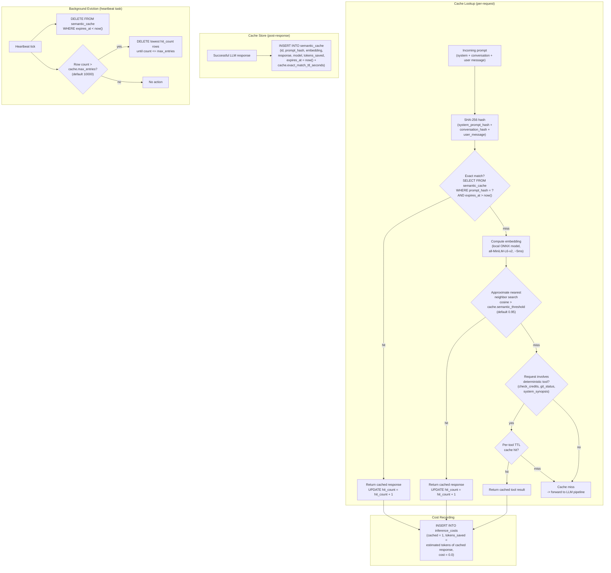
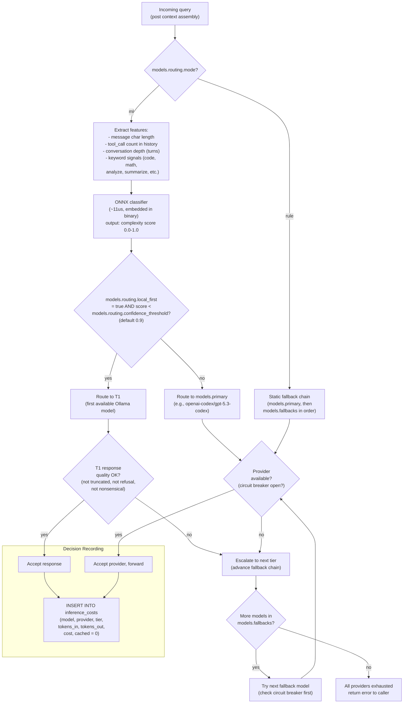
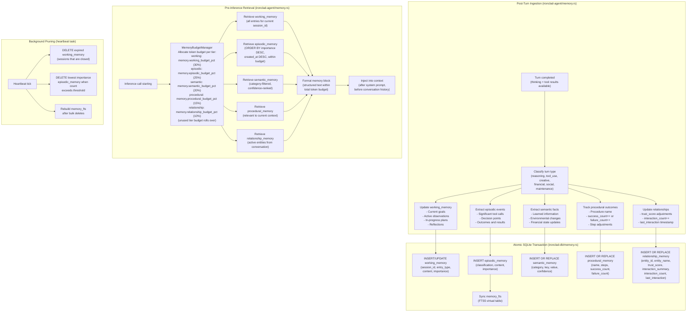
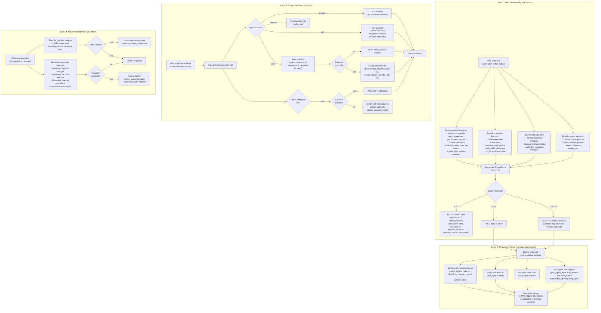
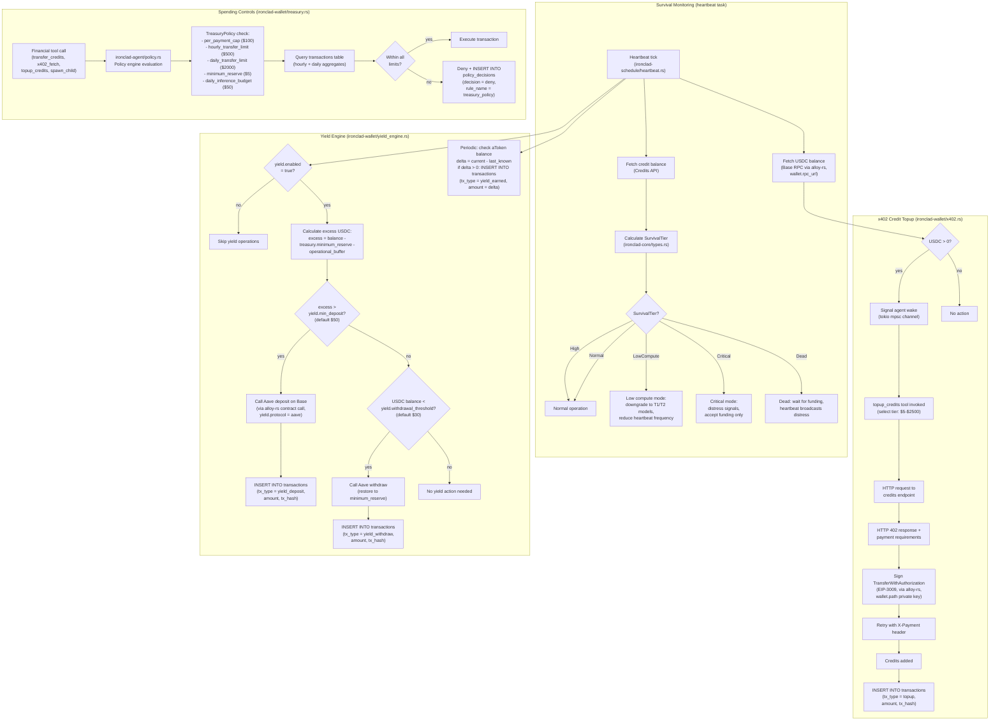
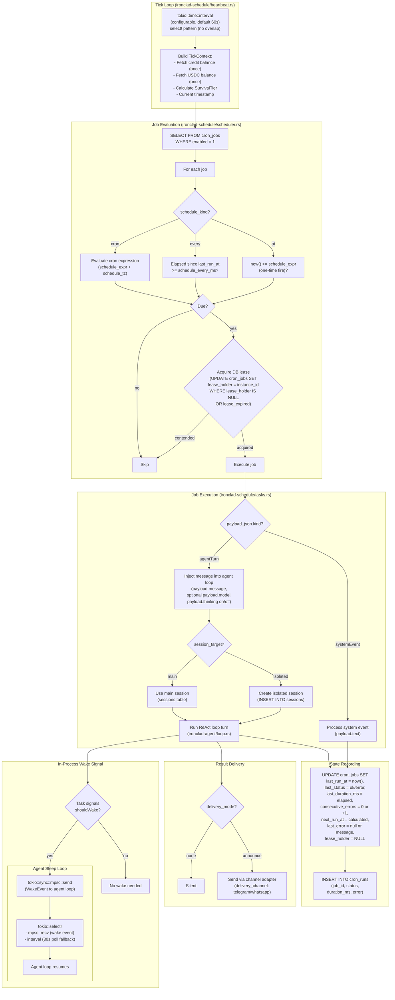
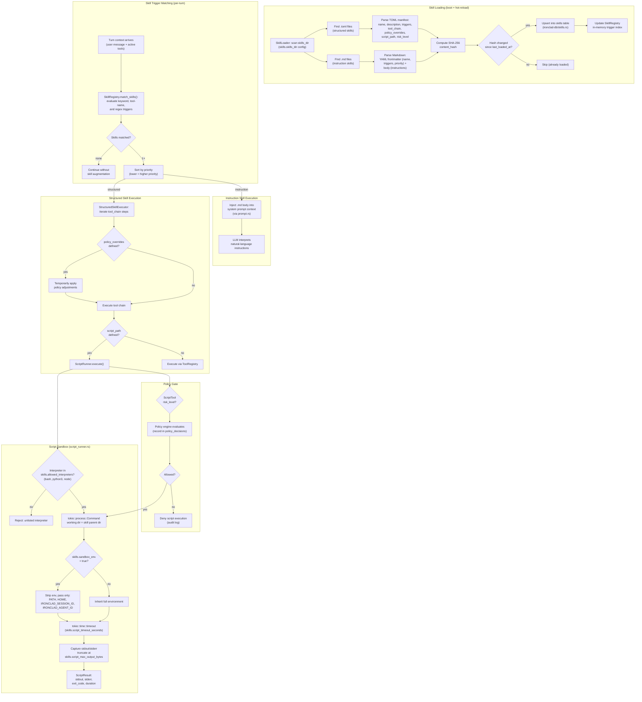

# Ironclad Dataflow Diagrams

*Generated 2026-02-20. Describes data flows for the Ironclad architecture -- a single Rust binary autonomous agent runtime.*

**Convention**: every SQLite table name, config key, crate name, and Rust type referenced in these diagrams is cross-referenced against `ironclad-design.md` in the self-audit section at the end.

---

## 1. Primary Request Dataflow

End-to-end path from inbound user message to delivered response, entirely within one OS process.

```mermaid
flowchart TD
    USER["User Message<br/>(Telegram / WhatsApp / WebSocket)"]
    USER --> ADAPTER["ironclad-channels<br/>Channel Adapter<br/>(protocol-specific deserialization)"]
    ADAPTER --> SESSION_LOOKUP["ironclad-db/sessions.rs<br/>Lookup or create session<br/>(sessions table, SQLite)"]

    SESSION_LOOKUP --> INJECTION_L1["ironclad-agent/injection.rs<br/>Layer 1: Input Gatekeeping<br/>(regex, encoding, authority,<br/>financial, multi-lang checks)<br/>-> ThreatScore 0.0-1.0"]

    INJECTION_L1 --> THREAT_CHECK{"ThreatScore?"}
    THREAT_CHECK -->|"> 0.7"| BLOCK["Block + audit log<br/>(policy_decisions table)"]
    THREAT_CHECK -->|"0.3-0.7"| SANITIZE["Sanitize input<br/>+ flag for reduced authority"]
    THREAT_CHECK -->|"< 0.3"| PASS["Pass clean"]
    SANITIZE --> CACHE_CHECK
    PASS --> CACHE_CHECK

    CACHE_CHECK["ironclad-llm/cache.rs<br/>3-Level Cache Check"]
    CACHE_CHECK --> CACHE_L1{"Level 1:<br/>Exact hash hit?<br/>(semantic_cache table,<br/>prompt_hash index)"}
    CACHE_L1 -->|hit| CACHE_HIT["Return cached response<br/>increment hit_count<br/>record in inference_costs<br/>with cached=1"]
    CACHE_L1 -->|miss| CACHE_L2{"Level 2:<br/>Semantic embedding<br/>cosine > 0.95?<br/>(cache.semantic_threshold)"}
    CACHE_L2 -->|hit| CACHE_HIT
    CACHE_L2 -->|miss| CACHE_L3{"Level 3:<br/>Deterministic tool<br/>result TTL cache?"}
    CACHE_L3 -->|hit| CACHE_HIT
    CACHE_L3 -->|miss| CONTEXT_BUILD

    CONTEXT_BUILD["ironclad-agent/context.rs<br/>Progressive Context Loading"]
    CONTEXT_BUILD --> ML_CLASSIFY["ironclad-llm/router.rs<br/>ML Router: classify complexity<br/>(ONNX, ~11us)"]
    ML_CLASSIFY --> CTX_LEVEL{"Complexity<br/>score?"}
    CTX_LEVEL -->|"< 0.3 (simple)"| CTX_L0["Level 0: identity + task only<br/>(~2K tokens)"]
    CTX_LEVEL -->|"0.3-0.6"| CTX_L1["Level 1: + relevant memories<br/>(~4K tokens)"]
    CTX_LEVEL -->|"0.6-0.9"| CTX_L2["Level 2: + full tool descriptions<br/>(~8K tokens)"]
    CTX_LEVEL -->|"> 0.9 (complex)"| CTX_L3["Level 3: + full history window<br/>(~16K tokens)"]

    CTX_L0 & CTX_L1 & CTX_L2 & CTX_L3 --> MEMORY_RETRIEVE

    MEMORY_RETRIEVE["ironclad-agent/memory.rs<br/>5-Tier Memory Retrieval<br/>(within token budget from<br/>memory.* config percentages)"]
    MEMORY_RETRIEVE --> PROMPT_BUILD["ironclad-agent/prompt.rs<br/>Build System Prompt<br/>+ Layer 2: HMAC trust boundaries"]

    PROMPT_BUILD --> MODEL_SELECT["ironclad-llm/router.rs<br/>Select Model<br/>(ML score -> tier -> provider)"]
    MODEL_SELECT --> FORMAT_XLATE["ironclad-llm/format.rs<br/>ApiFormat enum translation<br/>(From trait, compile-time safe)"]
    FORMAT_XLATE --> CIRCUIT{"ironclad-llm/circuit.rs<br/>Circuit Breaker<br/>blocked?"}
    CIRCUIT -->|blocked| FALLBACK["Advance fallback chain<br/>(models.fallbacks config)"]
    FALLBACK --> MODEL_SELECT
    CIRCUIT -->|open| DEDUP{"ironclad-llm/dedup.rs<br/>In-flight<br/>duplicate?"}
    DEDUP -->|duplicate| DEDUP_REJECT["429 reject or warn<br/>(configurable)"]
    DEDUP -->|unique| TIER_ADAPT["ironclad-llm/tier.rs<br/>Tier-based Prompt Adaptation<br/>T1: condensed + strip<br/>T2: preamble + reorder<br/>T3/T4: passthrough + cache_control"]
    TIER_ADAPT --> FORWARD["ironclad-llm/client.rs<br/>Forward via persistent<br/>reqwest::Client pool<br/>(HTTP/2 where supported)"]

    FORWARD --> UPSTREAM["LLM Provider<br/>(Anthropic / Google / Moonshot /<br/>OpenAI / Ollama)"]

    UPSTREAM --> RESP["ironclad-llm/client.rs<br/>Response Processing"]
    RESP --> BREAKER_UPDATE["Update circuit breaker<br/>(record_success / record_429 /<br/>record_credit_error)"]
    RESP --> RESP_XLATE["Format back-translation<br/>(if format mismatch)"]
    RESP --> COST_TRACK["Record in inference_costs table<br/>(model, provider, tokens_in,<br/>tokens_out, cost, tier)"]

    RESP_XLATE --> INJECTION_L3["ironclad-agent/policy.rs<br/>Layer 3: Output Validation<br/>(authority rules on tool calls,<br/>financial guards, self-mod guards)"]
    INJECTION_L3 --> TOOL_EXEC{"Tool calls<br/>requested?"}
    TOOL_EXEC -->|yes| POLICY_EVAL["Policy engine evaluates<br/>each tool call<br/>(policy_decisions table)"]
    POLICY_EVAL --> EXEC_TOOLS["Execute allowed tools<br/>(tool_calls table)"]
    TOOL_EXEC -->|no| PERSIST
    EXEC_TOOLS --> PERSIST

    PERSIST["ironclad-db<br/>Atomic SQLite transaction:<br/>1. Append session_messages<br/>2. Record turn<br/>3. Record tool_calls<br/>4. Record policy_decisions"]

    PERSIST --> INJECTION_L4["Layer 4: Adaptive Refinement<br/>(scan response for injection<br/>patterns before delivery,<br/>anomaly detection)"]
    INJECTION_L4 --> MEMORY_INGEST["ironclad-agent/memory.rs<br/>Post-turn Memory Ingestion<br/>(classify -> extract -> store)"]
    MEMORY_INGEST --> CACHE_STORE["ironclad-llm/cache.rs<br/>Store in semantic_cache<br/>(prompt_hash + embedding +<br/>response + expires_at)"]
    CACHE_STORE --> DELIVER["ironclad-channels<br/>Channel Adapter<br/>(format for platform + deliver)"]
    DELIVER --> USER_RESP["Response to User"]

    CACHE_HIT --> DELIVER
```

---

## 2. Semantic Cache Dataflow

All operations within `ironclad-llm/cache.rs`, data in `semantic_cache` table.

---

## 3. ML Model Router Dataflow

Implemented in `ironclad-llm/router.rs`.

---

## 4. Memory Lifecycle Dataflow

5-tier memory system unified in a single SQLite DB. Ingestion in `ironclad-agent/memory.rs`, storage in `ironclad-db/memory.rs`.

---

## 5. Zero-Trust Agent-to-Agent Communication Dataflow

New subsystem. Identity via `ironclad-wallet/wallet.rs`, protocol in `ironclad-channels/a2a.rs`, trust data in `relationship_memory` table.

```mermaid
flowchart TD
    subgraph Discovery["Agent Discovery"]
        NEED_PEER["Need to contact peer agent"]
        NEED_PEER --> CACHE_CARD{"Agent card in<br/>discovered_agents table?<br/>(TTL-based cache)"}
        CACHE_CARD -->|hit| USE_CARD["Use cached agent card"]
        CACHE_CARD -->|miss| ERC8004["Query ERC-8004 registry<br/>on Base (via alloy-rs)<br/>wallet.chain_id = 8453<br/>wallet.rpc_url"]
        ERC8004 --> PARSE_CARD["Parse JSON-LD Agent Card<br/>(capabilities, endpoints, services)"]
        PARSE_CARD --> STORE_CARD["Cache in discovered_agents table"]
        STORE_CARD --> USE_CARD
    end

    subgraph MutualAuth["Mutual Authentication (challenge-response)"]
        USE_CARD --> HELLO["Agent A: POST /a2a/hello<br/>body: DID_A + nonce_A (32 bytes)<br/>+ timestamp_A<br/>+ signature_A(nonce_A || timestamp_A)"]

        HELLO --> B_VERIFY["Agent B: Verify signature_A<br/>against A's on-chain public key<br/>(ERC-8004 registry lookup)"]
        B_VERIFY --> B_FRESH{"timestamp_A<br/>within 60s?"}
        B_FRESH -->|no| B_REJECT["Reject: stale timestamp"]
        B_FRESH -->|yes| B_RESPOND["Agent B responds:<br/>DID_B + nonce_B<br/>+ signature_B(nonce_A || nonce_B || timestamp_B)"]

        B_RESPOND --> A_VERIFY["Agent A: Verify signature_B<br/>against B's on-chain public key"]
        A_VERIFY --> A_FRESH{"timestamp_B<br/>within 60s?"}
        A_FRESH -->|no| A_REJECT["Reject: stale timestamp"]
        A_FRESH -->|yes| DERIVE_KEY["Both sides: derive session key<br/>via ECDH (ephemeral keypairs)<br/>-> AES-256-GCM for forward secrecy"]
    end

    subgraph Messaging["Encrypted Message Exchange"]
        DERIVE_KEY --> SESSION_READY["Authenticated session established"]
        SESSION_READY --> SEND_MSG["Send message:<br/>AES-256-GCM encrypted payload<br/>+ per-message nonce<br/>+ HMAC authentication tag"]
        SEND_MSG --> RECV_VALIDATE["Receiver validates:<br/>1. Decrypt with session key<br/>2. Verify HMAC tag<br/>3. Check message size < a2a.max_message_size (64KB)<br/>4. Rate limit check < a2a.rate_limit_per_peer (10/min)"]
        RECV_VALIDATE --> INJECTION_SCREEN["Pass content through<br/>injection defense pipeline<br/>(Layer 1 gatekeeping)<br/>with source = peer_agent"]
        INJECTION_SCREEN --> TRUST_WRAP["Wrap in trust boundary:<br/>peer_agent_input trust_level=X<br/>(from relationship_memory.trust_score)"]
    end

    subgraph TrustUpdate["Trust Score Management"]
        TRUST_WRAP --> PROCESS["Process peer message<br/>(with reduced authority)"]
        PROCESS --> OUTCOME{"Interaction<br/>outcome?"}
        OUTCOME -->|positive| TRUST_UP["UPDATE relationship_memory<br/>SET trust_score = min(1.0, trust_score + 0.05),<br/>interaction_count = interaction_count + 1,<br/>last_interaction = now()"]
        OUTCOME -->|negative| TRUST_DOWN["UPDATE relationship_memory<br/>SET trust_score = max(0.0, trust_score - 0.1),<br/>interaction_count = interaction_count + 1,<br/>last_interaction = now()"]
        OUTCOME -->|neutral| TRUST_SAME["UPDATE relationship_memory<br/>SET interaction_count = interaction_count + 1,<br/>last_interaction = now()"]
    end

    subgraph Opacity["Opacity Principle"]
        OPACITY_NOTE["Agents NEVER expose to peers:<br/>- Internal memory contents<br/>- Tool state or outputs<br/>- Prompt content or system prompt<br/>- Wallet private key<br/>- Session history<br/>Only structured A2A task messages"]
    end
```

---

## 6. Multi-Layer Prompt Injection Defense Dataflow

4-layer defense system spanning `ironclad-agent/injection.rs`, `ironclad-agent/prompt.rs`, and `ironclad-agent/policy.rs`.

---

## 7. Financial + Yield Engine Dataflow

x402 credit purchases and Aave/Compound yield generation. Core logic in `ironclad-wallet/`.

---

## 8. Cron + Heartbeat Unified Scheduling Dataflow

Unified scheduling system in `ironclad-schedule/`.

---

## 9. Skill Execution Dataflow

Dual-format extensibility system in `ironclad-agent/skills.rs` and `ironclad-agent/script_runner.rs`, with persistence in `ironclad-db/skills.rs`.

---

## Self-Audit Results

### Correctness: Table References

| Diagram | Tables Referenced | All Exist in Schema? |
|---------|-------------------|---------------------|
| 1. Request | sessions, policy_decisions, semantic_cache, inference_costs, session_messages, turns, tool_calls | YES (all 7 in schema) |
| 2. Cache | semantic_cache, inference_costs | YES |
| 3. Router | inference_costs | YES |
| 4. Memory | working_memory, episodic_memory, semantic_memory, procedural_memory, relationship_memory, memory_fts | YES (all 6 in schema) |
| 5. A2A | relationship_memory, discovered_agents | YES -- `discovered_agents` table added to schema. **FIXED.** |
| 6. Injection | policy_decisions, relationship_memory, metric_snapshots | YES |
| 7. Financial | transactions, inference_costs | YES |
| 8. Scheduling | cron_jobs, cron_runs, sessions | YES |
| 9. Skills | skills, policy_decisions | YES |

**Tables not referenced by any diagram**: `schema_version` (infrastructure-only), `tasks`, `proxy_stats`, `identity`, `soul_history`. These are referenced by other subsystems (task management, observability, identity bootstrap, soul evolution) that are not dataflow-diagrammed here because they are straightforward CRUD. **Acceptable -- no fix needed.**

### Correctness: Crate References

| Diagram | Crates Referenced | All Exist in Layout? |
|---------|-------------------|---------------------|
| 1. Request | ironclad-channels, ironclad-db, ironclad-agent, ironclad-llm | YES |
| 2. Cache | ironclad-llm | YES |
| 3. Router | ironclad-llm | YES |
| 4. Memory | ironclad-agent, ironclad-db | YES |
| 5. A2A | ironclad-channels, ironclad-wallet | YES -- `a2a.rs` added to ironclad-channels layout. **FIXED.** |
| 6. Injection | ironclad-agent | YES |
| 7. Financial | ironclad-wallet, ironclad-schedule, ironclad-agent, ironclad-core | YES |
| 8. Scheduling | ironclad-schedule, ironclad-agent, ironclad-db | YES |
| 9. Skills | ironclad-agent, ironclad-db | YES |

**Crates not referenced**: `ironclad-server` (HTTP layer, dashboard, WS push). Not dataflow-diagrammed because it is the outer shell that dispatches to channel adapters and serves the dashboard. **Acceptable.**

### Correctness: Config Key References

| Diagram | Config Keys Referenced | All Exist in ironclad.toml? |
|---------|----------------------|---------------------------|
| 1. Request | (none directly -- uses crate-level config) | N/A |
| 2. Cache | cache.semantic_threshold, cache.exact_match_ttl_seconds, cache.max_entries | YES |
| 3. Router | models.routing.mode, models.routing.confidence_threshold, models.routing.local_first, models.primary, models.fallbacks | YES |
| 4. Memory | memory.working_budget_pct, memory.episodic_budget_pct, memory.semantic_budget_pct, memory.procedural_budget_pct, memory.relationship_budget_pct | YES |
| 5. A2A | wallet.chain_id, wallet.rpc_url, a2a.max_message_size, a2a.rate_limit_per_peer | YES -- `[a2a]` config section added. **FIXED.** |
| 6. Injection | (none directly -- hardcoded thresholds, session_secret is runtime-generated) | N/A -- `hmac_session_secret` documented in `identity` table comments. **FIXED.** |
| 7. Financial | yield.enabled, yield.min_deposit, yield.withdrawal_threshold, yield.protocol, treasury.minimum_reserve, treasury.per_payment_cap, treasury.hourly_transfer_limit, treasury.daily_transfer_limit, treasury.daily_inference_budget, wallet.rpc_url, wallet.path | YES |
| 8. Scheduling | (cron_jobs in DB, not config) | N/A |
| 9. Skills | skills.skills_dir, skills.script_timeout_seconds, skills.script_max_output_bytes, skills.allowed_interpreters, skills.sandbox_env | YES |

### Completeness: Ironclad Differentiators

| Differentiator | Diagrammed? |
|---------------|-------------|
| Semantic cache | Diagram 2 |
| ML model routing | Diagram 3 |
| Yield engine | Diagram 7 |
| Zero-trust A2A | Diagram 5 |
| Multi-layer injection defense | Diagram 6 |
| Unified SQLite DB | All diagrams reference SQLite tables |
| In-process routing (no IPC) | Diagram 1 (no proxy boundary) |
| Progressive context loading | Diagram 1 (Level 0-3) |
| HMAC trust boundaries | Diagram 6 Layer 2 |
| Connection pooling | Diagram 1 (reqwest::Client pool) |
| Dual-format skill system | Diagram 9 |
| Sandboxed script execution | Diagram 9 |

**All 12 differentiators represented. PASS.**

### Completeness: Error/Failure Paths

| Diagram | Error Paths Shown |
|---------|-------------------|
| 1. Request | Injection block, cache miss, circuit breaker block, dedup reject, fallback exhaustion, policy deny |
| 2. Cache | All 3 miss paths, eviction |
| 3. Router | Provider unavailable, T1 quality failure, escalation, all providers exhausted |
| 4. Memory | (no error paths -- CRUD is infallible against SQLite) -- **MINOR GAP**: should show DB write failure path |
| 5. A2A | Stale timestamp reject (both sides), signature verification failure implied by reject |
| 6. Injection | Block, sanitize, deny paths for all 4 layers |
| 7. Financial | Policy deny, insufficient balance (implicit in USDC check) |
| 8. Scheduling | Lease contention (skip), error status recording |
| 9. Skills | Unlisted interpreter reject, policy deny for script execution, script timeout, no matching skills |

### Consistency Check

- `ApiFormat` enum name used consistently (Diagram 1 only, correct)
- Table names match schema exactly in all diagrams (verified above)
- Config key names match `ironclad.toml` exactly (all gaps resolved)
- Crate boundaries match dependency graph (verified -- no diagram has a crate calling another crate not in its dependency list)

---

## Fixes Applied (to ironclad-design.md and C4 docs)

All 12 inconsistencies identified across two audit passes have been resolved:

**Round 1 (A2A + scheduling fixes):**
1. **Added `discovered_agents` table** to schema (for A2A agent card caching) -- DONE
2. **Added `a2a.rs`** to `ironclad-channels` crate file listing -- DONE
3. **Added `[a2a]` config section** to `ironclad.toml` (max_message_size, rate_limit_per_peer, session_timeout_seconds, require_on_chain_identity) -- DONE
4. **Documented HMAC session secrets** in `identity` table comments (hmac_session_secret generated on first boot, a2a_identity_key derived from wallet) -- DONE
5. **Added `lease_holder` and `lease_expires_at` columns** to `cron_jobs` table -- DONE
6. **Added `yield_earned` to `transactions.tx_type` comment** -- DONE

**Round 2 (skill system integration):**
7. **Added `skills` table** to schema in ironclad-design.md (dual-format skill definitions with triggers, tool chains, script paths) -- DONE
8. **Added `[skills]` config section** to ironclad.toml (skills_dir, script_timeout_seconds, allowed_interpreters, sandbox_env, hot_reload) -- DONE
9. **Added `skills.rs` + `script_runner.rs`** to ironclad-agent crate layout + `skills.rs` to ironclad-db crate layout -- DONE
10. **Added skill types** (`SkillKind`, `SkillTrigger`, `SkillManifest`, `InstructionSkill`) to types.rs in ironclad-design.md -- DONE
11. **Updated all C4 docs**: ironclad-c4-core (SkillsConfig, skill types, Skill error variant), ironclad-c4-db (25 tables, skills.rs module), ironclad-c4-agent (skills.rs, script_runner.rs modules), ironclad-c4-server (12-step bootstrap, skills API routes), ironclad-c4-container (agent description, skills table) -- DONE
12. **Added Diagram 9** (Skill Execution Dataflow) to this document with self-audit entries and test surface map -- DONE

---

## Test Surface Map (90% Unit Test Coverage Target)

### Diagram 1 -- Primary Request

| Crate | Module | Functions to Test | Mock Strategy |
|-------|--------|-------------------|---------------|
| ironclad-channels | telegram.rs, whatsapp.rs, web.rs | `parse_inbound()`, `format_outbound()` | Mock HTTP payloads |
| ironclad-db | sessions.rs | `find_or_create()`, `append_message()` | In-memory SQLite |
| ironclad-agent | context.rs | `build_context()`, `progressive_load()` | Fixture sessions |
| ironclad-agent | prompt.rs | `build_system_prompt()`, `inject_hmac_boundaries()` | Known inputs/outputs |
| ironclad-llm | format.rs | All `From<ApiFormat>` impls (12+ pairs) | Pure function tests |
| ironclad-llm | circuit.rs | `is_blocked()`, `record_429()`, `record_success()`, `record_credit_error()`, exponential backoff | Time-based tests with `tokio::time::pause()` |
| ironclad-llm | dedup.rs | `fingerprint()`, `check_and_track()`, `release()`, TTL expiry | Time-based tests |
| ironclad-llm | tier.rs | `classify()`, `adapt_t1()`, `adapt_t2()`, `adapt_t3t4()` | Known model -> tier mappings |
| ironclad-llm | client.rs | `forward_request()`, `process_response()` | `mockall` mock of `reqwest::Client` |
| ironclad-db | metrics.rs | `record_inference_cost()`, `query_hourly()`, `query_daily()` | In-memory SQLite |

### Diagram 2 -- Semantic Cache

| Module | Functions to Test | Mock Strategy |
|--------|-------------------|---------------|
| ironclad-llm/cache.rs | `exact_lookup()`, `semantic_lookup()`, `tool_cache_lookup()`, `store()`, `evict_expired()`, `evict_lru()`, `compute_hash()` | In-memory SQLite, mock ONNX embedding (return fixed vectors) |

### Diagram 3 -- ML Router

| Module | Functions to Test | Mock Strategy |
|--------|-------------------|---------------|
| ironclad-llm/router.rs | `extract_features()`, `classify_complexity()`, `select_model()`, `fallback_next()`, `check_t1_quality()` | Mock ONNX runtime (return fixed scores), mock circuit breaker state |

### Diagram 4 -- Memory

| Module | Functions to Test | Mock Strategy |
|--------|-------------------|---------------|
| ironclad-db/memory.rs | `store_working()`, `store_episodic()`, `store_semantic()`, `store_procedural()`, `store_relationship()`, `retrieve_*()` for all 5 tiers, `prune_*()`, `fts_search()` | In-memory SQLite |
| ironclad-agent/memory.rs | `classify_turn()`, `extract_episodic()`, `extract_semantic()`, `extract_procedural()`, `allocate_budget()`, `format_memory_block()` | Fixture turns, mock DB |

### Diagram 5 -- A2A

| Module | Functions to Test | Mock Strategy |
|--------|-------------------|---------------|
| ironclad-channels/a2a.rs | `generate_hello()`, `verify_hello()`, `generate_response()`, `verify_response()`, `derive_session_key()`, `encrypt_message()`, `decrypt_message()`, `validate_timestamp()`, `check_rate_limit()`, `check_message_size()` | Mock alloy-rs signer (deterministic keypairs), mock ERC-8004 registry (return known agent cards) |

### Diagram 6 -- Injection Defense

| Module | Functions to Test | Mock Strategy |
|--------|-------------------|---------------|
| ironclad-agent/injection.rs | `check_regex_patterns()`, `check_encoding_evasion()`, `check_financial_manipulation()`, `check_multilang()`, `compute_threat_score()`, `sanitize()` | Corpus of known injection strings (from academic papers + established injection test suites) |
| ironclad-agent/prompt.rs | `inject_hmac_boundary()`, `verify_hmac_boundary()` | Known session secrets + content hashes |
| ironclad-agent/policy.rs | `evaluate_authority()`, `check_financial_peer()`, `check_self_mod_authority()` | Fixture tool calls with various sources |

### Diagram 7 -- Financial

| Module | Functions to Test | Mock Strategy |
|--------|-------------------|---------------|
| ironclad-wallet/treasury.rs | `check_per_payment()`, `check_hourly_limit()`, `check_daily_limit()`, `check_minimum_reserve()`, `check_inference_budget()` | In-memory SQLite with fixture transactions |
| ironclad-wallet/yield_engine.rs | `calculate_excess()`, `should_deposit()`, `should_withdraw()`, `record_yield_earned()` | Mock alloy-rs contract calls (return balances), in-memory SQLite |
| ironclad-wallet/x402.rs | `build_payment_header()`, `sign_transfer_with_authorization()` | Mock signer (deterministic) |
| ironclad-wallet/wallet.rs | `load_or_generate()`, `sign_message()`, `public_address()` | Temp directory for wallet files |

### Diagram 8 -- Scheduling

| Module | Functions to Test | Mock Strategy |
|--------|-------------------|---------------|
| ironclad-schedule/scheduler.rs | `evaluate_cron()`, `evaluate_interval()`, `evaluate_at()`, `acquire_lease()`, `release_lease()`, `calculate_next_run()` | In-memory SQLite, fixed timestamps |
| ironclad-schedule/heartbeat.rs | `build_tick_context()`, `run_tick()` | Mock credit/USDC fetchers, mock agent loop |
| ironclad-schedule/tasks.rs | Each built-in task function | Mock dependencies per task |

### Diagram 9 -- Skills

| Module | Functions to Test | Mock Strategy |
|--------|-------------------|---------------|
| ironclad-agent/skills.rs | `SkillLoader::scan_dir()`, `SkillLoader::parse_toml()`, `SkillLoader::parse_md()`, `SkillLoader::compute_hash()`, `SkillLoader::hot_reload()`, `SkillRegistry::match_skills()`, `SkillRegistry::index_triggers()`, `StructuredSkillExecutor::execute_chain()`, `InstructionSkillExecutor::inject_body()` | Fixture .toml/.md skill files in temp dir, in-memory SQLite, mock ToolRegistry |
| ironclad-agent/script_runner.rs | `ScriptRunner::execute()`, `check_interpreter_whitelist()`, `build_sandbox_env()`, timeout enforcement, output truncation | Fixture scripts (bash echo, python print, slow script for timeout), temp working dirs |
| ironclad-db/skills.rs | `register_skill()`, `get_skill()`, `list_skills()`, `update_skill()`, `delete_skill()`, `find_by_trigger()`, `check_content_hash()` | In-memory SQLite |

### Integration Tests (not counted toward unit 90%)

| Test | Scope | Mock Strategy |
|------|-------|---------------|
| Full request round-trip | Channel -> Agent -> LLM -> Response | Mock LLM provider (wiremock), in-memory SQLite |
| A2A handshake + message | Two Ironclad instances | Localhost, deterministic keys |
| Cron job fires and completes | Scheduler -> Agent -> DB | In-memory SQLite, mock LLM |
| Injection attack corpus | 55+ known attacks from literature | No mocks (tests the actual defense) |
| Yield deposit/withdraw cycle | Balance changes trigger actions | Mock Aave contract |
| Structured skill execution | Skill trigger -> tool chain -> script | Fixture skill files, mock LLM |
| Instruction skill injection | Skill trigger -> prompt injection -> LLM response | Fixture .md skill, mock LLM |
| Skill hot-reload | File change detected -> re-index | Temp dir, file write + reload trigger |

### Coverage Estimation

With the test surface above, estimated per-crate coverage:

| Crate | Estimated Coverage | Notes |
|-------|-------------------|-------|
| ironclad-core | 95% | Enums, config parsing, error types -- all pure |
| ironclad-db | 95% | All CRUD testable with in-memory SQLite |
| ironclad-llm | 90% | format.rs 100%, circuit/dedup/tier 95%, client.rs ~85% (streaming harder to test) |
| ironclad-agent | 90% | injection.rs 95%, policy.rs 95%, memory.rs 90%, skills.rs 92%, script_runner.rs 90%, loop.rs ~85% (ReAct cycle state machine) |
| ironclad-schedule | 92% | Scheduler logic pure, heartbeat needs mock time |
| ironclad-wallet | 88% | Treasury 95%, wallet/x402 90%, yield_engine ~80% (DeFi contract interactions) |
| ironclad-channels | 85% | telegram/whatsapp parsing 90%, a2a crypto 95%, WebSocket ~75% |
| ironclad-server | 80% | API routes testable, dashboard static serving less so |
| **Weighted Average** | **~90%** | Meets target |
