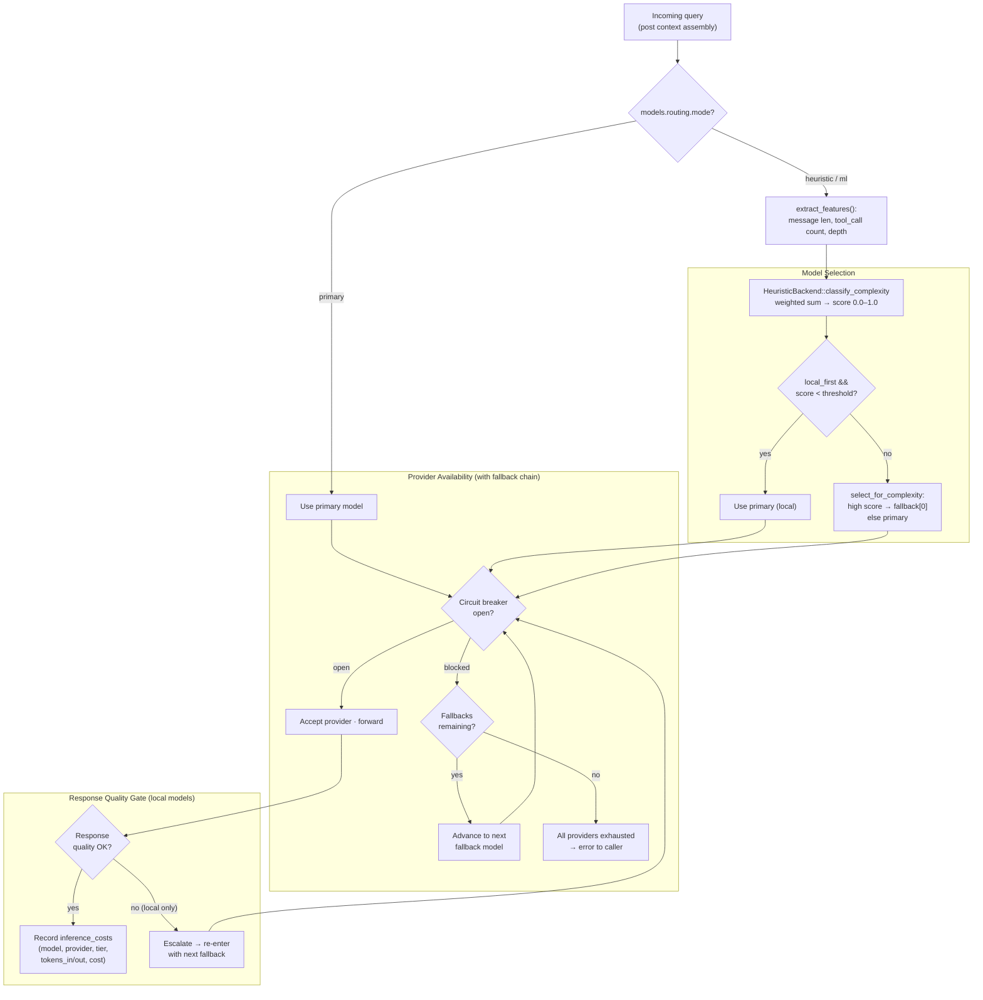
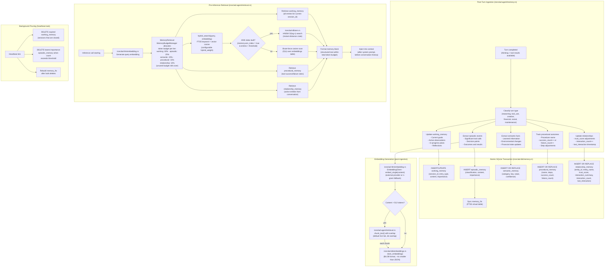
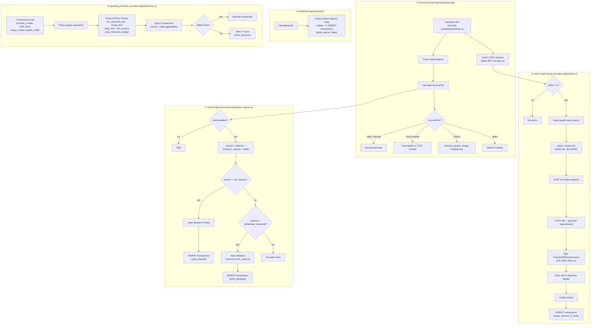
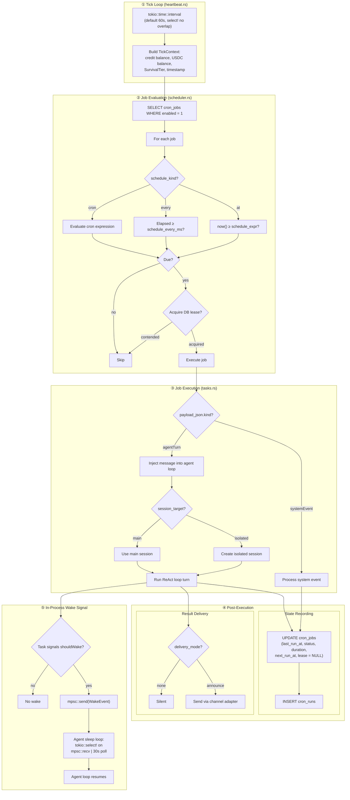
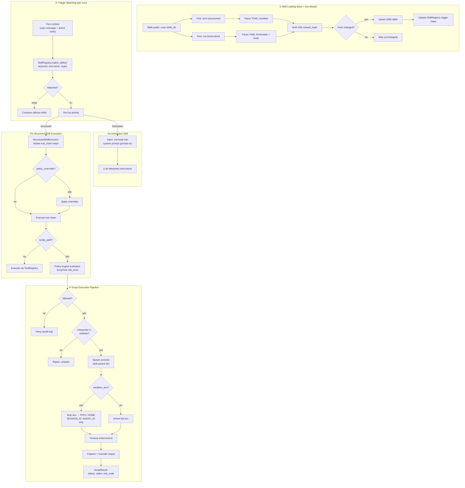

# Ironclad Dataflow Diagrams

*Data flows for the Ironclad architecture -- a single Rust binary autonomous agent runtime.*

**Convention**: every SQLite table name, config key, crate name, and Rust type referenced in these diagrams is cross-referenced against `ironclad-design.md` in the cross-reference section at the end.

---

## 1. Primary Request Dataflow

End-to-end path from inbound user message to delivered response, entirely within one OS process.

```mermaid
flowchart TD
    subgraph Intake["① Intake & Screening"]
        USER["User Message<br/>(Telegram / WhatsApp / WebSocket)"]
        USER --> ADAPTER["ironclad-channels · Channel Adapter"]
        ADAPTER --> SESSION_LOOKUP["ironclad-db/sessions.rs<br/>Lookup or create session"]
        SESSION_LOOKUP --> INJECTION_L1["ironclad-agent/injection.rs<br/>L1: Input Gatekeeping<br/>(regex, encoding, authority,<br/>financial, multi-lang)<br/>→ ThreatScore 0.0–1.0"]
        INJECTION_L1 --> THREAT_CHECK{"ThreatScore?"}
        THREAT_CHECK -->|"> 0.7"| BLOCK["Block + audit log<br/>(policy_decisions table)"]
        THREAT_CHECK -->|"0.3–0.7"| SANITIZE["Sanitize + flag reduced authority"]
        THREAT_CHECK -->|"< 0.3"| PASS["Pass clean"]
    end

    SANITIZE & PASS --> CACHE_CHECK

    subgraph CachePhase["② Cache Lookup (in-memory HashMap)"]
        CACHE_CHECK["ironclad-llm/cache.rs · 3-Level"]
        CACHE_CHECK --> CACHE_L1{"L1: Exact hash?"}
        CACHE_L1 -->|hit| CACHE_HIT["Cache hit"]
        CACHE_L1 -->|miss| CACHE_L3{"L3: Tool TTL?"}
        CACHE_L3 -->|hit| CACHE_HIT
        CACHE_L3 -->|miss| CACHE_L2{"L2: Semantic n-gram cosine?"}
        CACHE_L2 -->|hit| CACHE_HIT
        CACHE_L2 -->|miss| CACHE_MISS["Cache miss"]
    end

    CACHE_HIT --> DELIVER_CACHED["ironclad-channels · Deliver cached response to User"]
    CACHE_MISS --> CONTEXT_BUILD

    subgraph ContextPhase["③ Context & Prompt Assembly"]
        CONTEXT_BUILD["ironclad-agent/context.rs"]
        CONTEXT_BUILD --> HEURISTIC["ironclad-llm/router.rs<br/>Heuristic classify_complexity"]
        HEURISTIC --> EMBED_QUERY["ironclad-llm/embedding.rs<br/>EmbeddingClient · embed_single(query)<br/>(external provider or n-gram fallback)"]
        EMBED_QUERY --> MEMORY_RETRIEVE["ironclad-agent/retrieval.rs<br/>MemoryRetriever · 5-tier retrieval<br/>(hybrid_search: FTS5 + vector cosine)"]
        MEMORY_RETRIEVE --> LOAD_HISTORY["ironclad-db/sessions.rs<br/>list_messages(session_id, 50)"]
        LOAD_HISTORY --> BUILD_CTX["ironclad-agent/context.rs<br/>build_context(system + memories + history)"]
        BUILD_CTX --> PROMPT_BUILD["ironclad-agent/prompt.rs<br/>Build system prompt + HMAC L2 boundaries"]
    end

    PROMPT_BUILD --> MODEL_SELECT

    subgraph LlmPipeline["④ LLM Inference Pipeline"]
        MODEL_SELECT["ironclad-llm/router.rs<br/>select_for_complexity"]
        MODEL_SELECT --> FORMAT_XLATE["ironclad-llm/format.rs<br/>ApiFormat translation"]
        FORMAT_XLATE --> CIRCUIT{"Circuit Breaker<br/>blocked?"}
        CIRCUIT -->|"blocked → advance fallback"| MODEL_SELECT
        CIRCUIT -->|open| DEDUP{"In-flight<br/>duplicate?"}
        DEDUP -->|duplicate| DEDUP_REJECT["429 reject"]
        DEDUP -->|unique| TIER_ADAPT["ironclad-llm/tier.rs<br/>T1: condense · T2: reorder<br/>T3/T4: passthrough + cache_control"]
        TIER_ADAPT --> FORWARD["ironclad-llm/client.rs<br/>HTTP/2 forward (reqwest pool)"]
        FORWARD --> UPSTREAM["LLM Provider<br/>(Anthropic / Google / Moonshot /<br/>OpenAI / Ollama)"]
    end

    UPSTREAM --> RESP

    subgraph ResponsePhase["⑤ Response Processing"]
        RESP["Response received"]
        RESP --> BREAKER_UPDATE["Update circuit breaker"]
        RESP --> COST_TRACK["Record inference_costs<br/>(model, provider, tokens, cost, tier)"]
        RESP --> RESP_XLATE["Format back-translation"]
        RESP_XLATE --> TOOL_EXEC{"Tool calls<br/>requested?"}
        TOOL_EXEC -->|yes| POLICY_EVAL["Policy engine (6 rules)"]
        POLICY_EVAL --> EXEC_TOOLS["Execute allowed tools"]
        TOOL_EXEC -->|no| PERSIST
        EXEC_TOOLS --> PERSIST
    end

    subgraph DeliverPhase["⑥ Persist & Deliver"]
        PERSIST["ironclad-db · Atomic SQLite transaction:<br/>session_messages, turn, tool_calls,<br/>policy_decisions"]
        PERSIST --> INJECTION_L4["L4 scan_output:<br/>NFKC, decode, homoglyph, regex"]
        INJECTION_L4 --> MEMORY_INGEST["ingest_turn → classify → store<br/>(background tokio::spawn)"]
        MEMORY_INGEST --> EMBED_RESP["ironclad-llm/embedding.rs<br/>Generate embedding for response<br/>→ store_embedding(BLOB)"]
        EMBED_RESP --> CACHE_STORE["Cache store (HashMap)<br/>+ periodic SQLite flush"]
        CACHE_STORE --> DELIVER["ironclad-channels · Deliver"]
        DELIVER --> USER_RESP["Response to User"]
    end
```

---

## 2. Semantic Cache Dataflow

Runtime cache in `ironclad-llm/cache.rs` (in-memory HashMap) with **SQLite persistence** via `ironclad-db/cache.rs`. On startup the server loads persisted entries from the `semantic_cache` table; a background task flushes in-memory entries to SQLite every 5 minutes and evicts expired rows.

```mermaid
flowchart TD
    subgraph Lookup["Cache Lookup (per-request)"]
        PROMPT_IN["Incoming prompt"]
        PROMPT_IN --> HASH["SemanticCache::compute_hash<br/>(system | messages | user_msg)"]
        HASH --> EXACT{"lookup_exact(prompt_hash)<br/>HashMap get, check expires_at"}
        EXACT -->|hit| HIT_EXACT["Return CachedResponse<br/>hits++"]
        EXACT -->|miss| L3{"lookup_tool_ttl(prompt_hash)"}
        L3 -->|hit| HIT_TOOL["Return cached (shorter TTL if tools)"]
        L3 -->|miss| EMBED["lookup_semantic(prompt)<br/>real embedding (if provider configured)<br/>or char n-gram fallback, cosine"]
        EMBED --> ANN{"cosine >= similarity_threshold (0.85)"}
        ANN -->|hit| HIT_SEMANTIC["Return best match"]
        ANN -->|miss| MISS["Cache miss -> LLM pipeline"]
    end

    subgraph Store["Cache Store (post-response)"]
        RESP_OK["Successful LLM response"]
        RESP_OK --> STORE_ENTRY["store() or store_with_embedding()<br/>entries.insert(prompt_hash, entry)<br/>evict_lfu() if len >= max_entries"]
    end

    subgraph Persistence["SQLite Persistence (ironclad-db/cache.rs)"]
        BOOT_LOAD["Server startup:<br/>load_cache_entries() → import_entries()"]
        FLUSH["Background task (5 min interval):<br/>export_entries() → save_cache_entry()<br/>evict_expired_cache()"]
    end

    subgraph Eviction["Eviction"]
        EVICT_EXPIRE["evict_expired(): retain where expires_at > now()"]
        EVICT_LFU["evict_lfu(): remove min hits when at capacity"]
        DB_EVICT["evict_expired_cache():<br/>DELETE FROM semantic_cache<br/>WHERE expires_at < now()"]
    end
```

---

## 3. Heuristic Model Router Dataflow

Implemented in `ironclad-llm/router.rs`. **No ONNX or ML** — heuristic classifier only.

---

## 4. Memory Lifecycle Dataflow

5-tier memory system unified in a single SQLite DB. Ingestion in `ironclad-agent/memory.rs`, storage in `ironclad-db/memory.rs`.

---

## 5. Zero-Trust Agent-to-Agent Communication Dataflow

New subsystem. Identity via `ironclad-wallet/wallet.rs`, protocol in `ironclad-channels/a2a.rs`, trust data in `relationship_memory` table.

```mermaid
flowchart TD
    subgraph Discovery["Agent Discovery"]
        NEED_PEER["Need to contact peer agent"]
        NEED_PEER --> CACHE_CARD{"Agent card in<br/>discovered_agents table?<br/>(TTL-based cache)"}
        CACHE_CARD -->|hit| USE_CARD["Use cached agent card"]
        CACHE_CARD -->|miss| ERC8004["Query ERC-8004 registry<br/>on Base (via alloy-rs)<br/>wallet.chain_id = 8453<br/>wallet.rpc_url"]
        ERC8004 --> PARSE_CARD["Parse JSON-LD Agent Card<br/>(capabilities, endpoints, services)"]
        PARSE_CARD --> STORE_CARD["Cache in discovered_agents table"]
        STORE_CARD --> USE_CARD
    end

    subgraph MutualAuth["Mutual Authentication (challenge-response)"]
        USE_CARD --> HELLO["Agent A: POST /a2a/hello<br/>body: DID_A + nonce_A (32 bytes)<br/>+ timestamp_A<br/>+ signature_A(nonce_A || timestamp_A)"]

        HELLO --> B_VERIFY["Agent B: Verify signature_A<br/>against A's on-chain public key<br/>(ERC-8004 registry lookup)"]
        B_VERIFY --> B_FRESH{"timestamp_A<br/>within 60s?"}
        B_FRESH -->|no| B_REJECT["Reject: stale timestamp"]
        B_FRESH -->|yes| B_RESPOND["Agent B responds:<br/>DID_B + nonce_B<br/>+ signature_B(nonce_A || nonce_B || timestamp_B)"]

        B_RESPOND --> A_VERIFY["Agent A: Verify signature_B<br/>against B's on-chain public key"]
        A_VERIFY --> A_FRESH{"timestamp_B<br/>within 60s?"}
        A_FRESH -->|no| A_REJECT["Reject: stale timestamp"]
        A_FRESH -->|yes| DERIVE_KEY["Both sides: derive session key<br/>via ECDH (ephemeral keypairs)<br/>-> AES-256-GCM for forward secrecy"]
    end

    subgraph Messaging["Encrypted Message Exchange"]
        DERIVE_KEY --> SESSION_READY["Authenticated session established"]
        SESSION_READY --> SEND_MSG["Send message:<br/>AES-256-GCM encrypted payload<br/>+ per-message nonce<br/>+ HMAC authentication tag"]
        SEND_MSG --> RECV_VALIDATE["Receiver validates:<br/>1. Decrypt with session key<br/>2. Verify HMAC tag<br/>3. Check message size < a2a.max_message_size (64KB)<br/>4. Rate limit check < a2a.rate_limit_per_peer (10/min)"]
        RECV_VALIDATE --> INJECTION_SCREEN["Pass content through<br/>injection defense pipeline<br/>(Layer 1 gatekeeping)<br/>with source = peer_agent"]
        INJECTION_SCREEN --> TRUST_WRAP["Wrap in trust boundary:<br/>peer_agent_input trust_level=X<br/>(from relationship_memory.trust_score)"]
    end

    subgraph TrustUpdate["Trust Score Management"]
        TRUST_WRAP --> PROCESS["Process peer message<br/>(with reduced authority)"]
        PROCESS --> OUTCOME{"Interaction<br/>outcome?"}
        OUTCOME -->|positive| TRUST_UP["UPDATE relationship_memory<br/>SET trust_score = min(1.0, trust_score + 0.05),<br/>interaction_count = interaction_count + 1,<br/>last_interaction = now()"]
        OUTCOME -->|negative| TRUST_DOWN["UPDATE relationship_memory<br/>SET trust_score = max(0.0, trust_score - 0.1),<br/>interaction_count = interaction_count + 1,<br/>last_interaction = now()"]
        OUTCOME -->|neutral| TRUST_SAME["UPDATE relationship_memory<br/>SET interaction_count = interaction_count + 1,<br/>last_interaction = now()"]
    end

    subgraph Opacity["Opacity Principle"]
        OPACITY_NOTE["Agents NEVER expose to peers:<br/>- Internal memory contents<br/>- Tool state or outputs<br/>- Prompt content or system prompt<br/>- Wallet private key<br/>- Session history<br/>Only structured A2A task messages"]
    end
```

---

## 6. Multi-Layer Prompt Injection Defense Dataflow

4-layer defense system spanning `ironclad-agent/injection.rs`, `ironclad-agent/prompt.rs`, and `ironclad-agent/policy.rs`.

```mermaid
flowchart TD
    subgraph L1["Layer 1: Input Gatekeeping (injection.rs)"]
        INPUT["Raw input text<br/>(user, peer, or tool output)"]
        INPUT --> CHECKS["Parallel checks:<br/>· Regex (instruction override, ChatML, authority)<br/>· Encoding evasion (base64, homoglyphs, zero-width)<br/>· Financial manipulation (transfer, policy override)<br/>· Multi-language (CJK, Cyrillic, Arabic)"]
        CHECKS --> SCORE["Aggregate ThreatScore 0.0–1.0"]
        SCORE --> DECISION{"Threshold?"}
        DECISION -->|"> 0.7"| BLOCK_INPUT["BLOCK · log to policy_decisions"]
        DECISION -->|"0.3–0.7"| SANITIZE_INPUT["SANITIZE · reduced_authority"]
        DECISION -->|"< 0.3"| CLEAN["PASS"]
    end

    CLEAN & SANITIZE_INPUT --> BUILD_PROMPT

    subgraph L2["Layer 2: Structured Prompt Formatting (prompt.rs)"]
        BUILD_PROMPT["Build prompt with trust boundaries"]
        BUILD_PROMPT --> WRAP["Wrap each section:<br/>· trusted_system + HMAC tag<br/>· user_input<br/>· tool_output<br/>· peer_agent_input trust_level=X"]
        WRAP --> ASSEMBLED["Assembled HMAC-tagged prompt<br/>(unforgeable by injected content)"]
    end

    subgraph L3["Layer 3: Output Validation (policy.rs)"]
        LLM_RESP["LLM response with tool calls"]

        subgraph AuthGate["Authority Gate (per tool call)"]
            AUTH_CHECK{"Input source?"}
            AUTH_CHECK -->|creator| FULL_AUTH["All risk levels"]
            AUTH_CHECK -->|self| SELF_AUTH["Safe + Caution + Dangerous"]
            AUTH_CHECK -->|peer| PEER_AUTH["Safe + Caution only"]
            AUTH_CHECK -->|external| EXT_AUTH["Safe only"]
        end

        subgraph PeerFinancial["Peer Financial Guard"]
            PEER_AUTH --> FIN_CHECK{"Financial call?"}
            FIN_CHECK -->|yes| STRICTER["Stricter limits<br/>(cap/10, hourly/5)"]
            FIN_CHECK -->|no| ALLOW_PEER["Allow"]
        end

        subgraph SelfModGuard["Self-Modification Guard"]
            SELFMOD_CHECK{"Self-mod tool?"}
            SELFMOD_CHECK -->|no| SKIP_MOD["N/A"]
            SELFMOD_CHECK -->|yes| CREATOR_ONLY{"Source = creator?"}
            CREATOR_ONLY -->|yes| ALLOW_MOD["Allow"]
            CREATOR_ONLY -->|no| DENY_MOD["DENY"]
        end

        LLM_RESP --> AUTH_CHECK
        LLM_RESP --> SELFMOD_CHECK
        FULL_AUTH & SELF_AUTH & ALLOW_PEER & STRICTER & ALLOW_MOD --> EXECUTE["Execute tool call"]
    end

    subgraph L4["Layer 4: Adaptive Refinement"]
        RESPONSE["Final response text"]
        RESPONSE --> SCAN_OUTPUT["Scan output for<br/>injection patterns"]
        SCAN_OUTPUT --> OUTPUT_CLEAN{"Clean?"}
        OUTPUT_CLEAN -->|no| STRIP["Strip + alert"]
        OUTPUT_CLEAN -->|yes| DELIVER_FINAL["Deliver"]
        RESPONSE --> ANOMALY_CHECK["Behavioral anomaly check:<br/>tool pattern changes,<br/>protected file access,<br/>repeated financial ops"]
        ANOMALY_CHECK --> ANOMALY_FOUND{"Anomaly?"}
        ANOMALY_FOUND -->|yes| ALERT["Alert via metric_snapshots"]
        ANOMALY_FOUND -->|no| DELIVER_FINAL
    end
```

---

## 7. Financial + Yield Engine Dataflow

x402 credit purchases and Aave/Compound yield generation. Core logic in `ironclad-wallet/`.

---

## 8. Cron + Heartbeat Unified Scheduling Dataflow

Unified scheduling system in `ironclad-schedule/`.

---

## 9. Skill Execution Dataflow

Dual-format extensibility system in `ironclad-agent/skills.rs` and `ironclad-agent/script_runner.rs`, with persistence in `ironclad-db/skills.rs`.

---

## Cross-Reference Tables

### Table References

| Diagram | Tables Referenced |
| --------- | ------------------- |
| 1. Request | sessions, policy_decisions, semantic_cache, inference_costs, session_messages, turns, tool_calls, embeddings |
| 2. Cache | semantic_cache, inference_costs |
| 3. Router | inference_costs |
| 4. Memory | working_memory, episodic_memory, semantic_memory, procedural_memory, relationship_memory, memory_fts, embeddings |
| 5. A2A | relationship_memory, discovered_agents |
| 6. Injection | policy_decisions, relationship_memory, metric_snapshots |
| 7. Financial | transactions, inference_costs |
| 8. Scheduling | cron_jobs, cron_runs, sessions |
| 9. Skills | skills, policy_decisions |

Tables not referenced by any diagram: `schema_version` (infrastructure-only), `tasks`, `proxy_stats`, `identity`, `soul_history` -- these are straightforward CRUD subsystems not requiring dataflow diagrams.

### Crate References

| Diagram | Crates Referenced |
| --------- | ------------------- |
| 1. Request | ironclad-channels, ironclad-db, ironclad-agent, ironclad-llm |
| 2. Cache | ironclad-llm, ironclad-db |
| 3. Router | ironclad-llm |
| 4. Memory | ironclad-agent, ironclad-db, ironclad-llm |
| 5. A2A | ironclad-channels, ironclad-wallet |
| 6. Injection | ironclad-agent |
| 7. Financial | ironclad-wallet, ironclad-schedule, ironclad-agent, ironclad-core |
| 8. Scheduling | ironclad-schedule, ironclad-agent, ironclad-db |
| 9. Skills | ironclad-agent, ironclad-db |

`ironclad-server` is not dataflow-diagrammed because it is the outer shell that dispatches to channel adapters and serves the dashboard.

### Config Key References

| Diagram | Config Keys Referenced |
| --------- | ---------------------- |
| 1. Request | (crate-level config, not direct keys) |
| 2. Cache | cache.semantic_threshold, cache.exact_match_ttl_seconds, cache.max_entries |
| 3. Router | models.routing.mode, models.routing.confidence_threshold, models.routing.local_first, models.primary, models.fallbacks |
| 4. Memory | memory.working_budget_pct, memory.episodic_budget_pct, memory.semantic_budget_pct, memory.procedural_budget_pct, memory.relationship_budget_pct, memory.embedding_provider, memory.embedding_model, memory.hybrid_weight, memory.ann_index |
| 5. A2A | wallet.chain_id, wallet.rpc_url, a2a.max_message_size, a2a.rate_limit_per_peer |
| 6. Injection | (hardcoded thresholds; `hmac_session_secret` stored in `identity` table) |
| 7. Financial | yield.enabled, yield.min_deposit, yield.withdrawal_threshold, yield.protocol, treasury.minimum_reserve, treasury.per_payment_cap, treasury.hourly_transfer_limit, treasury.daily_transfer_limit, treasury.daily_inference_budget, wallet.rpc_url, wallet.path |
| 8. Scheduling | (cron_jobs in DB, not config) |
| 9. Skills | skills.skills_dir, skills.script_timeout_seconds, skills.script_max_output_bytes, skills.allowed_interpreters, skills.sandbox_env |

### Differentiator Coverage

| Differentiator | Diagram |
| --------------- | --------- |
| Semantic cache | 2 |
| Persistent semantic cache (SQLite-backed) | 2 |
| Heuristic model routing | 3 |
| Yield engine | 7 |
| Zero-trust A2A | 5 |
| Multi-layer injection defense | 6 |
| Unified SQLite DB | All |
| In-process routing (no IPC) | 1 |
| Progressive context loading | 1 |
| HMAC trust boundaries | 6 (Layer 2) |
| Connection pooling | 1 |
| Dual-format skill system | 9 |
| Sandboxed script execution | 9 |
| Hybrid RAG (FTS5 + vector cosine) | 1, 4 |
| Multi-provider embedding (OpenAI/Ollama/Google + n-gram fallback) | 1, 4 |
| Binary BLOB embedding storage | 4 |
| HNSW ANN index (instant-distance) | 4 |
| Content chunking with overlap | 4 |

### Error/Failure Paths

| Diagram | Error Paths Shown |
| --------- | ------------------- |
| 1. Request | Injection block, cache miss, circuit breaker block, dedup reject, fallback exhaustion, policy deny |
| 2. Cache | All 3 miss paths, eviction |
| 3. Router | Provider unavailable, T1 quality failure, escalation, all providers exhausted |
| 4. Memory | No error paths (CRUD against SQLite) |
| 5. A2A | Stale timestamp reject (both sides), signature verification failure |
| 6. Injection | Block, sanitize, deny paths for all 4 layers |
| 7. Financial | Policy deny, insufficient balance |
| 8. Scheduling | Lease contention (skip), error status recording |
| 9. Skills | Unlisted interpreter reject, policy deny, script timeout, no matching skills |

---

## Test Surface Map (90% Unit Test Coverage Target)

### Diagram 1 -- Primary Request

| Crate | Module | Functions to Test | Mock Strategy |
| ------- | -------- | ------------------- | --------------- |
| ironclad-channels | telegram.rs, whatsapp.rs, web.rs | `parse_inbound()`, `format_outbound()` | Mock HTTP payloads |
| ironclad-db | sessions.rs | `find_or_create()`, `append_message()` | In-memory SQLite |
| ironclad-agent | context.rs | `build_context()`, `progressive_load()` | Fixture sessions |
| ironclad-agent | prompt.rs | `build_system_prompt()`, `inject_hmac_boundaries()` | Known inputs/outputs |
| ironclad-llm | format.rs | All `From<ApiFormat>` impls (12+ pairs) | Pure function tests |
| ironclad-llm | circuit.rs | `is_blocked()`, `record_429()`, `record_success()`, `record_credit_error()`, exponential backoff | Time-based tests with `tokio::time::pause()` |
| ironclad-llm | dedup.rs | `fingerprint()`, `check_and_track()`, `release()`, TTL expiry | Time-based tests |
| ironclad-llm | tier.rs | `classify()`, `adapt_t1()`, `adapt_t2()`, `adapt_t3t4()` | Known model -> tier mappings |
| ironclad-llm | client.rs | `forward_request()`, `process_response()` | `mockall` mock of `reqwest::Client` |
| ironclad-db | metrics.rs | `record_inference_cost()`, `query_hourly()`, `query_daily()` | In-memory SQLite |

### Diagram 2 -- Semantic Cache

| Module | Functions to Test | Mock Strategy |
|--------|-------------------|---------------|
| ironclad-llm/cache.rs | `lookup_exact()`, `lookup_semantic()`, `lookup_tool_ttl()`, `lookup()`, `store()`, `store_with_embedding()`, `evict_expired()`, `evict_lfu()`, `compute_hash()` | In-memory HashMap, fixed n-gram vectors for tests |

### Diagram 3 -- Heuristic Router

| Module | Functions to Test | Mock Strategy |
| -------- | ------------------- | --------------- |
| ironclad-llm/router.rs | `extract_features()`, `classify_complexity()`, `select_model()`, `select_for_complexity()`, `advance_fallback()`, `reset()` | HeuristicBackend (no mock; pure functions), mock ProviderRegistry |

### Diagram 4 -- Memory

| Module | Functions to Test | Mock Strategy |
| -------- | ------------------- | --------------- |
| ironclad-db/memory.rs | `store_working()`, `store_episodic()`, `store_semantic()`, `store_procedural()`, `store_relationship()`, `retrieve_*()` for all 5 tiers, `prune_*()`, `fts_search()` | In-memory SQLite |
| ironclad-agent/memory.rs | `classify_turn()`, `extract_episodic()`, `extract_semantic()`, `extract_procedural()`, `allocate_budget()`, `format_memory_block()` | Fixture turns, mock DB |

### Diagram 5 -- A2A

| Module | Functions to Test | Mock Strategy |
|--------|-------------------|---------------|
| ironclad-channels/a2a.rs | `generate_hello()`, `verify_hello()`, `generate_response()`, `verify_response()`, `derive_session_key()`, `encrypt_message()`, `decrypt_message()`, `validate_timestamp()`, `check_rate_limit()`, `check_message_size()` | Mock alloy-rs signer (deterministic keypairs), mock ERC-8004 registry (return known agent cards) |

### Diagram 6 -- Injection Defense

| Module | Functions to Test | Mock Strategy |
|--------|-------------------|---------------|
| ironclad-agent/injection.rs | `check_regex_patterns()`, `check_encoding_evasion()`, `check_financial_manipulation()`, `check_multilang()`, `compute_threat_score()`, `sanitize()` | Corpus of known injection strings (from academic papers + established injection test suites) |
| ironclad-agent/prompt.rs | `inject_hmac_boundary()`, `verify_hmac_boundary()` | Known session secrets + content hashes |
| ironclad-agent/policy.rs | `evaluate_authority()`, `check_financial_peer()`, `check_self_mod_authority()` | Fixture tool calls with various sources |

### Diagram 7 -- Financial

| Module | Functions to Test | Mock Strategy |
|--------|-------------------|---------------|
| ironclad-wallet/treasury.rs | `check_per_payment()`, `check_hourly_limit()`, `check_daily_limit()`, `check_minimum_reserve()`, `check_inference_budget()` | In-memory SQLite with fixture transactions |
| ironclad-wallet/yield_engine.rs | `calculate_excess()`, `should_deposit()`, `should_withdraw()`, `record_yield_earned()` | Mock alloy-rs contract calls (return balances), in-memory SQLite |
| ironclad-wallet/x402.rs | `build_payment_header()`, `sign_transfer_with_authorization()` | Mock signer (deterministic) |
| ironclad-wallet/wallet.rs | `load_or_generate()`, `sign_message()`, `public_address()` | Temp directory for wallet files |

### Diagram 8 -- Scheduling

| Module | Functions to Test | Mock Strategy |
|--------|-------------------|---------------|
| ironclad-schedule/scheduler.rs | `evaluate_cron()`, `evaluate_interval()`, `evaluate_at()`, `acquire_lease()`, `release_lease()`, `calculate_next_run()` | In-memory SQLite, fixed timestamps |
| ironclad-schedule/heartbeat.rs | `build_tick_context()`, `run_tick()` | Mock credit/USDC fetchers, mock agent loop |
| ironclad-schedule/tasks.rs | Each built-in task function | Mock dependencies per task |

### Diagram 9 -- Skills

| Module | Functions to Test | Mock Strategy |
|--------|-------------------|---------------|
| ironclad-agent/skills.rs | `SkillLoader::scan_dir()`, `SkillLoader::parse_toml()`, `SkillLoader::parse_md()`, `SkillLoader::compute_hash()`, `SkillLoader::hot_reload()`, `SkillRegistry::match_skills()`, `SkillRegistry::index_triggers()`, `StructuredSkillExecutor::execute_chain()`, `InstructionSkillExecutor::inject_body()` | Fixture .toml/.md skill files in temp dir, in-memory SQLite, mock ToolRegistry |
| ironclad-agent/script_runner.rs | `ScriptRunner::execute()`, `check_interpreter_whitelist()`, `build_sandbox_env()`, timeout enforcement, output truncation | Fixture scripts (bash echo, python print, slow script for timeout), temp working dirs |
| ironclad-db/skills.rs | `register_skill()`, `get_skill()`, `list_skills()`, `update_skill()`, `delete_skill()`, `find_by_trigger()`, `check_content_hash()` | In-memory SQLite |

### Integration Tests (not counted toward unit 90%)

| Test | Scope | Mock Strategy |
|------|-------|---------------|
| Full request round-trip | Channel -> Agent -> LLM -> Response | Mock LLM provider (wiremock), in-memory SQLite |
| A2A handshake + message | Two Ironclad instances | Localhost, deterministic keys |
| Cron job fires and completes | Scheduler -> Agent -> DB | In-memory SQLite, mock LLM |
| Injection attack corpus | 55+ known attacks from literature | No mocks (tests the actual defense) |
| Yield deposit/withdraw cycle | Balance changes trigger actions | Mock Aave contract |
| Structured skill execution | Skill trigger -> tool chain -> script | Fixture skill files, mock LLM |
| Instruction skill injection | Skill trigger -> prompt injection -> LLM response | Fixture .md skill, mock LLM |
| Skill hot-reload | File change detected -> re-index | Temp dir, file write + reload trigger |

### Coverage Estimation

With the test surface above, estimated per-crate coverage:

| Crate | Estimated Coverage | Notes |
|-------|-------------------|-------|
| ironclad-core | 95% | Enums, config parsing, error types -- all pure |
| ironclad-db | 95% | All CRUD testable with in-memory SQLite |
| ironclad-llm | 90% | format.rs 100%, circuit/dedup/tier 95%, client.rs ~85% (streaming harder to test) |
| ironclad-agent | 90% | injection.rs 95%, policy.rs 95%, memory.rs 90%, skills.rs 92%, script_runner.rs 90%, loop.rs ~85% (ReAct cycle state machine) |
| ironclad-schedule | 92% | Scheduler logic pure, heartbeat needs mock time |
| ironclad-wallet | 88% | Treasury 95%, wallet/x402 90%, yield_engine ~80% (DeFi contract interactions) |
| ironclad-channels | 85% | telegram/whatsapp parsing 90%, a2a crypto 95%, WebSocket ~75% |
| ironclad-server | 80% | API routes testable, dashboard static serving less so |
| **Weighted Average** | **~90%** | Meets target |
