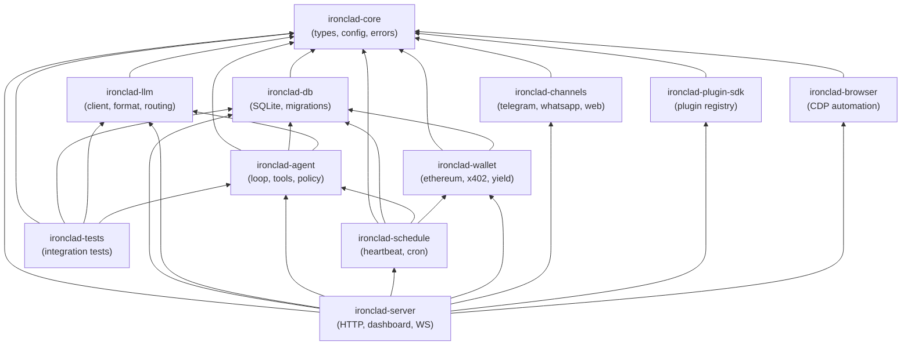

<!-- last_updated: 2026-02-26, version: 0.8.0 -->

# Ironclad: Architecture Design Document

*Complete blueprint for a Rust-native autonomous agent runtime.*

---

## 1. Workspace Layout

```
ironclad/
├── Cargo.toml                  # Workspace root
├── README.md
├── crates/
│   ├── ironclad-core/          # Core types, config, errors
│   │   ├── Cargo.toml
│   │   └── src/
│   │       ├── lib.rs
│   │       ├── config.rs       # Unified configuration
│   │       ├── error.rs        # Error types (thiserror)
│   │       ├── types.rs        # Shared domain types
│   │       ├── personality.rs  # Personality system
│   │       ├── style.rs        # Style formatting
│   │       └── bundled_providers.toml  # Bundled provider configs
│   │
│   ├── ironclad-db/            # Database layer (SQLite via rusqlite)
│   │   ├── Cargo.toml
│   │   └── src/
│   │       ├── lib.rs
│   │       ├── schema.rs       # Table definitions + migrations
│   │       ├── sessions.rs     # Session CRUD
│   │       ├── memory.rs       # 5-tier memory CRUD
│   │       ├── tools.rs        # Tool call records
│   │       ├── policy.rs       # Policy decision records
│   │       ├── metrics.rs      # Metrics + cost tracking
│   │       ├── cron.rs         # Cron job state
│   │       ├── skills.rs       # Skill definition CRUD
│   │       ├── embeddings.rs   # Embedding storage / lookup (BLOB + JSON)
│   │       ├── ann.rs          # HNSW ANN index (instant-distance)
│   │       ├── cache.rs        # Semantic cache persistence
│   │       ├── efficiency.rs   # Context Observatory analytics (0.5.0)
│   │       └── migrations/     # SQL migration files
│   │
│   ├── ironclad-llm/           # LLM client + format translation
│   │   ├── Cargo.toml
│   │   └── src/
│   │       ├── lib.rs
│   │       ├── client.rs       # HTTP client pool (reqwest), streaming support (0.5.0)
│   │       ├── format.rs       # API format enums + translation
│   │       ├── provider.rs     # Provider definitions
│   │       ├── circuit.rs      # Circuit breaker
│   │       ├── dedup.rs        # In-flight dedup tracker
│   │       ├── tier.rs         # Tier classification + adaptation
│   │       ├── router.rs       # Heuristic model router
│   │       ├── cache.rs        # Semantic cache (HashMap + SQLite persist)
│   │       ├── transform.rs    # Response transform pipeline (0.5.0)
│   │       └── embedding.rs    # Multi-provider embedding client
│   │
│   ├── ironclad-agent/         # Agent loop + tools + policy
│   │   ├── Cargo.toml
│   │   └── src/
│   │       ├── lib.rs
│   │       ├── loop.rs         # ReAct loop (state machine)
│   │       ├── tools.rs        # Tool trait + built-in tools
│   │       ├── policy.rs       # Policy engine
│   │       ├── prompt.rs       # System prompt builder
│   │       ├── context.rs      # Context assembly + compression
│   │       ├── injection.rs    # Injection defense
│   │       ├── memory.rs       # Memory budget + ingestion
│   │       ├── retrieval.rs    # MemoryRetriever + content chunker (RAG)
│   │       ├── skills.rs       # Skill loader, registry, executor
│   │       ├── script_runner.rs # Sandboxed external script execution
│   │       ├── approvals.rs    # Approval flows
│   │       ├── addressability.rs # Group chat addressability filter (0.5.0)
│   │       ├── browser_tool.rs # Browser as agent tool (0.5.0)
│   │       ├── interview.rs    # Personality interview
│   │       └── subagents.rs    # Subagent registry
│   │
│   ├── ironclad-schedule/      # Heartbeat + cron
│   │   ├── Cargo.toml
│   │   └── src/
│   │       ├── lib.rs
│   │       ├── heartbeat.rs    # Heartbeat daemon
│   │       ├── scheduler.rs    # Cron scheduler (DB-backed)
│   │       └── tasks.rs        # Built-in heartbeat tasks
│   │
│   ├── ironclad-wallet/        # Ethereum + x402 + yield
│   │   ├── Cargo.toml
│   │   └── src/
│   │       ├── lib.rs
│   │       ├── wallet.rs       # Ethereum wallet (alloy-rs)
│   │       ├── x402.rs         # x402 payment protocol
│   │       ├── treasury.rs     # Treasury policy
│   │       ├── yield_engine.rs # DeFi yield (Aave/Compound)
│   │       └── money.rs        # Money/currency types
│   │
│   ├── ironclad-channels/      # Channel adapters
│   │   ├── Cargo.toml
│   │   └── src/
│   │       ├── lib.rs
│   │       ├── router.rs       # ChannelRouter
│   │       ├── formatter.rs    # ChannelFormatter trait + per-platform formatters
│   │       ├── telegram.rs     # Telegram Bot API
│   │       ├── whatsapp.rs     # WhatsApp Cloud API
│   │       ├── web.rs          # WebSocket interface
│   │       ├── a2a.rs          # Agent-to-Agent protocol (zero-trust)
│   │       ├── delivery.rs     # Delivery / notification
│   │       ├── signal.rs       # Signal Protocol (signal-cli daemon)
│   │       ├── email.rs        # Email adapter (IMAP + SMTP)
│   │       └── discord.rs      # Discord adapter
│   │
│   ├── ironclad-plugin-sdk/    # Plugin registry, tool discovery
│   │   ├── Cargo.toml
│   │   └── src/
│   │
│   ├── ironclad-browser/       # Browser automation (CDP)
│   │   ├── Cargo.toml
│   │   └── src/
│   │
│   ├── ironclad-server/        # HTTP server + dashboard
│   │   ├── Cargo.toml
│   │   ├── src/
│   │   │   ├── lib.rs
│   │   │   ├── main.rs         # Entry point + CLI
│   │   │   ├── api/
│   │   │   │   ├── mod.rs
│   │   │   │   └── routes/     # build_router(), admin, agent, approvals, channels, cron, health, interview, memory, sessions, skills, subagents
│   │   │   ├── cli/            # CLI commands (admin, wallet, schedule, memory, sessions, status, ...)
│   │   │   ├── auth.rs          # Token-based API authentication
│   │   │   ├── daemon.rs        # System daemon management
│   │   │   ├── rate_limit.rs    # Rate limiting middleware
│   │   │   ├── dashboard.rs     # Dashboard serving
│   │   │   ├── dashboard_spa.html # Embedded SPA template
│   │   │   ├── plugins.rs       # Plugin management
│   │   │   └── ws.rs            # WebSocket push
│   │   └── static/             # Dashboard static assets
│   │
│   ├── ironclad-tests/         # Integration tests
│   │   ├── Cargo.toml
│   │   └── src/
│   │
│   └── ...
├── docs/
│   └── architecture/           # This documentation
│
└── crates/ironclad-tests/      # End-to-end tests (not tests/integration/)
```

## 2. Crate Dependency Graph



## 3. Core Trait Hierarchy

```rust
// ironclad-core/src/types.rs

/// Survival tiers for financial health
pub enum SurvivalTier {
    High,       // > $5.00
    Normal,     // > $0.50
    LowCompute, // > $0.10
    Critical,   // >= $0.00
    Dead,       // < $0.00 for 1 hour
}

/// Agent lifecycle states (typestate enforcement is a roadmap item)
pub enum AgentState {
    Setup,
    Waking,
    Running,
    Sleeping,
    Dead,
}

/// LLM API formats (exhaustive enum)
pub enum ApiFormat {
    AnthropicMessages,
    OpenAiCompletions,
    OpenAiResponses,
    GoogleGenerativeAi,
}

/// Model tier classification
pub enum ModelTier {
    T1, // Local/free
    T2, // Cheap cloud
    T3, // Frontier
    T4, // Premium frontier
}

/// Policy evaluation result
pub enum PolicyDecision {
    Allow,
    Deny { rule: String, reason: String },
}

/// Tool risk levels
pub enum RiskLevel {
    Safe,
    Caution,
    Dangerous,
    Forbidden,
}

/// Skill definition kinds
pub enum SkillKind {
    Structured,  // TOML manifest with tool chains + optional script
    Instruction, // Markdown with YAML frontmatter + natural-language body
}

/// Trigger conditions for skill activation
pub struct SkillTrigger {
    pub keywords: Vec<String>,
    pub tool_names: Vec<String>,
    pub regex_patterns: Vec<String>,
}

/// Parsed structured skill manifest (from .toml)
pub struct SkillManifest {
    pub name: String,
    pub description: String,
    pub kind: SkillKind,
    pub triggers: SkillTrigger,
    pub priority: u32,
    pub tool_chain: Option<Vec<ToolChainStep>>,
    pub policy_overrides: Option<serde_json::Value>,
    pub script_path: Option<PathBuf>,
    pub risk_level: RiskLevel,
}

/// Parsed instruction skill (from .md)
pub struct InstructionSkill {
    pub name: String,
    pub description: String,
    pub triggers: SkillTrigger,
    pub priority: u32,
    pub body: String, // Markdown body injected into system prompt
}
```

```rust
// ironclad-agent/src/tools.rs

/// Every tool implements this trait
#[async_trait]
pub trait Tool: Send + Sync {
    fn name(&self) -> &str;
    fn description(&self) -> &str;
    fn risk_level(&self) -> RiskLevel;
    fn parameters_schema(&self) -> serde_json::Value;

    async fn execute(
        &self,
        params: serde_json::Value,
        ctx: &ToolContext,
    ) -> Result<ToolResult, ToolError>;
}
```

```rust
// ironclad-agent/src/policy.rs

/// Policy rules implement this trait
pub trait PolicyRule: Send + Sync {
    fn name(&self) -> &str;
    fn priority(&self) -> u32; // lower = higher priority
    fn evaluate(&self, call: &ToolCall, ctx: &PolicyContext) -> PolicyDecision;
}

/// Memory tiers implement this trait
#[async_trait]
pub trait MemoryTier: Send + Sync {
    fn tier_name(&self) -> &str;
    async fn store(&self, entry: MemoryEntry) -> Result<(), DbError>;
    async fn retrieve(&self, query: &str, budget_tokens: usize) -> Result<Vec<MemoryEntry>, DbError>;
    async fn prune(&self, max_entries: usize) -> Result<usize, DbError>;
}
```

## 4. Database Schema (Unified SQLite)

```sql
-- Schema version tracking
CREATE TABLE schema_version (
    version INTEGER NOT NULL,
    applied_at TEXT NOT NULL DEFAULT (datetime('now'))
);

-- Sessions (replaces JSONL files)
CREATE TABLE sessions (
    id TEXT PRIMARY KEY,
    agent_id TEXT NOT NULL,
    model TEXT,
    created_at TEXT NOT NULL DEFAULT (datetime('now')),
    updated_at TEXT NOT NULL DEFAULT (datetime('now')),
    metadata TEXT -- JSON blob
);

-- Session messages (replaces JSONL append-only log)
CREATE TABLE session_messages (
    id TEXT PRIMARY KEY,
    session_id TEXT NOT NULL REFERENCES sessions(id),
    parent_id TEXT,
    role TEXT NOT NULL, -- user, assistant, system, tool
    content TEXT NOT NULL,
    usage_json TEXT, -- token counts, cost
    created_at TEXT NOT NULL DEFAULT (datetime('now'))
);
CREATE INDEX idx_session_messages_session ON session_messages(session_id, created_at);

-- Agent turns (reasoning log)
CREATE TABLE turns (
    id TEXT PRIMARY KEY,
    session_id TEXT NOT NULL REFERENCES sessions(id),
    thinking TEXT,
    tool_calls_json TEXT,
    tokens_in INTEGER,
    tokens_out INTEGER,
    cost REAL,
    model TEXT,
    created_at TEXT NOT NULL DEFAULT (datetime('now'))
);

-- Tool call records
CREATE TABLE tool_calls (
    id TEXT PRIMARY KEY,
    turn_id TEXT NOT NULL REFERENCES turns(id),
    tool_name TEXT NOT NULL,
    input TEXT NOT NULL,
    output TEXT,
    status TEXT NOT NULL, -- success, error, denied
    duration_ms INTEGER,
    created_at TEXT NOT NULL DEFAULT (datetime('now'))
);
CREATE INDEX idx_tool_calls_turn ON tool_calls(turn_id);

-- Policy decisions (audit trail)
CREATE TABLE policy_decisions (
    id TEXT PRIMARY KEY,
    turn_id TEXT,
    tool_name TEXT NOT NULL,
    decision TEXT NOT NULL, -- allow, deny
    rule_name TEXT,
    reason TEXT,
    context_json TEXT,
    created_at TEXT NOT NULL DEFAULT (datetime('now'))
);

-- Working memory (session-scoped)
CREATE TABLE working_memory (
    id TEXT PRIMARY KEY,
    session_id TEXT NOT NULL,
    entry_type TEXT NOT NULL, -- goal, observation, plan, reflection
    content TEXT NOT NULL,
    importance INTEGER NOT NULL DEFAULT 5,
    created_at TEXT NOT NULL DEFAULT (datetime('now'))
);

-- Episodic memory (event log)
CREATE TABLE episodic_memory (
    id TEXT PRIMARY KEY,
    classification TEXT NOT NULL,
    content TEXT NOT NULL,
    importance INTEGER NOT NULL DEFAULT 5,
    created_at TEXT NOT NULL DEFAULT (datetime('now'))
);
CREATE INDEX idx_episodic_importance ON episodic_memory(importance DESC, created_at DESC);

-- Semantic memory (fact store)
CREATE TABLE semantic_memory (
    id TEXT PRIMARY KEY,
    category TEXT NOT NULL,
    key TEXT NOT NULL,
    value TEXT NOT NULL,
    confidence REAL NOT NULL DEFAULT 0.8,
    created_at TEXT NOT NULL DEFAULT (datetime('now')),
    updated_at TEXT NOT NULL DEFAULT (datetime('now')),
    UNIQUE(category, key)
);

-- Procedural memory (how-to)
CREATE TABLE procedural_memory (
    id TEXT PRIMARY KEY,
    name TEXT NOT NULL UNIQUE,
    steps TEXT NOT NULL, -- JSON array
    success_count INTEGER NOT NULL DEFAULT 0,
    failure_count INTEGER NOT NULL DEFAULT 0,
    created_at TEXT NOT NULL DEFAULT (datetime('now')),
    updated_at TEXT NOT NULL DEFAULT (datetime('now'))
);

-- Relationship memory (social graph)
CREATE TABLE relationship_memory (
    id TEXT PRIMARY KEY,
    entity_id TEXT NOT NULL UNIQUE,
    entity_name TEXT,
    trust_score REAL NOT NULL DEFAULT 0.5,
    interaction_summary TEXT,
    interaction_count INTEGER NOT NULL DEFAULT 0,
    last_interaction TEXT,
    created_at TEXT NOT NULL DEFAULT (datetime('now'))
);

-- Full-text search on memories: standalone FTS5 table + triggers
-- (triggers sync episodic/working/semantic inserts into memory_fts)
CREATE VIRTUAL TABLE memory_fts USING fts5(
    content,
    category,
    source_table,
    source_id
);

-- Tasks (replaces PostgreSQL tasks table)
CREATE TABLE tasks (
    id TEXT PRIMARY KEY,
    title TEXT NOT NULL,
    description TEXT,
    status TEXT NOT NULL DEFAULT 'pending', -- pending, running, done, cancelled
    priority INTEGER NOT NULL DEFAULT 0,
    source TEXT, -- cron, user, agent
    created_at TEXT NOT NULL DEFAULT (datetime('now')),
    updated_at TEXT NOT NULL DEFAULT (datetime('now'))
);

-- Cron jobs (replaces jobs.json)
CREATE TABLE cron_jobs (
    id TEXT PRIMARY KEY,
    name TEXT NOT NULL,
    description TEXT,
    enabled INTEGER NOT NULL DEFAULT 1,
    schedule_kind TEXT NOT NULL, -- cron, every, at
    schedule_expr TEXT, -- cron expression or ISO timestamp
    schedule_every_ms INTEGER, -- for 'every' kind
    schedule_tz TEXT DEFAULT 'UTC',
    agent_id TEXT NOT NULL,
    session_target TEXT NOT NULL DEFAULT 'main',
    payload_json TEXT NOT NULL,
    delivery_mode TEXT DEFAULT 'none',
    delivery_channel TEXT,
    last_run_at TEXT,
    last_status TEXT,
    last_duration_ms INTEGER,
    consecutive_errors INTEGER NOT NULL DEFAULT 0,
    next_run_at TEXT,
    last_error TEXT,
    lease_holder TEXT,                  -- Instance ID holding execution lease
    lease_expires_at TEXT               -- Lease expiry (prevents double-execution)
);

-- Cron run history
CREATE TABLE cron_runs (
    id TEXT PRIMARY KEY,
    job_id TEXT NOT NULL REFERENCES cron_jobs(id),
    status TEXT NOT NULL,
    duration_ms INTEGER,
    error TEXT,
    created_at TEXT NOT NULL DEFAULT (datetime('now'))
);

-- Financial transactions
CREATE TABLE transactions (
    id TEXT PRIMARY KEY,
    tx_type TEXT NOT NULL, -- topup, transfer, inference, yield_deposit, yield_withdraw, yield_earned
    amount REAL NOT NULL,
    currency TEXT NOT NULL DEFAULT 'USD',
    counterparty TEXT,
    tx_hash TEXT, -- on-chain transaction hash
    metadata_json TEXT,
    created_at TEXT NOT NULL DEFAULT (datetime('now'))
);

-- Inference cost tracking
CREATE TABLE inference_costs (
    id TEXT PRIMARY KEY,
    model TEXT NOT NULL,
    provider TEXT NOT NULL,
    tokens_in INTEGER NOT NULL,
    tokens_out INTEGER NOT NULL,
    cost REAL NOT NULL,
    tier TEXT, -- T1/T2/T3/T4
    cached INTEGER NOT NULL DEFAULT 0, -- was this a cache hit?
    created_at TEXT NOT NULL DEFAULT (datetime('now'))
);
CREATE INDEX idx_inference_costs_time ON inference_costs(created_at DESC);

-- Proxy stats snapshots
CREATE TABLE proxy_stats (
    id INTEGER PRIMARY KEY AUTOINCREMENT,
    snapshot_json TEXT NOT NULL,
    created_at TEXT NOT NULL DEFAULT (datetime('now'))
);

-- Semantic cache
CREATE TABLE semantic_cache (
    id TEXT PRIMARY KEY,
    prompt_hash TEXT NOT NULL, -- exact match key
    embedding BLOB, -- for semantic matching
    response TEXT NOT NULL,
    model TEXT NOT NULL,
    tokens_saved INTEGER NOT NULL DEFAULT 0,
    hit_count INTEGER NOT NULL DEFAULT 0,
    created_at TEXT NOT NULL DEFAULT (datetime('now')),
    expires_at TEXT
);
CREATE INDEX idx_cache_hash ON semantic_cache(prompt_hash);

-- Embeddings (vector storage for RAG)
CREATE TABLE embeddings (
    id TEXT PRIMARY KEY,
    source_table TEXT NOT NULL,      -- memory tier or 'turn'
    source_id TEXT NOT NULL,
    content_preview TEXT NOT NULL DEFAULT '',
    embedding_json TEXT NOT NULL DEFAULT '',   -- legacy JSON format
    embedding_blob BLOB,                      -- preferred binary format (~4x smaller)
    dimensions INTEGER NOT NULL DEFAULT 0,
    created_at TEXT NOT NULL DEFAULT (datetime('now'))
);
CREATE INDEX idx_embeddings_source ON embeddings(source_table, source_id);

-- Agent identity (includes runtime-generated secrets)
-- Keys include: "ethereum_address", "did", "soul_hash",
-- "hmac_session_secret" (generated on first boot for injection defense HMAC tags),
-- "a2a_identity_key" (derived from wallet keypair for A2A authentication)
CREATE TABLE identity (
    key TEXT PRIMARY KEY,
    value TEXT NOT NULL
);

-- OS personality history
CREATE TABLE os_personality_history (
    id TEXT PRIMARY KEY,
    content TEXT NOT NULL,
    content_hash TEXT NOT NULL,
    created_at TEXT NOT NULL DEFAULT (datetime('now'))
);

-- Metric snapshots
CREATE TABLE metric_snapshots (
    id TEXT PRIMARY KEY,
    metrics_json TEXT NOT NULL,
    alerts_json TEXT,
    created_at TEXT NOT NULL DEFAULT (datetime('now'))
);

-- Discovered agents (A2A agent card cache)
CREATE TABLE discovered_agents (
    id TEXT PRIMARY KEY,
    did TEXT NOT NULL UNIQUE,            -- Decentralized identifier (Ethereum address)
    agent_card_json TEXT NOT NULL,       -- JSON-LD agent card from ERC-8004
    capabilities TEXT,                   -- Comma-separated capability tags
    endpoint_url TEXT NOT NULL,
    chain_id INTEGER NOT NULL DEFAULT 8453,
    trust_score REAL NOT NULL DEFAULT 0.5,
    last_verified_at TEXT,
    expires_at TEXT,                     -- TTL for cache invalidation
    created_at TEXT NOT NULL DEFAULT (datetime('now'))
);
CREATE INDEX idx_discovered_agents_did ON discovered_agents(did);

-- Skill definitions (dual-format: structured TOML + instruction markdown)
CREATE TABLE skills (
    id TEXT PRIMARY KEY,
    name TEXT NOT NULL UNIQUE,
    kind TEXT NOT NULL,                  -- structured, instruction
    description TEXT,
    source_path TEXT NOT NULL,           -- filesystem path to .toml or .md
    content_hash TEXT NOT NULL,          -- SHA-256 for change detection / hot-reload
    triggers_json TEXT,                  -- serialized SkillTrigger matchers
    tool_chain_json TEXT,               -- ordered tool call sequence (structured only)
    policy_overrides_json TEXT,          -- temporary policy adjustments
    script_path TEXT,                   -- optional external script (structured only)
    enabled INTEGER NOT NULL DEFAULT 1,
    last_loaded_at TEXT,
    created_at TEXT NOT NULL DEFAULT (datetime('now'))
);
CREATE INDEX idx_skills_kind ON skills(kind);

-- Delivery queue (outbound notifications with retry)
CREATE TABLE delivery_queue (
    id TEXT PRIMARY KEY,
    channel TEXT NOT NULL,
    recipient_id TEXT NOT NULL,
    content TEXT NOT NULL,
    status TEXT NOT NULL DEFAULT 'pending',
    attempts INTEGER NOT NULL DEFAULT 0,
    max_attempts INTEGER NOT NULL DEFAULT 5,
    next_retry_at TEXT NOT NULL DEFAULT (datetime('now')),
    last_error TEXT,
    created_at TEXT NOT NULL DEFAULT (datetime('now'))
);
CREATE INDEX idx_delivery_queue_status ON delivery_queue(status, next_retry_at);

-- Approval requests (human-in-the-loop gating)
CREATE TABLE approval_requests (
    id TEXT PRIMARY KEY,
    tool_name TEXT NOT NULL,
    tool_input TEXT NOT NULL,
    session_id TEXT,
    status TEXT NOT NULL DEFAULT 'pending',
    decided_by TEXT,
    decided_at TEXT,
    timeout_at TEXT NOT NULL,
    created_at TEXT NOT NULL DEFAULT (datetime('now'))
);
CREATE INDEX idx_approvals_status ON approval_requests(status);

-- Plugins (installed plugin registry)
CREATE TABLE plugins (
    id TEXT PRIMARY KEY,
    name TEXT NOT NULL UNIQUE,
    version TEXT NOT NULL,
    description TEXT,
    enabled INTEGER NOT NULL DEFAULT 1,
    manifest_path TEXT NOT NULL,
    permissions_json TEXT,
    installed_at TEXT NOT NULL DEFAULT (datetime('now'))
);

-- Sub-agents (child agent registry) [0.5.0]
CREATE TABLE sub_agents (
    name TEXT PRIMARY KEY,
    description TEXT,
    model TEXT,
    capabilities TEXT,          -- JSON array of capability strings
    enabled INTEGER NOT NULL DEFAULT 1,
    created_at TEXT NOT NULL DEFAULT (datetime('now')),
    updated_at TEXT NOT NULL DEFAULT (datetime('now'))
);

-- Context checkpoints (instant boot readiness) [0.5.0]
CREATE TABLE context_checkpoints (
    id TEXT PRIMARY KEY,
    agent_id TEXT NOT NULL,
    checkpoint_json TEXT NOT NULL, -- compiled system prompt, top-k summaries, task list
    turn_number INTEGER NOT NULL DEFAULT 0,
    created_at TEXT NOT NULL DEFAULT (datetime('now'))
);

-- Hippocampus (self-describing schema map) [0.5.0]
CREATE TABLE hippocampus (
    table_name TEXT PRIMARY KEY,
    description TEXT,
    owner TEXT NOT NULL DEFAULT 'system',
    agent_owned INTEGER NOT NULL DEFAULT 0,
    created_by TEXT,
    created_at TEXT NOT NULL DEFAULT (datetime('now'))
);
CREATE INDEX idx_hippocampus_agent ON hippocampus(created_by, agent_owned);

-- Turn feedback (Context Observatory outcome grading) [0.5.0]
CREATE TABLE turn_feedback (
    id TEXT PRIMARY KEY,
    turn_id TEXT NOT NULL REFERENCES turns(id),
    session_id TEXT NOT NULL REFERENCES sessions(id),
    grade INTEGER,              -- thumbs up (1) / down (-1) / neutral (0)
    comment TEXT,
    created_at TEXT NOT NULL DEFAULT (datetime('now'))
);
CREATE INDEX idx_turn_feedback_turn ON turn_feedback(turn_id);
CREATE INDEX idx_turn_feedback_session ON turn_feedback(session_id);
```

## 5. Configuration (ironclad.toml)

```toml
[agent]
name = "Duncan Idaho"
id = "duncan"
workspace = "~/.ironclad/workspace"
log_level = "info"

[server]
port = 18789
bind = "127.0.0.1"

[database]
path = "~/.ironclad/state.db"

[models]
primary = "openai-codex/gpt-5.3-codex"
fallbacks = [
    "google/gemini-3-flash-preview",
    "moonshot/kimi-k2.5",
    "anthropic/claude-sonnet-4-6",
    "ollama-gpu/qwen3:14b",
    "ollama-gpu/qwen3:8b",
    "ollama-gpu/phi4-mini",
]

[models.routing]
mode = "metascore"  # "primary" or "metascore"
confidence_threshold = 0.9
local_first = true

[providers.anthropic]
url = "https://api.anthropic.com"
tier = "T3"

[providers.google]
url = "https://generativelanguage.googleapis.com"
tier = "T2"

[providers.moonshot]
url = "https://api.moonshot.ai"
tier = "T2"

[providers.openai-codex]
url = "https://api.openai.com/v1"
tier = "T3"

[providers.ollama]
url = "http://127.0.0.1:11434"
tier = "T1"
embedding_path = "/api/embed"
embedding_model = "nomic-embed-text"
embedding_dimensions = 768

[providers.ollama-gpu]
url = "http://192.168.50.253:11434"
tier = "T1"

[circuit_breaker]
threshold = 3
window_seconds = 60
cooldown_seconds = 60
max_cooldown_seconds = 900

[memory]
working_budget_pct = 30
episodic_budget_pct = 25
semantic_budget_pct = 20
procedural_budget_pct = 15
relationship_budget_pct = 10
embedding_provider = "ollama"       # provider name for embeddings (must have embedding_path)
# embedding_model = "nomic-embed-text"  # override provider default
# hybrid_weight = 0.7              # FTS5 vs vector cosine blend (0.0 = pure keyword, 1.0 = pure vector)
ann_index = false                   # enable HNSW ANN index for large embedding sets

[cache]
enabled = true
exact_match_ttl_seconds = 3600
semantic_threshold = 0.95
max_entries = 10000

[treasury]
per_payment_cap = 100.0
hourly_transfer_limit = 500.0
daily_transfer_limit = 2000.0
minimum_reserve = 5.0
daily_inference_budget = 50.0

[yield]
enabled = false
protocol = "aave"
chain = "base"
min_deposit = 50.0
withdrawal_threshold = 30.0

[wallet]
path = "~/.ironclad/wallet.json"
chain_id = 8453  # Base mainnet
rpc_url = "https://mainnet.base.org"

[a2a]
enabled = true
max_message_size = 65536          # 64KB per A2A message
rate_limit_per_peer = 10          # requests per minute per peer
session_timeout_seconds = 3600    # 1 hour idle timeout for A2A sessions
require_on_chain_identity = true  # require ERC-8004 registration

[skills]
skills_dir = "~/.ironclad/skills"
script_timeout_seconds = 30
script_max_output_bytes = 1048576  # 1MB
allowed_interpreters = ["bash", "python3", "node"]
sandbox_env = true
hot_reload = true

[channels.telegram]
enabled = true
token_env = "TELEGRAM_BOT_TOKEN"

[channels.whatsapp]
enabled = false

[obsidian]
enabled = true
vault_path = "~/Documents/MyVault"
auto_detect = false              # scan auto_detect_paths for .obsidian dirs
index_on_start = true            # scan vault at boot
watch_for_changes = false        # re-index on filesystem events (requires notify)
default_folder = "ironclad"      # where agent writes notes
template_folder = "templates"    # Obsidian template directory
preferred_destination = true     # steer document output to vault
tag_boost = 0.2                  # relevance boost for tag matches in search
ignored_folders = [".obsidian", ".trash", ".git"]
```

See `docs/CONFIGURATION.md` for the complete configuration reference.

## 6. Context Observatory (0.5.0)

The Context Observatory provides runtime analytics for understanding and optimizing context assembly, inference cost, and output quality.

### Architecture

```
ironclad-db/efficiency.rs ──► EfficiencyAnalyzer
    reads: turns, inference_costs, turn_feedback, semantic_cache
    produces: ModelEfficiency, QualityMetrics, CostAttribution, Recommendations

ironclad-server/routes/admin.rs ──► REST endpoints
    GET  /api/stats/efficiency         → per-model efficiency breakdown
    GET  /api/recommendations          → rule-based optimization suggestions
    POST /api/recommendations/generate → LLM-powered deep analysis
```

### Data Model

| Metric | Source | Description |
| --- | --- | --- |
| Output density | `turns.tokens_out` / response length | Ratio of useful tokens to total output |
| Budget utilization | `turns.tokens_in` / allocated budget | How much of the context budget was used |
| Memory ROI | quality w/ memory vs. without | Quantifies RAG effectiveness |
| System prompt weight | system prompt tokens / total input | Proportion of input consumed by system prompt |
| Cache hit rate | `inference_costs.cached` | Fraction of requests served from cache |
| Context pressure rate | turns exceeding budget / total turns | How often context overflows |
| Cost attribution | token breakdown | Input cost split across system prompt, memories, and history |
| Quality metrics | `turn_feedback.grade` | Average grade, cost-per-quality-point, complexity breakdown |

### Turn Feedback

The `turn_feedback` table stores human outcome grades per turn:
- **grade**: `1` (thumbs up), `-1` (thumbs down), `0` (neutral)
- **comment**: optional free-text feedback
- Feeds into quality metrics: average grade, grade coverage, memory impact analysis, trend detection
