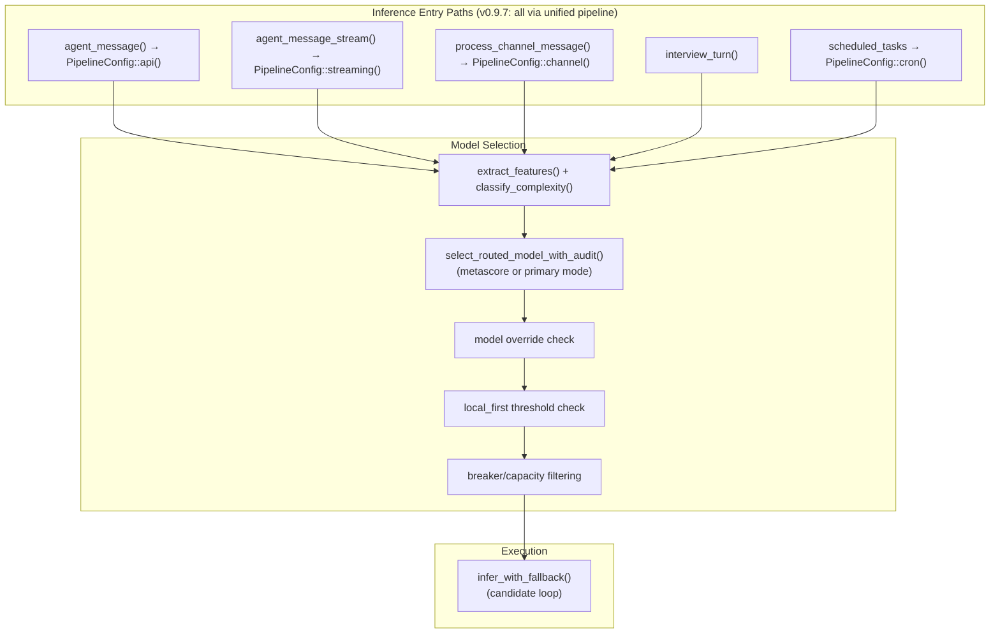
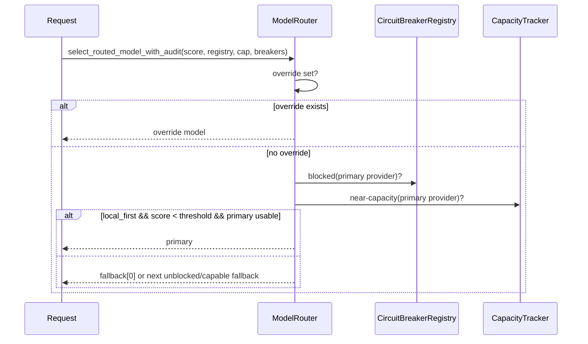
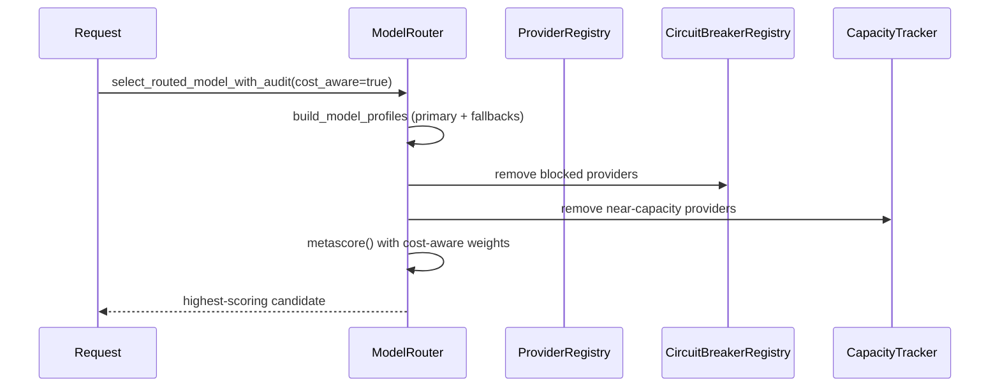
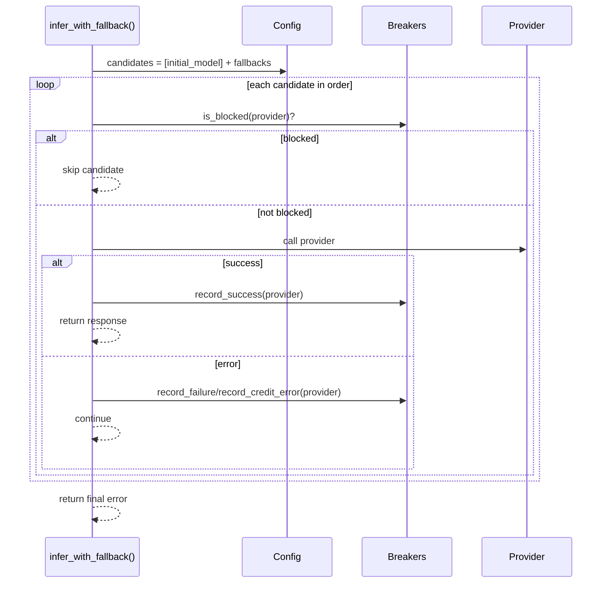

# Router Dataflow and Audit

This document maps current model-router behavior, defines intended routing sequences, and audits implementation paths against intended behavior.

## Current Router Dataflow (As Implemented)

## Intended Sequence Diagrams

### 1) Metascore Routing (Primary Mode)

### 2) Metascore Routing (Cost-Aware Mode)

### 3) Bounded Fallback Execution

## Audit: Code vs Intended Behavior

### Pass

- Router supports two configured runtime modes: `primary` and `metascore`. Legacy `heuristic` configs are migrated by update/mechanic before runtime load.
- Complexity-aware path applies `local_first`, breaker filtering, and capacity filtering.
- Cost-aware path applies breaker and capacity pruning before metascore cost-weight adjustment.
- Runtime model override (`set_override`) cleanly short-circuits both selection modes.
- All entry points (API, streaming, channel, cron) converge through unified pipeline (v0.9.7).
- Non-stream chat/channel paths run bounded candidate loop via `infer_with_fallback`.

### Mismatches / Risks

1. **~~Route-family inconsistency~~ (RESOLVED in v0.8.0)**
   - All inference paths (`agent_message()`, `agent_message_stream()`, `interview_turn()`, channel processing) now use `infer_with_fallback()` bounded candidate loop.

2. **Config-vs-router drift risk**
   - Runtime config mutations can update config structures while active `ModelRouter` internals (`primary`, `fallbacks`, `override`) remain independently stateful.
   - Requires explicit synchronization guarantees per mutation path.

3. **Override observability gap**
   - Override can be set via chat command; status visibility is command/UI dependent.
   - Without explicit audit events, operator may not realize override is active.

4. **Unused `model_overrides` config map**
   - `models.model_overrides` exists in config schema/docs but router selection paths do not currently consume it.

## Files Audited

- `crates/ironclad-llm/src/router.rs`
- `crates/ironclad-server/src/api/routes/agent/core.rs`
- `crates/ironclad-server/src/api/routes/agent/pipeline.rs` (v0.9.7: unified pipeline)
- `crates/ironclad-server/src/api/routes/agent/intent_registry.rs` (v0.9.7: intent classification)
- `crates/ironclad-server/src/api/routes/agent/shortcuts.rs` (v0.9.7: shortcut dispatcher)
- `crates/ironclad-server/src/api/routes/interview.rs`
- `crates/ironclad-core/src/config.rs`

## Router Test Objectives

1. Verify local-first selection for low complexity with healthy primary.
2. Verify blocked provider skip logic picks next eligible fallback.
3. Verify cost-aware routing selects cheapest eligible candidate.
4. Verify override short-circuits routing and clear restores normal behavior.

## Path Coverage Matrix (Integration Test Set)

- `E1 -> S1 -> S2 -> S3 -> S4 -> S5 -> X1`  
  - `server_api::fallback_chain_is_bounded_to_configured_candidates`
- `E2 -> S1 -> S2 -> S3 -> S4 -> S5 -> X1`
  - `server_api::stream_path_uses_bounded_fallback_surface`
- `E3 -> webhook -> process_channel_message`  
  - `server_api::telegram_webhook_public_entrypoint_accepts_and_returns_ok`
- `E3 -> webhook slash payload -> command handling branch`  
  - `server_api::telegram_webhook_public_entrypoint_accepts_slash_command_payload`
- `E4 -> S1 -> S2 -> S3 -> S4 -> S5 -> X1`
  - `server_api::interview_path_uses_shared_fallback_surface`

Router behavior integration set:

- `router_integration::router_local_first_prefers_primary_for_low_complexity`
- `router_integration::router_skips_blocked_first_choice`
- `router_integration::router_cost_aware_chooses_cheapest_eligible`
- `router_integration::router_override_short_circuits_then_clear_restores`
