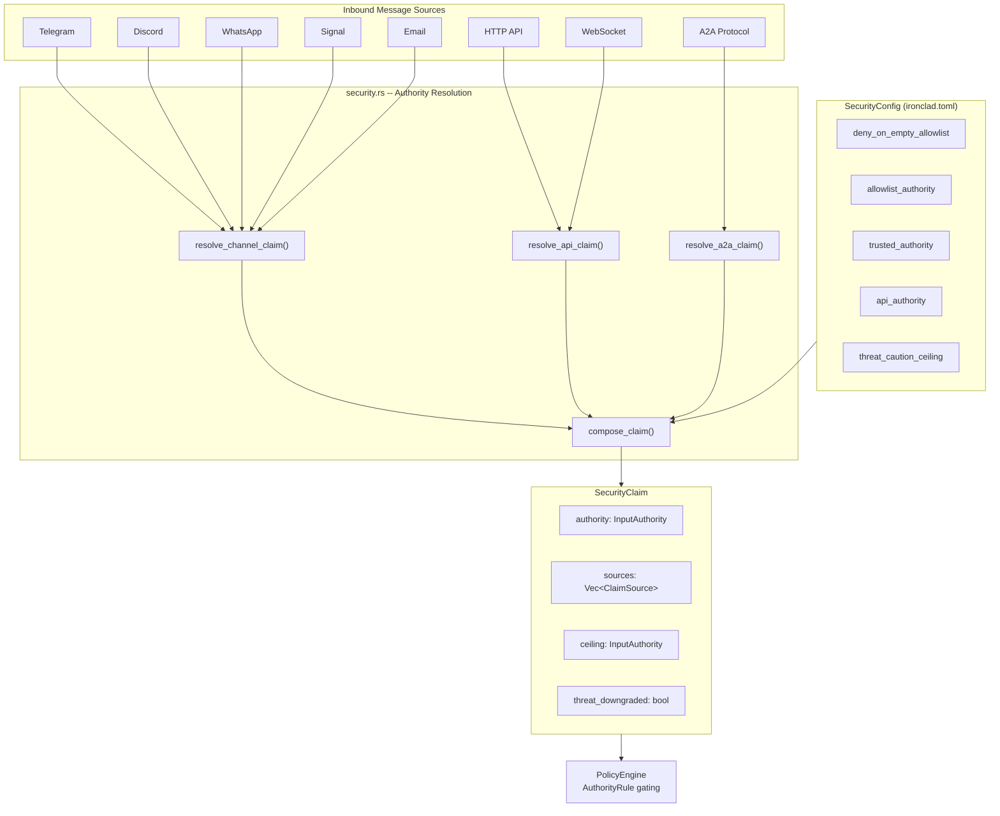
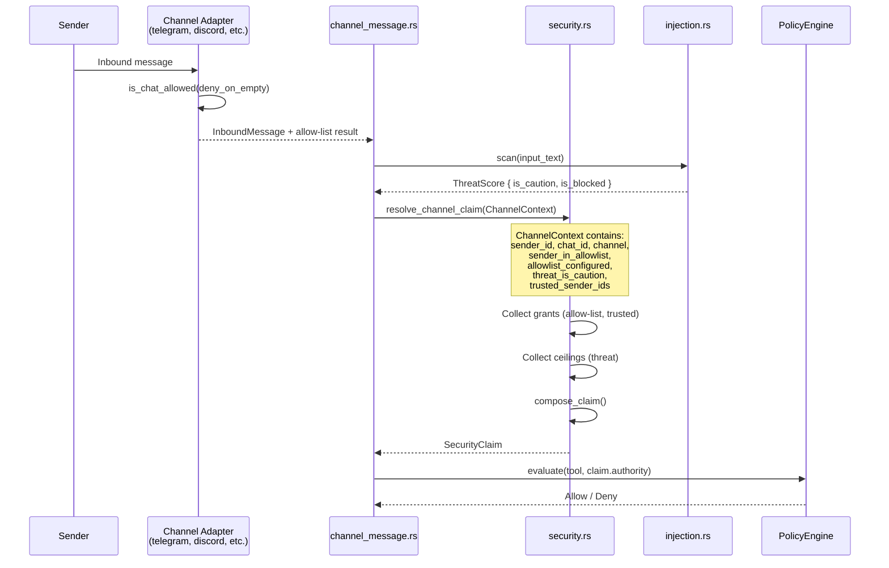
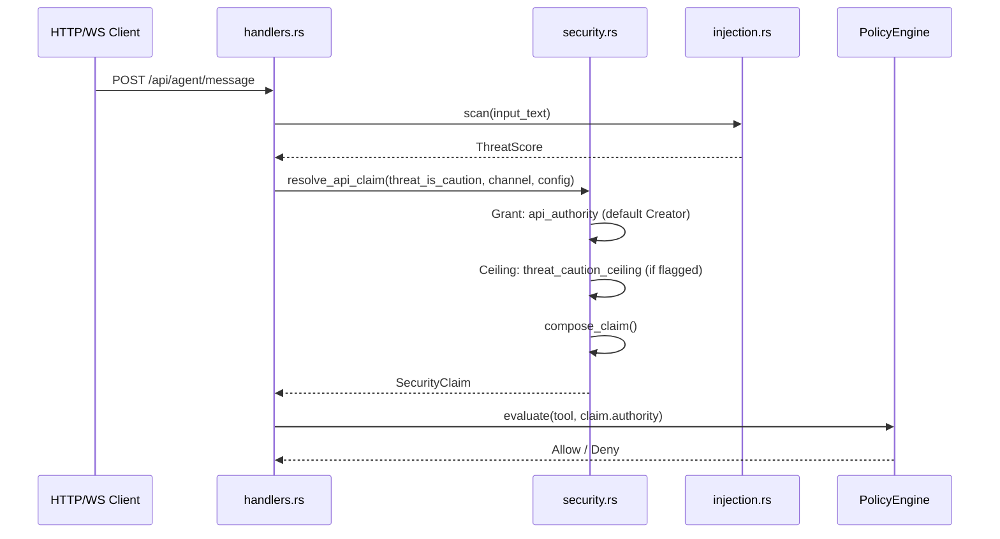
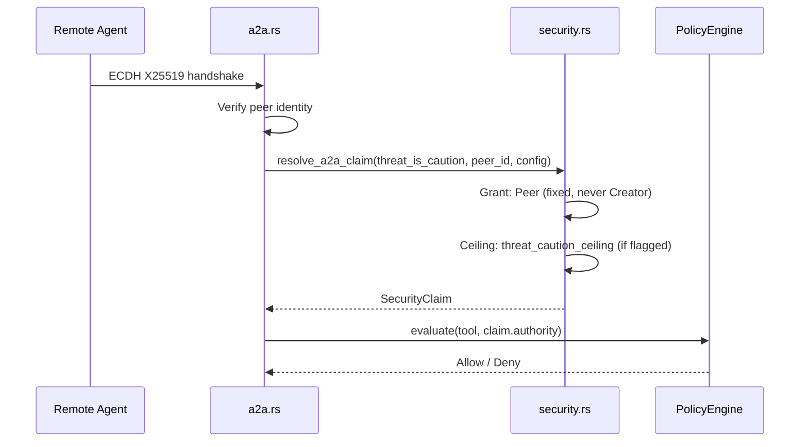
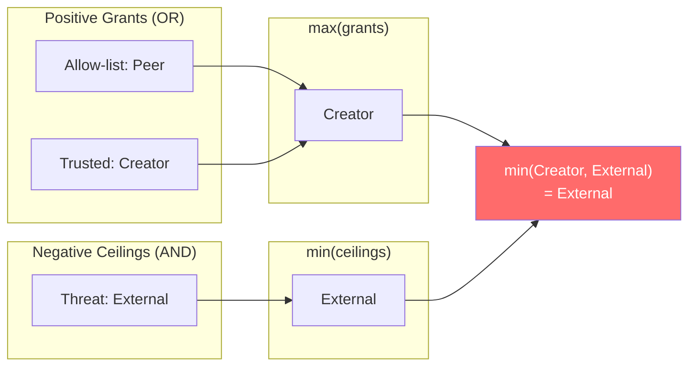
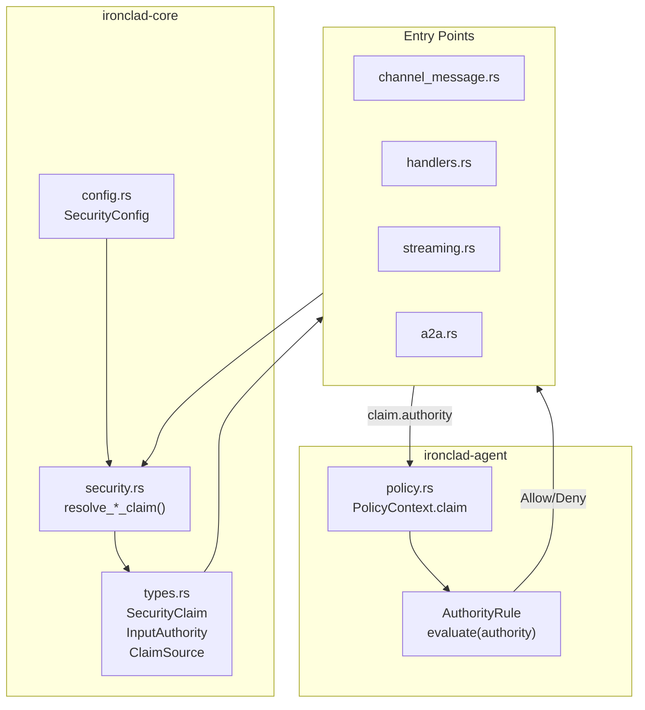

<!-- last_updated: 2026-03-02, version: 0.9.2 -->
# Security: Claim-Based RBAC Authority Resolution

*Unified access control system that resolves every inbound message to an immutable SecurityClaim, determining which tools the sender can invoke.*

---

## Problem Statement

Prior to v0.9.0, Ironclad had three disconnected security layers:

1. **Channel allow-lists** -- per-adapter filter, but empty = allow everyone
2. **`trusted_sender_ids`** -- global list, but non-members got `External` with no middle ground
3. **PolicyEngine** -- authority-based tool gating, but only saw `Creator` or `External`

This meant: fresh installs defaulted to permissive channel exposure, nobody could access Caution-level tools without being in `trusted_sender_ids`, and the `Peer`/`SelfGenerated` authority levels existed in the enum but were never assigned.

## Architecture Overview



## Authority Levels

`InputAuthority` is an ordered enum where `Ord` derivation produces correct least-privilege ordering:

| Level | Numeric | Description | Tool Access |
|-------|---------|-------------|-------------|
| `External` | 0 | Anonymous / unrecognized sender | Safe only |
| `Peer` | 1 | Allow-listed or A2A peer | Safe + Caution (filesystem, delegation) |
| `SelfGenerated` | 2 | Agent's own internal messages | Safe + Caution + Dangerous |
| `Creator` | 3 | Trusted sender or API caller | Full access (except Forbidden) |

## Claim Resolution Algorithm

```
effective = min(max(positive_grants...), min(negative_ceilings...))
```

- **Positive grants OR** -- any authentication layer can grant authority; the best grant wins
- **Negative ceilings AND** -- all restrictions must allow; the strictest ceiling wins

### Grant Sources

| Source | Default Authority | Configurable Via |
|--------|------------------|------------------|
| Channel allow-list member | `Peer` | `security.allowlist_authority` |
| `trusted_sender_ids` match | `Creator` | `security.trusted_authority` |
| HTTP API / WebSocket key | `Creator` | `security.api_authority` |
| A2A ECDH session | `Peer` | Fixed (never Creator) |
| No authentication match | `External` | N/A |

### Ceiling Sources

| Source | Default Ceiling | Configurable Via |
|--------|----------------|------------------|
| Threat scanner (Caution-level) | `External` | `security.threat_caution_ceiling` |

## Sequence Diagrams

### Channel Message Flow



### API Request Flow



### A2A Peer Flow



## Claim Composition Detail



In this example, a trusted sender whose input triggered the threat scanner gets downgraded from Creator to External. The `threat_downgraded` flag on the SecurityClaim records this for audit purposes.

## Data Flow: SecurityClaim Through the Stack



## Authority Integrity Notes

- Virtual orchestration tools (subagent composition/roster management) execute under the caller's resolved authority and are **not** privilege-elevated.
- This preserves RBAC guarantees across channel/API origins: `External` and `Peer` callers cannot bypass policy by asking the model to invoke orchestration internals.

## Configuration Reference

### `[security]` section in `ironclad.toml`

```toml
[security]
# Reject messages on channels with empty allow-lists (default: true)
deny_on_empty_allowlist = true

# Authority granted when sender passes a channel's allow-list
# Options: External, Peer, SelfGenerated, Creator (default: Peer)
allowlist_authority = "Peer"

# Authority granted when sender is in channels.trusted_sender_ids
# Options: External, Peer, SelfGenerated, Creator (default: Creator)
trusted_authority = "Creator"

# Authority for HTTP API and WebSocket requests
# Options: External, Peer, SelfGenerated, Creator (default: Creator)
api_authority = "Creator"

# Maximum authority when threat scanner flags input as Caution
# Must be below Creator (default: External)
threat_caution_ceiling = "External"
```

### Validation Rules

1. `allowlist_authority` must be <= `trusted_authority`
2. `threat_caution_ceiling` must be < `Creator`

### Channel Allow-Lists

Each channel adapter has an allow-list that controls which senders can communicate:

| Channel | Config Key | Example |
|---------|-----------|---------|
| Telegram | `channels.telegram.allowed_chat_ids` | `[123456789, -100123456]` |
| Discord | `channels.discord.allowed_guild_ids` | `["123456789012345"]` |
| WhatsApp | `channels.whatsapp.allowed_numbers` | `["+15551234567"]` |
| Signal | `channels.signal.allowed_numbers` | `["+15551234567"]` |
| Email | `channels.email.allowed_senders` | `["user@example.com"]` |

### Trusted Sender IDs

```toml
[channels]
trusted_sender_ids = ["123456789", "+15551234567", "user@example.com"]
```

Matches against both `sender_id` and `chat_id` for each inbound message.

## Empty Allow-List Behavior

| `deny_on_empty_allowlist` | Allow-list state | Behavior |
|---------------------------|-----------------|----------|
| `true` (default) | Empty | **Reject all** -- no grant from this layer |
| `true` | Non-empty, sender in list | Grant `allowlist_authority` |
| `true` | Non-empty, sender not in list | No grant from this layer |

## Web UI

The dashboard Settings page includes an **Access Control** tab that provides:

- **Authority Matrix** -- visual reference of what each level can do
- **Security Policy** -- all 5 configurable knobs with descriptions
- **Claim Resolution** -- explanation of the grants + ceilings algorithm

Changes in the Access Control tab follow the same save/apply workflow as all other settings.

## CLI Tools

### `ironclad check`

Displays security configuration summary:

```
Security: deny_on_empty=true  allow-list→Peer  trusted→Creator  api→Creator  threat-ceil→External
  trusted_sender_ids: 2 configured
  ✔ Telegram: 1 allowed_chat_ids configured
  ⚠ Discord: allowed_guild_ids is empty (all messages will be rejected)
```

### `ironclad mechanic`

Reports security findings:

| Finding ID | Severity | Condition |
|-----------|----------|-----------|
| `security-missing-section` | MEDIUM | No `[security]` section in config |
| `security-no-trusted-senders` | HIGH | Empty `trusted_sender_ids` with channels enabled |
| `security-no-allowlist` | HIGH | Channel enabled with empty allow-list + deny mode |

### `ironclad mechanic --repair`

Interactive interview to configure security settings:

1. Enforce `deny_on_empty_allowlist = true`
2. Collect trusted sender IDs
3. Set `allowlist_authority` level
4. Write `[security]` section to config file

### `ironclad update`

Post-upgrade migration detects pre-RBAC configs and:

1. Warns about the breaking change (empty allow-lists now deny)
2. Shows per-channel allow-list status
3. Auto-appends `[security]` section with explicit defaults

## Implementation Files

| File | Role |
|------|------|
| `ironclad-core/src/types.rs` | `InputAuthority`, `SecurityClaim`, `ClaimSource` |
| `ironclad-core/src/config.rs` | `SecurityConfig` struct + validation |
| `ironclad-core/src/security.rs` | `resolve_channel_claim()`, `resolve_api_claim()`, `resolve_a2a_claim()`, `compose_claim()` |
| `ironclad-channels/src/{telegram,discord,whatsapp,signal,email}.rs` | `deny_on_empty` field in adapters |
| `ironclad-server/src/api/routes/agent/channel_message.rs` | Channel entry point wiring |
| `ironclad-server/src/api/routes/agent/handlers.rs` | API entry point wiring |
| `ironclad-server/src/api/routes/agent/streaming.rs` | WS audit trail |
| `ironclad-agent/src/policy.rs` | `PolicyContext.claim` field |
| `ironclad-server/src/cli/admin/misc.rs` | Mechanic findings + interactive repair |
| `ironclad-server/src/cli/update.rs` | Post-upgrade migration |
| `ironclad-server/src/dashboard_spa.html` | Access Control settings tab |

## Test Coverage

21 unit tests in `security.rs` covering:

- Grant composition (no grants, allowlist-only, trusted-only, both)
- Ceiling composition (threat downgrade, custom ceiling, no threat)
- Empty allow-list behavior (deny vs allow modes)
- API claims (default Creator, threat downgrade)
- A2A claims (always Peer, threat downgrade)
- Configurable authority levels
- Monotonicity properties (adding grant never decreases, adding ceiling never increases)
- Edge cases (threat present but not binding, custom ceiling matching grant)

4 validation tests in `config.rs`:

- Default config passes validation
- `allowlist_authority > trusted_authority` rejected
- `threat_caution_ceiling == Creator` rejected
- `Peer` ceiling accepted

## Future: Sudo Elevation (Design Only)

The `SecurityClaim.sources` vector and ceiling model accommodate future sudo:

- Add `ClaimSource::SudoElevation` variant
- Time-limited elevation store (similar to existing `TicketStore`)
- `/sudo` bot command adds Creator grant while active
- Claim composition handles it naturally as another positive grant
