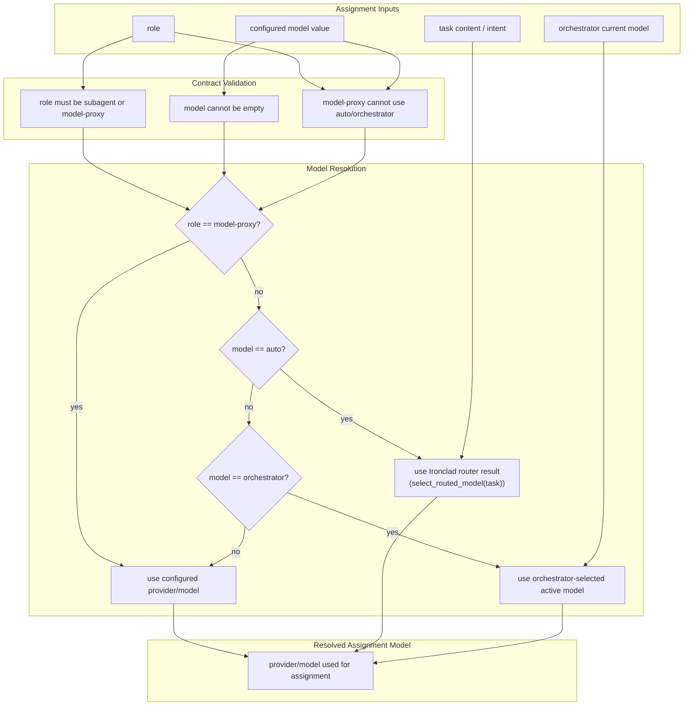
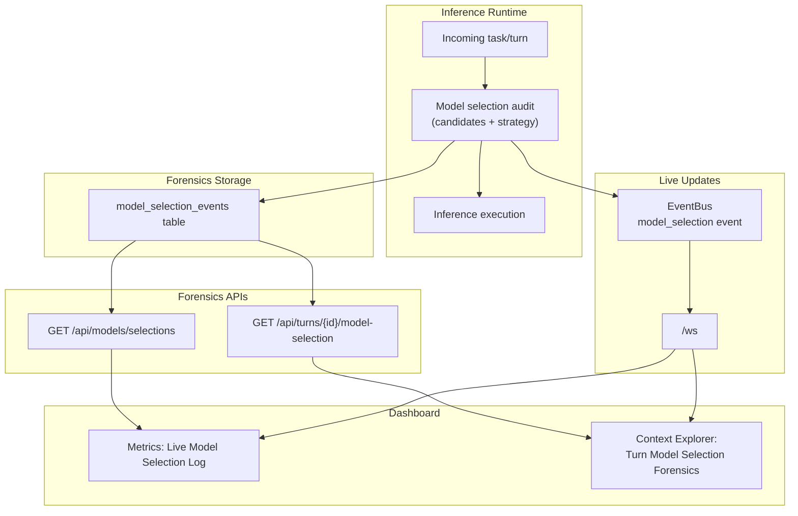
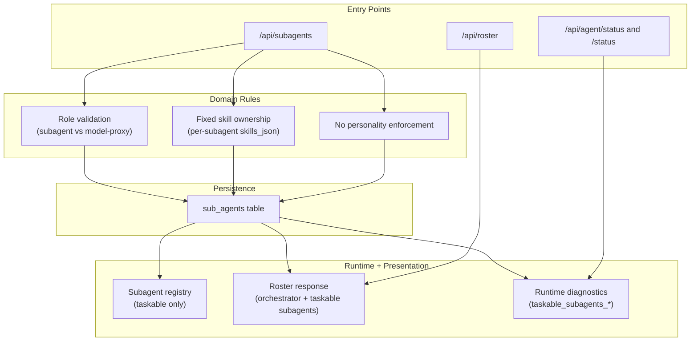
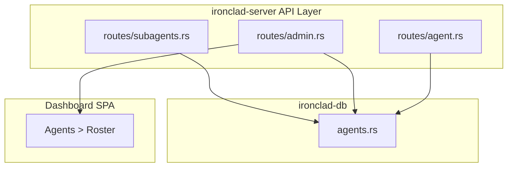

# Subagent Ubiquitous Language

## Canonical Definition

A **subagent** is:
- independently taskable by the primary agent,
- configured with a fixed set of skills,
- personality-free (no voice/persona payload),
- model-selectable and task-directed by the primary agent via built-in Ironclad orchestration.

A **model-proxy** is not a subagent. It is a routing/proxy record and is excluded from taskable-subagent semantics.

## Current-State Gap Audit (Pre-Fix)

- `role` values were loosely enforced (`specialist`, `model-proxy`, etc.), allowing semantic drift.
- subagent create/update APIs had no first-class `skills` payload, so ownership frequently appeared empty.
- unknown fields were silently accepted, so persona-like payload keys could be sent without rejection.
- roster payload assigned global enabled skills to orchestrator, making ownership appear concentrated on the primary agent.
- `/status` and diagnostics used generic `subagents` wording, which blurred taskable subagents and proxies.

## Enforced Contract (Post-Fix)

- role validation is strict: `subagent` or `model-proxy` (legacy `specialist` normalized to `subagent`).
- fixed skills are stored on each subagent (`skills_json`) from explicit API `skills`.
- personality payloads are rejected (`personality` unsupported for subagents).
- `model-proxy` records cannot own skills.
- roster exposes taskable subagents and model proxies separately.
- status diagnostics use `taskable_subagents_*` terminology and exclude proxies.
- taskable subagent model supports three modes:
  - fixed provider/model (for example `openai/gpt-4o-mini`),
  - `auto` (Ironclad router chooses),
  - `orchestrator` (primary agent-selected model at assignment time).

## Assignment-Time Model Selection

## Live Forensics Pipeline

## Dataflow

## Component Boundaries

